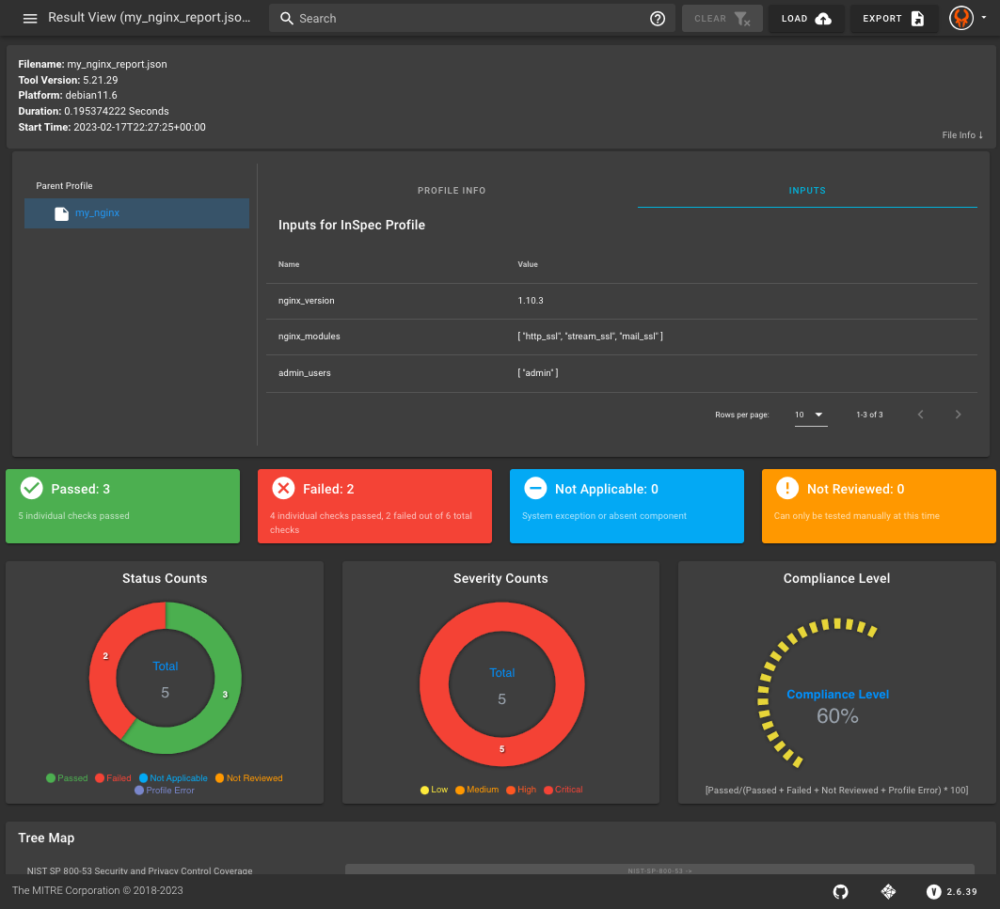

## 3. Revisiting the NGINX Web Server InSpec Profile
In the [first course](https://mitre.github.io/inspec-developer/course/05.html), we wrote, ran, and analyzed results of an InSpec profile made up of controls. Let's recap this process with some practice.

## 3.1 The Requirements
### 3.1.1 NGINX Configuration
InSpec profiles are a set of automated tests that relate back to a security requirements benchmark, so the controls are always motivated by the requirements. Let's review a few requirements for an NGINX web server.

1. NGINX version 1.10.3 or later.
2. The following NGINX modules should be installed:
   * `http_ssl`
   * `stream_ssl`
   * `mail_ssl`
3. The NGINX configuration file - `/etc/nginx/nginx.conf`- should:
   * be owned by the `root` user and group.
   * not be readable, writeable, or executable by others.

## 3.2 The Target
### 3.2.1 An NGINX Web Server
InSpec is a framework which is used to validate the security configuration of a certain target. In this case, we are interested in validating that an NGINX server complies with our 3 requirements.

First let's find our nginx container id using the `docker ps` command:

```shell
docker ps
```

Which will return something like:

```sh
➜  course git:(master) ✗ docker ps
CONTAINER ID   IMAGE          COMMAND                  CREATED          STATUS          PORTS                NAMES
d4bcef5bb9e3   nginx:latest   "/docker-entrypoint.…"   23 seconds ago   Up 22 seconds   80/tcp               nifty_shtern
4f0ceb9b5974   nginx:latest   "/docker-entrypoint.…"   2 months ago     Up 45 seconds   0.0.0.0:80->80/tcp   nginx
```

We can then use the container id of our nginx container to target the inspec validation scans at that container.

## 3.3 The Controls

Run the following command to initialize your InSpec profile for testing NGINX.
```
inspec init profile my_nginx
``` 

### 3.3.1 Version
```ruby
control 'nginx-version' do
  impact 1.0
  title 'NGINX version'
  desc 'The required version of NGINX should be installed.'
  describe nginx do
    its('version') { should cmp >= '1.10.3' }
  end
end
```
### 3.3.2 Installed Modules
```ruby
control 'nginx-modules' do
  impact 1.0
  title 'NGINX modules'
  desc 'The required NGINX modules should be installed.'
  describe nginx do
    its('modules') { should include 'http_ssl' }
    its('modules') { should include 'stream_ssl' }
    its('modules') { should include 'mail_ssl' }
  end
end
```
### 3.3.3 File Permissions
```ruby
control 'nginx-conf' do
  impact 1.0
  title 'NGINX configuration'
  desc 'The NGINX config file should owned by root, be writable only by owner, and not writeable or and readable by others.'
  describe file('/etc/nginx/nginx.conf') do
    it { should be_owned_by 'root' }
    it { should be_grouped_into 'root' }
    it { should_not be_readable.by('others') }
    it { should_not be_writable.by('others') }
    it { should_not be_executable.by('others') }
  end
end
```

## 3.4 Running the Controls
Run `inspec exec` on the target.

```sh
$ inspec exec /root/my_nginx -t docker://DOCKER_CONTAINER_ID
```
This will ouput:
```sh
  Profile: InSpec Profile (my_nginx)
  Version: 0.1.0
  Target:  docker://DOCKER_CONTAINER_ID

    ✔  nginx-version: NGINX version
       ✔  Nginx Environment version should cmp >= "1.10.3"
    ✔  nginx-modules: NGINX version
       ✔  Nginx Environment modules should include "http_ssl"
       ✔  Nginx Environment modules should include "stream_ssl"
       ✔  Nginx Environment modules should include "mail_ssl"
    ×  nginx-conf: NGINX configuration (1 failed)
       ✔  File /etc/nginx/nginx.conf should be owned by "root"
       ✔  File /etc/nginx/nginx.conf should be grouped into "root"
       ×  File /etc/nginx/nginx.conf should not be readable by others
       expected File /etc/nginx/nginx.conf not to be readable by others
       ✔  File /etc/nginx/nginx.conf should not be writable by others
       ✔  File /etc/nginx/nginx.conf should not be executable by others


  Profile Summary: 2 successful controls, 1 control failure, 0 controls skipped
  Test Summary: 8 successful, 1 failure, 0 skipped
```

## 3.5 Reporting Results
In the [first class](https://mitre-inspec-developer.netlify.app/course/06.html), we mentioned that you can specify an InSpec reporter to indicate the format in which you desire the results. 

If you want to read the results on the command line as well as save them in a JSON file, you can run this command.
```sh
$ inspec exec /root/my_nginx --reporter cli json:path/to/output.json -t docker://DOCKER_CONTAINER_ID
```

## 3.6 Visualizing Results
You can use this output file to upload and visualize your results in [Heimdall](https://heimdall-lite.mitre.org/).



---
