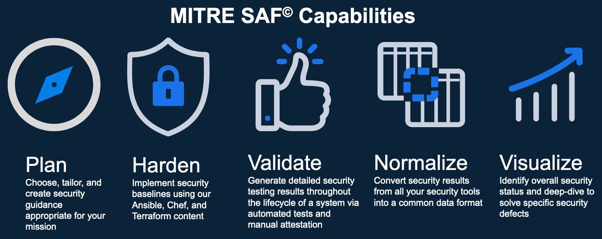

## The Security Automation Framework (SAF)
We focus on InSpec as the language that the MITRE SAF team uses for security validation, but let's take a moment to see where that fits in the big picture of security automation. Take a look at the [SAF Website](https://saf.mitre.org) to get a quick understanding of the pillars of SAF, what kinds of tools and techniques are available, and how what you have learned so far fits into the picture.



## 4. SAF CLI
The [SAF CLI](https://saf-cli.mitre.org/) is one the tool that the SAF supports to help automate security validation.

If you are working in the course development lab environment, this tool is provided for you. If not, reference the page for installation guidance. 

To update the SAF CLI version with `npm`, run:
```sh
npm update -g @mitre/saf
```

### 4.1. SAF CLI Capability
The SAF CLI has various commands. Some are listed in this diagram, but you can see all of them on the [SAF CLI documentation](https://saf-cli.mitre.org/).

In addition to the documentation site, you can view the SAF CLI capabilities by running:

::: code-tabs

@tab Command
```sh
saf help
```

@tab Output
```sh
The MITRE Security Automation Framework (SAF) Command Line Interface (CLI) brings together applications, techniques, libraries, and tools developed by MITRE and the security community to streamline security automation for systems and DevOps pipelines

VERSION
  @mitre/saf/1.2.5 linux-x64 node-v16.19.0

USAGE
  $ saf [COMMAND]

TOPICS
  attest      [Attest]       Attest to 'Not Reviewed' control requirements (that can’t be tested automatically by security tools and hence require manual review), helping to
              account for all requirements
  convert     [Normalize]    Convert security results from all your security tools between common data formats
  emasser     [eMASS]        The eMASS REST API implementation
  generate    [Generate]     Generate pipeline thresholds, configuration files, and more
  harden      [Harden]       Implement security baselines using Ansible, Chef, and Terraform content: Visit https://saf.mitre.org/#/harden to explore and run hardening scripts
  plugins     List installed plugins.
  scan        [Scan]         Scan to get detailed security testing results: Visit https://saf.mitre.org/#/validate to explore and run inspec profiles
  supplement  [Supplement]   Supplement (ex. read or modify) elements that provide contextual information in the Heimdall Data Format results JSON file such as `passthrough` or
              `target`
  validate    [Validate]     Verify pipeline thresholds
  view        [Visualize]    Identify overall security status and deep-dive to solve specific security defects

COMMANDS
  convert   The generic convert command translates any supported file-based security results set into the Heimdall Data Format
  harden    Visit https://saf.mitre.org/#/harden to explore and run hardening scripts
  heimdall  Run an instance of Heimdall Lite to visualize your data
  help      Display help for saf.
  plugins   List installed plugins.
  scan      Visit https://saf.mitre.org/#/validate to explore and run inspec profiles
  summary   Get a quick compliance overview of an HDF file
  version
```
:::

You can get more information on a specific topic by running:
```sh
saf [TOPIC] -h
```

### 4.2. View Summary of Results
Let's try out using the SAF CLI to understand our InSpec scan results. 

You can view a summary of the results by running this command which will show the high level information about the test results:

::: code-tabs

@tab View Summary Command
```sh
saf view summary -i my_nginx_results.json
```

@tab Output
```sh
- profileName: my_nginx
  resultSets:
    - my_nginx_results.json
  compliance: 80
  passed:
    critical: 4
    high: 0
    medium: 0
    low: 0
    total: 4
  failed:
    critical: 1
    high: 0
    medium: 0
    low: 0
    total: 1
  skipped:
    critical: 0
    high: 0
    medium: 0
    low: 0
    total: 0
  error:
    critical: 0
    high: 0
    medium: 0
    low: 0
    total: 0
  no_impact:
    none: 0
    total: 0
```
:::

### 4.3. Validate Results Against a Threshold
We can also generate a threshold for the results to be validated against. We will later see how this can be helpful in automated testing pipelines to indicate whether the pipeline should be considered a failure or a success.

Create a new file called `threshold.yml` in the main directory to specify the thresholds for acceptable test results. These file contents specify some basic thresholds, such as the minimum compliance level, minimum number of tests passed, and maximum number of tests failed.

```yaml
# threshold.yml file
compliance:
  min: 80
passed:
  total:
    min: 1
failed:
  total:
    max: 2
```
::: info Threshold Files
  To make more specific or detailed thresholds, check out [this documentation on generating theshold files](https://github.com/mitre/saf/wiki/Validation-with-Thresholds).

  *NOTE: You can name the threshold file something else or put it in a different location. We specify the name and location only for convenience.* 
:::

Now, validate the InSpec results against this threshold by running:

::: code-tabs

@tab Command
```sh
saf validate threshold -i my_nginx_results.json -F threshold.yml
```

@tab Generic Command
```sh
saf validate threshold -i output.json -F threshold.yml
```

@tab Output
```sh
All validation tests passed
```
:::

If you try changing the threshold values to be more strict, you can see failing results. For example, update the threshold file like this:
```yaml
# threshold.yml file
compliance:
  min: 80
passed:
  total:
    min: 1
failed:
  total:
    max: 0
```

::: code-tabs

@tab Command
```sh
saf validate threshold -i my_nginx_results.json -F threshold.yml
```

@tab Output
```sh
 Error: failed.total.max: Threshold not met. Number of received total failed controls (1) is greate
 than your set threshold for the number of failed controls (0)
```
:::

Try changing other values in the threshold file to see how the results change!

::: tip Using Threshold Files for Automation
Threshold files are used in CI to ensure minimum compliance levels and validate control severities and statuses using the saf validate threshold command.
:::