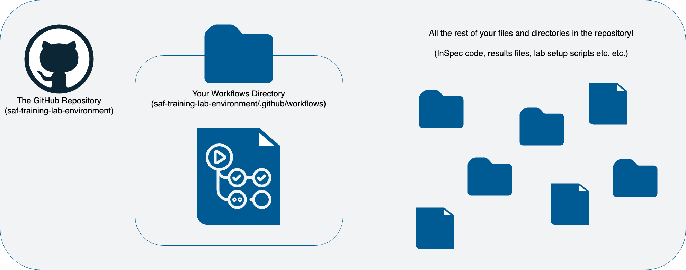
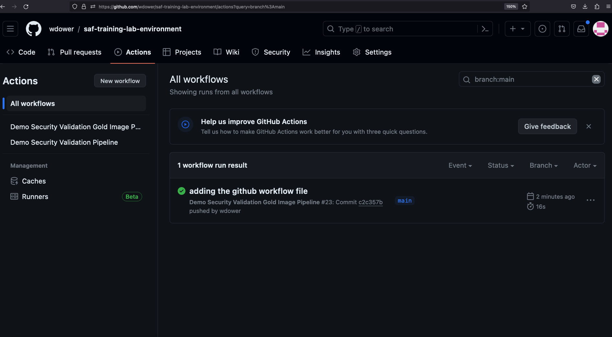

## GitHub Actions

Let's create a GitHub Action workflow to define our pipeline.

### Workflow File - Complete Example

For reference, this is the complete file we will end up with at the end of the class:

``` yaml
```

We will construct this full pipeline piece by piece.

### The Workflow file



Pipeline orchestration tools are usually configured in a predefined workflow file, which defines a set of tasks and the order they should run in. Workflow files live in the `.github` folder for GitHub Actions (the equivalent is the `gitlab-ci` file for GitLab CI, for example).

Let's create a new file to store our workflow.

``` sh
mkdir .github/workflows
touch .github/workflows/pipeline.yml
```

Neither command has output, but you should see a new file if you examine your `.github` directory:

::: code-tabs#shell

@tab Tree Command

```sh
tree .github
```
@tab Expected Output - .github folder structure
```
.github
└── workflows
    └── pipeline.yml
```
:::

Open that file up for editing.

### Workflow Triggers

Pipeline orchestrators also need you to define some set of events that will trigger the pipeline to run. The first thing we want to define in a new pipeline is what triggers it.

In our case, we want this pipeline to be a continuous integration pipeline, which should trigger every time we push code to the repository.

::: note Saving Files vs. Pushing Code
In all class content so far, we have been taking advantage of Codespaces' autosave feature. We have been saving our many edits to our profiles locally.

*Pushing code*, by contrast, means taking your saved code and officially adding it to your base repository's committed codebase, making it a permanent change. Codespaces won't do that automatically.
:::

Let's give our pipeline a name and add a workflow trigger:

``` yaml
name: Demo Security Validation Gold Image Pipeline

on:
  push:
    branches: [ main, pipeline ]                # trigger this action on any push to main branch
```

GitHub Actions has a number of [pre-defined workflow triggers](https://docs.github.com/en/actions/using-workflows/triggering-a-workflow) we can lean on and refer to as attributes in our YAML file. GitHub will now watch for pushes to our `main` branch and run the workflow when it sees a push.

::: warning YAML Syntax
We will be heavily editing `pipeline.yml` throughout this part of the class. Recall that YAML files like this are whitespace-delimited. If you hit confusing errors when we run these pipelines, always be sure to double-check your code lines up with the examples.
:::

### Our First Step

Next, we need to define some kind of task to complete when the event triggers.

First, we'll define a `job`, the logical group for our tasks. In our `pipeline.yml` file, add:

::: code-tabs#shell
@tab Adding a Job
``` yaml
jobs:
  gold-image:
    name: Gold Image NGINX
    runs-on: ubuntu-20.04
    env:
      CHEF_LICENSE: accept                      # so that we can use InSpec without manually accepting the license
      PROFILE: my_nginx							# path to our profile
```
@tab `pipeline.yml` after adding a job
``` yaml
name: Demo Security Validation Gold Image Pipeline

on:
  push:
    branches: [ main, pipeline ]                # trigger this action on any push to main branch

jobs:
  gold-image:
    name: Gold Image NGINX
    runs-on: ubuntu-20.04
    env:
      CHEF_LICENSE: accept                      # so that we can use InSpec without manually accepting the license
      PROFILE: my_nginx                         # path to our profile
```
:::

- `gold-image` is an arbitrary name we gave this job. It would be more useful if we were running more than one.
- `name` is a simple title for this job.
- `runs-on` declares what operating system we want our runner node to be. We picked Ubuntu (and we suggest you do to to make sure the rest of the workflow commands work correctly).
- `env` declares environment variables for use by any step of this job. We will go ahead and set a few variables for running InSpec later on:
	- `CHEF_LICENSE` will automatically accept the license prompt when you run InSpec the first time so that we don' hang waiting for input!
	- `PROFILE` is set to the path of the InSpec profile we will use to test. This will make it easier to refer to the profile multiple times and still make it easy to swap out.

### The Next Step

Now that we have our job metadata in place, let's add an actual task for the runner to complete, which GitHub Actions refer to as **steps** -- a quick update on our runner node's dependencies (this shouldn't be strictly necessary, but it's always good to practice good dependency hygiene!). In our `pipeline.yml` file, add:

::: code-tabs#shell
@tab Adding a Step
``` yaml
steps:
  - name: PREP - Update runner              # updating all dependencies is always a good start
    run: sudo apt-get update
```
@tab `pipeline.yml` after adding a step
``` yaml
name: Demo Security Validation Gold Image Pipeline

on:
  push:
    branches: [ main, pipeline ]                # trigger this action on any push to main branch

jobs:
  gold-image:
    name: Gold Image NGINX
    runs-on: ubuntu-20.04
    env:
      CHEF_LICENSE: accept                      # so that we can use InSpec without manually accepting the license
      PROFILE: my_nginx                         # path to our profile
    steps:
      - name: PREP - Update runner              # updating all dependencies is always a good start
        run: sudo apt-get update
```
:::

::: warning Again, be very careful about your whitespacing when filling out this structure!
:::

We now have a valid workflow file that we can run. We can trigger this pipeline to run by simply committing what we have written so far to our repository -- because of the event trigger we set, GitHub will catch the commit event and trigger our pipeline for us. Let's do this now. At your terminal:

``` sh
git add .github
git commit -s -m "adding the github workflow file"
git push origin main
```

Once we push our code, you can go to another tab in our browser, load up your personal code repository for the class content that you forked earlier, and check out the Actions tab to see your pipeline executing.



Note the little yellow circle next to your pipeline run. This indicates that the pipeline has not yet finished running. You may also see a green check mark or a red X mark depending on the status of your pipeline when you examine it.

If we click on the card for our pipeline run, we get more detail:

TODO add the pipeline examination view

Congratulations, you've run a pipeline! Now we just need to make it do something useful for us.

- Some background info on GH Actions and why they are useful
		- Show them what a completed workflow file looks like as a code sample and also a diagram. REFER BACK TO DIAGRAM FREQUENTLY
	- Show ANOTHER DIAGRAM that describes where the workflow action file sits in the repo and how it relates to the actual repository code
	- Stress that GH Actions are one of MANY pipeline software solutions
		- obvious parallels are GitLab pipelines, DroneCI, Jenkins
		- Ask people what stuff they've used to automate before, have SAF team members give some war stories, etc.