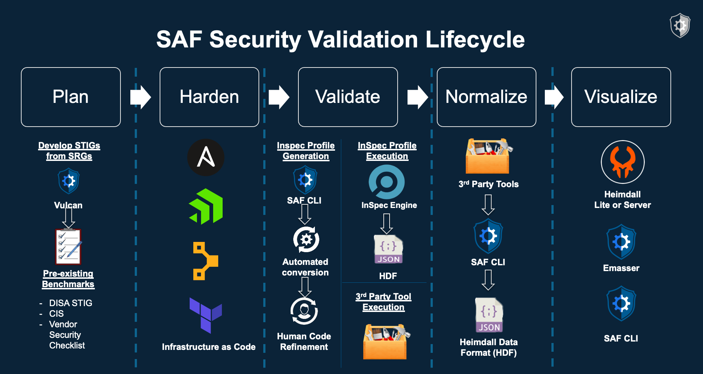

## 1.1 Course Objectives
The purpose of this course is to take you beyond profile development and give you the tools to actively participate in the open source security automation community. The advanced course builds off of the beginner course fundamentals, and by the end, you should be able to achieve all of these objectives.

### 1.1.1 Beginner course fundamentals:
-	Describe the InSpec framework and its capabilities
-	Describe the architecture of an InSpec profile
-	Build an InSpec profile to transform security policy into automated security testing
-	Inherit controls from existing profile baselines into your profiles to avoid rework
-	Run an InSpec profile against a target - a component of an application stack
-	View and analyze InSpec results
-	Report Results
-	Create concise, human-readable control output using RSpec syntax in InSpec profiles

### 1.1.2 Advanced course objectives:
-   Develop resources to aid in creating controls
-	Automate security testing by integrating InSpec into a CI/CD pipeline
-	Contribute to an open-source security platform by pushing the resources you develop to the InSpec framework

## 1.2 About InSpec
- InSpec is an open-source, community-developed  compliance validation framework
- Provides a mechanism for defining machine-readable compliance and security requirements
- Easy to create, validate, and read content
- Cross-platform (Windows, Linux, Mac)
- Agnostic to other DevOps tools and techniques
- Integrates into multiple configuration managament tools

## 1.3 The Road to Security Automation

InSpec is one of the primary tools in the Security Automation workflow. It integrates easily with orchestration and configuration management tools found in the DevOps world.

As you can see from the picture below, the process for developing automated security tests starts with a human-language requirements documents like SRGs, STIGs or CIS Benchmark and then implements them as code. We need that code to record test results in a standardized format so that we can easily export our security data somewhere people can use it to make decisions (like the Heimdall visualization app).

This challenge is what the [MITRE Security Automation Framework](https://saf.mitre.org) or MITRE SAF was developed to simplify -- to make the journey from a Requirement Document to an automated test profile and back again a little easier to navigate.

<!-- ## About Security Automation

Orchestration, Configuration Management, Validation to Deployment
InSpec operates with most orchestration and CM tools found in the DevOps pipeline implementations

 -->

## 1.4 Where can I start on my own?
You can contribute to existing profiles that can be found here:  
[https://github.com/mitre](https://github.com/mitre)  

Otherwise you can create your own profiles if they don't exist using the following security guidelines:  
[https://public.cyber.mil/stigs/downloads/](https://public.cyber.mil/stigs/downloads/)  
[https://www.cisecurity.org/cis-benchmarks/](https://www.cisecurity.org/cis-benchmarks/)  
