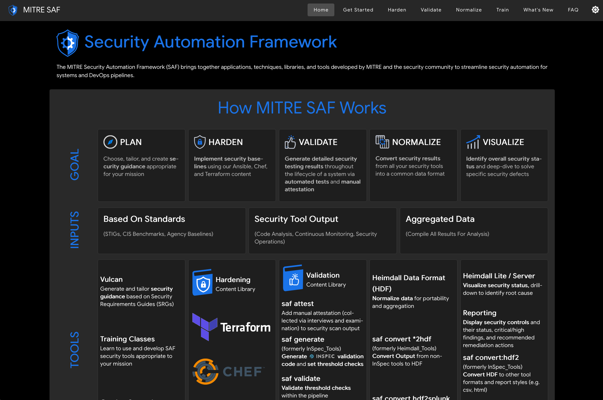
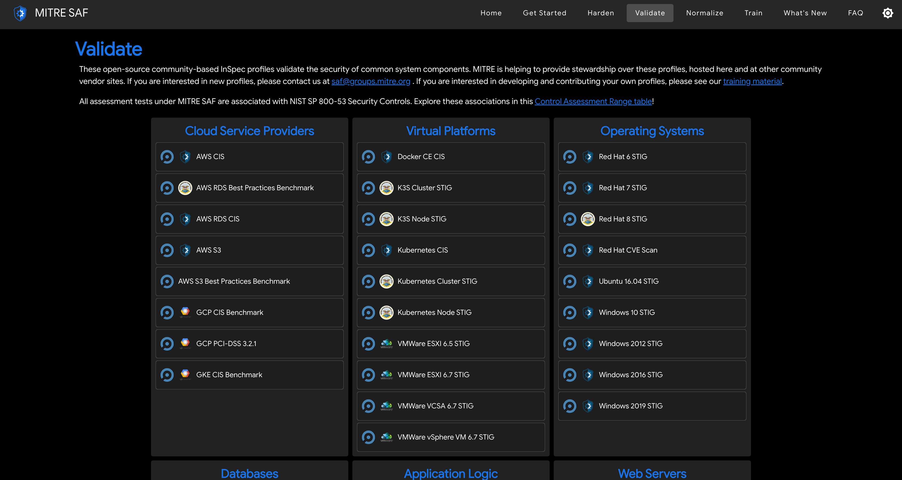

## 3. Identify your stack of components for the system you are assessing (i.e., Cloud Services, Virtualization Platforms, Operating Systems, Databases, Application Logic, and Web Servers)

First step of any assessment is identifying the components for the system you are assessing.  
[[Graphic of Stack with Redhat 7, NGINX]]

## 3.1. Identify which profiles match these components at https://saf.cms.gov/#/validate

After we have identified the stack from the previous step you would then go to the [SAF site](saf.mitre.org). The site will look like this:  

Now navigate over to the Validate page:  

On the validate screen you will identify which profiles are currently written to validate against your stack:  
[SAF Site](https://saf.mitre.org/#/validate)
