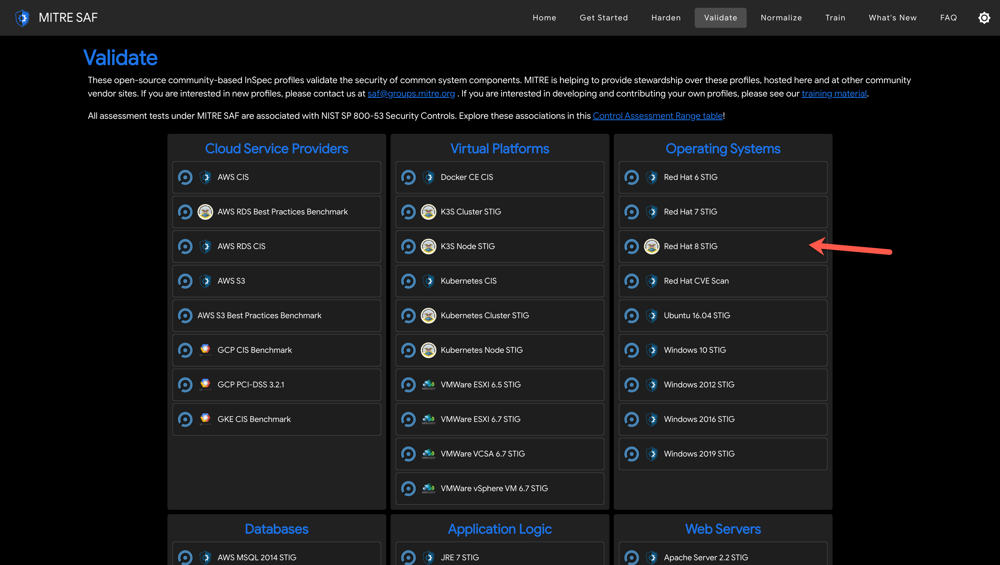
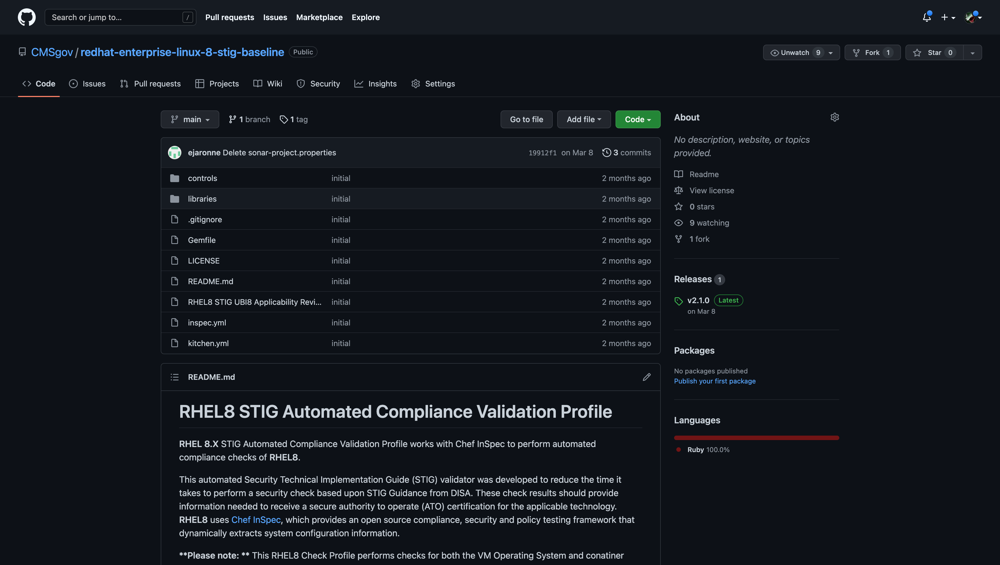

## 4. Review the READMEs for each profile for specific run instructions

### 4.1. RHEL8 baseline profile

Let's take the [RHEL8 baseline profile](https://github.com/CMSgov/redhat-enterprise-linux-8-stig-baseline) as an example  

### 4.2. NGINX baseline profile

Let's take the [NGINX baseline profile](https://github.com/mitre/nginx-baseline) as an example  

