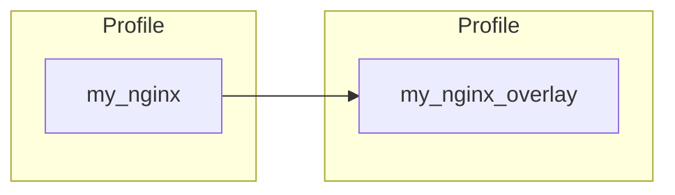

## Profile Dependencies (Overlays)

In addition to its own controls, an InSpec profile can leverage controls from one or more other InSpec profiles.

When a profile depends on controls from other profiles, it can be referred to as an "overlay" or "wrapper" profile. We'll use the term overlay profile in this section.

An overlay can include all, select specific, skip some, or modify controls it uses from the profiles it is depending on.



::: details Initializing the overlay
`inspec init profile my_nginx_overlay`
:::

To recap, here are the controls that are in the `my_nginx` profile:

```ruby
control 'nginx-version' do
  impact 1.0
  title 'NGINX version'
  desc 'The required version of NGINX should be installed.'
  describe nginx do
    its('version') { should cmp >= input('nginx_version') }
  end
end

control 'nginx-modules' do
  impact 1.0
  title 'NGINX modules'
  desc 'The required NGINX modules should be installed.'
  required_modules = input('nginx_modules')
  describe nginx do
    required_modules.each do |required_module|
      its('modules') { should include required_module }
    end
  end
end

control 'nginx-conf-file' do
  impact 1.0
  title 'NGINX configuration file'
  desc 'The NGINX config file should exist.'
  describe file(input('conf_file')) do
    it { should be_file }
  end
end

control 'nginx-conf-perms' do
  impact 1.0
  title 'NGINX configuration permissions'
  desc 'The NGINX config file should owned by root, be writable only by owner, and not writeable or and readable by others.'
  describe file('/etc/nginx/nginx.conf') do
    it { should be_owned_by 'root' }
    it { should be_grouped_into 'root' }
    it { should_not be_readable.by('others') }
    it { should_not be_writable.by('others') }
    it { should_not be_executable.by('others') }
  end
end

control 'nginx-shell-access' do
  impact 1.0
  title 'NGINX shell access'
  desc 'The NGINX shell access should be restricted to admin users.'
  describe users.shells(/bash/).usernames do
    it { should be_in input('admin_users')}
  end
end
```

### Defining the Profile Dependency  

For a profile to use controls from another profile, the dependency needs to be included in the `depends` section of the overlay's `inspec.yml` file. For example, you can develop my_nginx_overlay that uses controls from my_nginx profile. In this case, the `depends` section of `inspec.yml` of my_nginx_overlay should list the name and location of my_nginx. One way of declaring the dependency is:

::: code-tabs
@tab inspec.yml of the my_nginx_overlay
```yaml
name: my_nginx_overlay
# Metadata

depends:
  - name: my_nginx
    path: ../my_nginx # {path relative to the overlay}
```
:::

Once defined in the `inspec.yml` file, controls from the included profiles can be used!

::: info Find out more
[Profile Dependencies ](https://www.inspec.io/docs/reference/profiles/#sts=Profile%20Dependencies)
:::


### Including All Controls

After defining the dependency in the `inspec.yml` of `my_nginx_overlay`, controls from `my_nginx` are available to be used in the overlay. By using `include_controls <profile>` in the `overlay.rb` of the overlay profile, all controls from the named profile will be executed every time the overlay is executed. Below you can see an example of an `overlay.rb` file in the `controls` folder of the overlay.

::: code-tabs
@tab my_nginx_overlay
```ruby
include_controls 'my_nginx'
```
:::

In the example above, every time `my_nginx_overlay` profile is executed, all the controls from `my_nginx` profile are also executed. Therefore, the following controls would be executed for `my_nginx_overlay`:

| Controls      |     Executed  |
| ------------- | ------------- |
| nginx-version |      &check;  |
| nginx-modules |      &check;  |
| nginx-conf-file |     &check;  |
| nginx-conf-perms |    &check;  |
| nginx-shell-access |  &check;  |

### Skipping a Control

What if one of the controls from the included profile does not apply to your environment? Luckily, it is not necessary to maintain a slightly-modified copy of the included profile just to delete a control. The skip_control command tells InSpec not to run a particular control.

::: code-tabs
@tab my_nginx_overlay
```ruby
include_controls 'my_nginx' do
  skip_control 'nginx-conf-perms'
end
```
:::

In the above example, all controls from `my_nginx` profile will be executed, **except** for control `nginx-conf-perms`, every time `my_nginx_overlay` is executed. Therefore, the following controls will be executed for `my_nginx_overlay`:

| Controls      |     Executed  |
| ------------- | ------------- |
| nginx-version |      &check;  |
| nginx-modules |      &check;  |
| nginx-conf-file |     &check;  |
| nginx-conf-perms |   &cross;   |
| nginx-shell-access |  &check;  |

### Selectively Including Controls

If there are only a handful of controls that should be executed from an included profile, it’s not necessary to skip all the unneeded controls, or worse, copy/paste those controls bit-for-bit into your profile. Instead, use the `require_controls` command.

::: code-tabs
@tab my_nginx_overlay
```ruby
require_controls 'my_nginx' do
  control 'nginx-version'
  control 'nginx-modules'
end
```
:::


Whenever `my_nginx_overlay` is executed, it will run only the controls from `my_nginx` that are specified in the `require_controls` block. In the case, the following controls would be executed:

| Controls      |     Executed  |
| ------------- | ------------- |
| nginx-version |      &check;  |
| nginx-modules |      &check;  |
| nginx-conf-file |     &cross;  |
| nginx-conf-perms |   &cross;   |
| nginx-shell-access |  &cross;  |

Controls `nginx-conf-file`, `nginx-conf-perms`, and `nginx-shell-access` would not be executed, just as if they were manually skipped. This method of including specific controls ensures only the controls specified are executed

::: warning
If new controls are added to a later version of `my_nginx`, they would not be executed unless explicitly required in this scenario.
:::

### Modifying a Control  

Let’s say a particular control from an included profile should still run, but the impact isn’t appropriate? When a control is included or required, it can also be modified!

::: code-tabs
@tab include_controls
```ruby
include_controls 'my_nginx' do
  control 'nginx-modules' do
    impact 0.5
  end
end
```

@tab require_controls
```ruby
require_controls 'my_nginx' do
  control 'nginx-modules' do
    impact 0.5
  end
  control 'nginx-conf-file'
end
```

:::

In the above example, all included or required controls from `my_nginx` profile are executed. However, should control `nginx-modules` fail, it will be raised with an impact of `0.5` instead of the originally-intended impact of `1.0`.

### Additional Examples

- [Sample Hello World Web ](https://github.com/mitre/helloworld-web-baseline)
- [Sample RHEL8 Overlay ](https://github.com/mitre/sample-rhel8-overlay)
- [Sample MySQL Overlay ](https://github.com/mitre/sample-mysql-overlay)
- [AWS RDS Oracle 19c ](https://github.com/mitre/aws-rds-oracle-database-19c-cis-baseline) (Advanced)