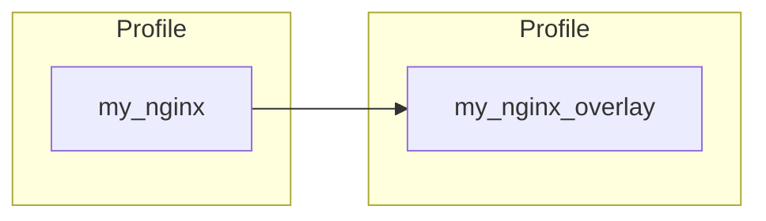

## Profile Inheritance and Overlays

In addition to its own controls, an InSpec profile can bring in the controls from another InSpec profile. Additionally, when inheriting the controls from another profile, a profile can skip or even modify those included controls.

When a profile includes controls from another profile, it is usually referred to as a “meta profile” or a “profile overlay.” Those of us with Chef background sometimes call it a “wrapper profile”.



::: details Initializing the overlay
`inspec init profile my_nginx_overlay`
:::

To recap, here are the controls that are in the `my_nginx` profile:

```ruby
control 'nginx-version' do
  impact 1.0
  title 'NGINX version'
  desc 'The required version of NGINX should be installed.'
end

control 'nginx-modules' do
  impact 1.0
  title 'NGINX modules'
  desc 'The required NGINX modules should be installed.'
end

control 'nginx-conf-file' do
  impact 1.0
  title 'NGINX configuration file'
  desc 'The NGINX config file should exist.'
end

control 'nginx-conf-perms' do
  impact 1.0
  title 'NGINX configuration permissions'
  desc 'The NGINX config file should owned by root, be writable only by owner, and not writeable or and readable by others.'
end

control 'nginx-shell-access' do
  impact 1.0
  title 'NGINX shell access'
  desc 'The NGINX shell access should be restricted to admin users.'
```

### Defining the Profile Dependency  

For a profile to use controls from another profile, the dependency needs to be included in the `depends` section of the `inspec.yml` file. For example, you can develop my_nginx_overlay that uses controls from my_nginx profile. In that case, the `depends` section of `inspec.yml` of my_nginx_overlay should list the name and location of my_nginx. One way of declaring the dependency is:

::: code-tabs
@tab my_nginx_overlay
```yaml
depends:
  - name: my_nginx
    path: ../my_nginx
    # {path relative to the overlay}
```
:::

Once defined in the `inspec.yml` file, controls from the included profiles can be used!

::: info Find out more
[Profile Dependencies ](https://www.inspec.io/docs/reference/profiles/#sts=Profile%20Dependencies)
:::


### Including All Controls

With the `include_controls` in a profile, all controls from the named profile will be executed every time the including profile is executed. Below you can see an example of a profile and overlay.

::: code-tabs
@tab my_nginx_overlay
```ruby
include_controls 'my_nginx'
```
:::

In the example above, every time `my_nginx_overlay` profile is executed, all the controls from `my_nginx` profile are also executed. Therefore, the following controls would be executed for `my_nginx_overlay`:

| Controls      |     Executed  |
| ------------- | ------------- |
| nginx-version |      &check;  |
| nginx-modules |      &check;  |
| nginx-conf-file |     &check;  |
| nginx-conf-perms |    &check;  |
| nginx-shell-access |  &check;  |

### Skipping a Control

What if one of the controls from the included profile does not apply to your environment? Luckily, it is not necessary to maintain a slightly-modified copy of the included profile just to delete a control. The skip_control command tells InSpec to not run a particular control.

::: code-tabs
@tab my_nginx_overlay
```ruby
include_controls 'my_nginx' do
  skip_control 'nginx-conf-perms'
end
```
:::

In the above example, all controls from `my_nginx` profile will be executed, **except** for control `nginx-conf-perms`, every time `my_nginx_overlay` is executed. Therefore, the following controls will be executed for `my_nginx_overlay`:

| Controls      |     Executed  |
| ------------- | ------------- |
| nginx-version |      &check;  |
| nginx-modules |      &check;  |
| nginx-conf-file |     &check;  |
| nginx-conf-perms |   &cross;   |
| nginx-shell-access |  &check;  |

### Selectively Including Controls

If there are only a handful of controls that should be executed from an included profile, it’s not necessary to skip all the unneeded controls, or worse, copy/paste those controls bit-for-bit into your profile. Instead, use the `require_controls` command.

::: code-tabs
@tab my_nginx_overlay
```ruby
require_controls 'my_nginx' do
  control 'nginx-version'
  control 'nginx-modules'
end
```
:::


Whenever `my_nginx_overlay` is executed, it will run only the controls from `my_nginx` that are specified in the `require_controls` block. In the case, the following controls would be executed:

| Controls      |     Executed  |
| ------------- | ------------- |
| nginx-version |      &check;  |
| nginx-modules |      &check;  |
| nginx-conf-file |     &cross;  |
| nginx-conf-perms |   &cross;   |
| nginx-shell-access |  &cross;  |

Controls `nginx-conf-file`, `nginx-conf-perms`, and `nginx-shell-access` would not be executed, just as if they were manually skipped. This method of including specific controls ensures only the controls specified are executed

::: warning
If new controls are added to a later version of `my_nginx`, they would not be executed unless explicitly required in this scenario.
:::

### Modifying a Control  

Let’s say a particular control from an included profile should still run, but the impact isn’t appropriate? When a control is included or required, it can also be modified!

::: code-tabs
@tab include_controls
```ruby
include_controls 'my_nginx' do
  control 'nginx-modules' do
    impact 0.5
  end
end
```

@tab require_controls
```ruby
require_controls 'my_nginx' do
  control 'nginx-modules' do
    impact 0.5
  end
  control 'nginx-conf-file'
end
```

:::

In the above example, all included or required controls from `my_nginx` profile are executed. However, should control `nginx-modules` fail, it will be raised with an impact of `0.5` instead of the originally-intended impact of `1.0`.

#### Inputs with profile inheritance

In order for a control to run properly, the values for inputs can be overriden to align with your environment. Let's say your environment uses `root` not `admin`, so the input for `nginx-shell-access` control can be updated to measure accordingly.

One way of updating the input is by using the `inspec.yml` file:

::: code-tabs
@tab my_nginx
```yaml
inputs:
  - name: admin_users
    type: array
    value:
      - 'admin'
```

@tab my_nginx_overlay
```yaml
inputs:
  - name: admin_users
    type: array
    value:
      - 'root'
    profile: my_nginx
```
:::


::: danger Overriding Inputs
Inputs should be overriden in an overlay only with an approved justification for that change.
:::

### Additional Examples

- [Sample Hello World Web ](https://github.com/mitre/helloworld-web-baseline)
- [Sample RHEL8 Overlay ](https://github.com/mitre/sample-rhel8-overlay)
- [Sample MySQL Overlay ](https://github.com/mitre/sample-mysql-overlay)
- [AWS RDS Oracle 19c ](https://github.com/mitre/aws-rds-oracle-database-19c-cis-baseline) (Advanced)