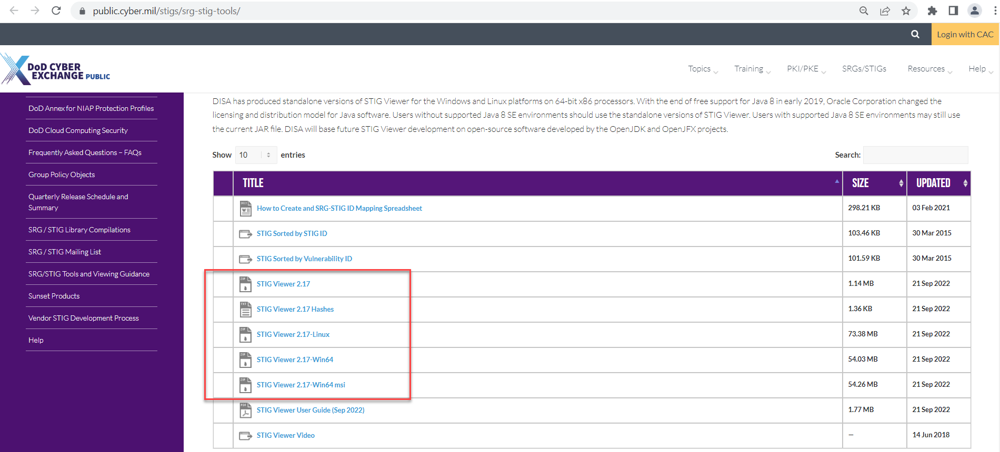

## From STIG to Profile

### Download STIG Requirements

Download the latest STIG Viewer located here [STIG Viewer](https://public.cyber.mil/stigs/srg-stig-tools/)



Download the `Red Hat Enterprise Linux 8 STIG - Ver 1, Rel 5` located here [RHEL8 STIG Download](https://public.cyber.mil/stigs/downloads/?_dl_facet_stigs=operating-systems%2Cunix-linux)


### Convert the STIG XCCDF Benchmark To an InSpec Stubs Profile

::: note Timesaver Ahead!

We already converted the XCCDF STIG Benchmark into a starter profile using the `saf generate xccdf_benchmark2inspec_stub` command using the correct flags, mapping file and other options.
:::

The SAF CLI has the `generate xccdf_benchmark2inspec_stub` sub-command which can help you quickly convert an XCCDF Benchmark document into the start of an InSpec Profile.

To learn how you can use the `saf generate xccdf_benchmark2inspec_stub` or any other `saf` cli command, go to the [saf-cli homepage](https://saf-cli.mitre.org/#generate) or use the help commands. An example help command to generate the stubs of the InSpec profile is below.

::: code-tabs#shell

@tab Command
```sh
saf generate xccdf_benchmark2inspec_stub --help
```

@tab Output
```sh
Translate an XCCDF benchmark file to a skeleton for an InSpec profile

USAGE
  $ saf saf generate xccdf_benchmark2inspec_stub -i <stig-xccdf-xml> [-o <output-folder>] [-h]
    [-m <metadata-json>] [-T (rule|group|cis|version)] [-s] [-L (info|warn|debug|verbose)]

FLAGS
  -L, --logLevel=<option>        [default: info]
                                 <options: info|warn|debug|verbose>
  -O, --ovalDefinitions=<value>  Path to an OVAL definitions file to populate profile elements
                                 that reference OVAL defintions
  -T, --idType=<option>          [default: rule] Control ID Types: 'rule' - Vulnerability IDs
                                 (ex. 'SV-XXXXX'), 'group' - Group IDs (ex. 'V-XXXXX'), 'cis' -
                                 CIS Rule IDs (ex. C-1.1.1.1), 'version' - Version IDs (ex.
                                 RHEL-07-010020 - also known as STIG IDs)
                                 <options: rule|group|cis|version>
  -h, --help                     Show CLI help.
  -i, --input=<value>            (required) Path to the XCCDF benchmark file
  -m, --metadata=<value>         Path to a JSON file with additional metadata for the inspec.yml
                                 file
  -o, --output=<value>           [default: profile] The output folder to write the generated
                                 InSpec content
  -s, --singleFile               Output the resulting controls as a single file

DESCRIPTION
  Translate an XCCDF benchmark file to a skeleton for an InSpec profile

EXAMPLES
  $ saf generate xccdf_benchmark2inspec_stub -i ./U_RHEL_6_STIG_V2R2_Manual-xccdf.xml -T group --logLevel debug -r rhel-6-update-report.md

  $ saf generate xccdf_benchmark2inspec_stub -i ./CIS_Ubuntu_Linux_18.04_LTS_Benchmark_v1.1.0-xccdf.xml -O ./CIS_Ubuntu_Linux_18.04_LTS_Benchmark_v1.1.0-oval.xml --logLevel debug
```
:::

### Example 'Stub' Control SV-230502

Let's take a look at what one of the `stub` InSpec control created by the `saf-cli generate xccdf_benchmark2inspec_stub` command and the completed InSpec control.

::: code-tabs#shell

@tab Stub Generated InSpec Control

```ruby
control 'SV-230502' do
  title 'The RHEL 8 file system automounter must be disabled unless required.'
  desc  "Automatically mounting file systems permits easy introduction of
unknown devices, thereby facilitating malicious activity."
  desc  'rationale', ''
  desc  'check', "
    Verify the operating system disables the ability to automount devices.

    Check to see if automounter service is active with the following command:

    Note: If the autofs service is not installed, this requirement is not
applicable.

    $ sudo systemctl status autofs

    autofs.service - Automounts filesystems on demand
    Loaded: loaded (/usr/lib/systemd/system/autofs.service; disabled)
    Active: inactive (dead)

    If the \"autofs\" status is set to \"active\" and is not documented with
the Information System Security Officer (ISSO) as an operational requirement,
this is a finding.
  "
  desc 'fix', "
    Configure the operating system to disable the ability to automount devices.

    Turn off the automount service with the following commands:

    $ sudo systemctl stop autofs
    $ sudo systemctl disable autofs

    If \"autofs\" is required for Network File System (NFS), it must be
documented with the ISSO.
  "
  impact 0.5
  tag severity: 'medium'
  tag gtitle: 'SRG-OS-000114-GPOS-00059'
  tag gid: 'V-230502'
  tag rid: 'SV-230502r627750_rule'
  tag stig_id: 'RHEL-08-040070'
  tag fix_id: 'F-33146r568253_fix'
  tag cci: ['CCI-000778']
  tag nist: ['IA-3']

  # ...add your describe blocks here ... #

end
```

@tab Completed InSpec Control

```ruby
control 'SV-230502' do
  title 'The RHEL 8 file system automounter must be disabled unless required.'
  desc  "Automatically mounting file systems permits easy introduction of
unknown devices, thereby facilitating malicious activity."
  desc  'rationale', ''
  desc  'check', "
    Verify the operating system disables the ability to automount devices.

    Check to see if automounter service is active with the following command:

    Note: If the autofs service is not installed, this requirement is not
applicable.

    $ sudo systemctl status autofs

    autofs.service - Automounts filesystems on demand
    Loaded: loaded (/usr/lib/systemd/system/autofs.service; disabled)
    Active: inactive (dead)

    If the \"autofs\" status is set to \"active\" and is not documented with
the Information System Security Officer (ISSO) as an operational requirement,
this is a finding.
  "
  desc 'fix', "
    Configure the operating system to disable the ability to automount devices.

    Turn off the automount service with the following commands:

    $ sudo systemctl stop autofs
    $ sudo systemctl disable autofs

    If \"autofs\" is required for Network File System (NFS), it must be
documented with the ISSO.
  "
  impact 0.5
  tag severity: 'medium'
  tag gtitle: 'SRG-OS-000114-GPOS-00059'
  tag gid: 'V-230502'
  tag rid: 'SV-230502r627750_rule'
  tag stig_id: 'RHEL-08-040070'
  tag fix_id: 'F-33146r568253_fix'
  tag cci: ['CCI-000778']
  tag nist: ['IA-3']

  if virtualization.system.eql?('docker')
    impact 0.0
    describe "Control not applicable within a container" do
      skip "Control not applicable within a container"
    end
  else
    if package('autofs').installed?
      describe systemd_service('autofs.service') do
        it { should_not be_running }
        it { should_not be_enabled }
        it { should_not be_installed }
      end
    else
      impact 0.0
      describe 'The autofs service is not installed' do
        skip 'The autofs service is not installed, this control is Not Applicable.'
      end
    end
  end
end
```
