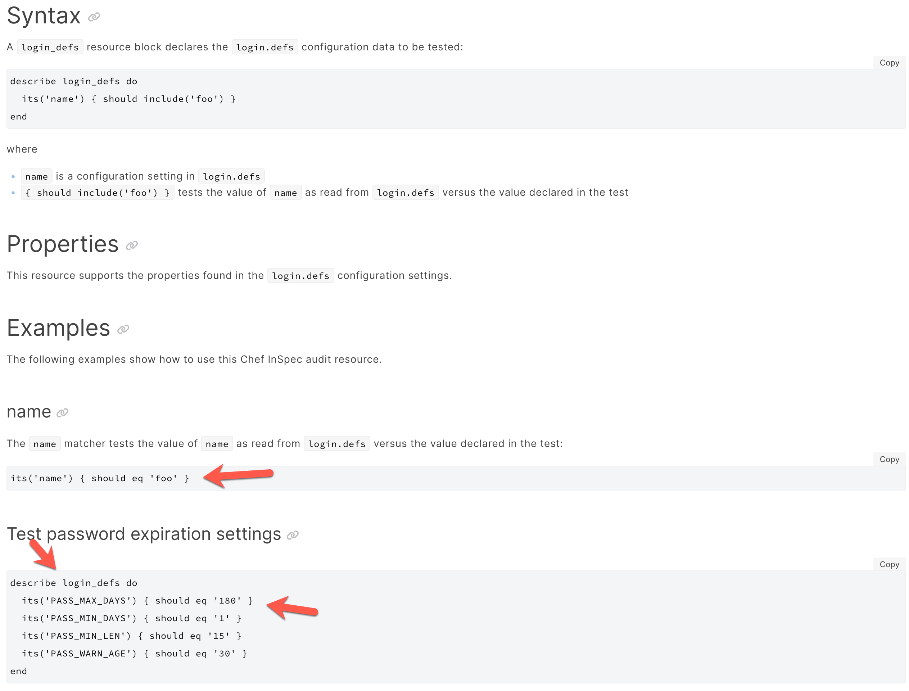

## Getting Started on the RHEL8 Baseline

### Steps:
1. Go to the control (you made from the stub generator) and read the check text to understand the goal of the control
```ruby
control "SV-230324" do
  title "All RHEL 8 local interactive user accounts must be assigned a home directory upon creation."
  desc "If local interactive users are not assigned a valid home directory, there is no place for the 
storage and control of files they should own."
  desc "check", "Verify all local interactive users on RHEL 8 are assigned a home directory upon creation with 
the following command:

$ sudo grep -i create_home /etc/login.defs

CREATE_HOME yes

If 
the value for \"CREATE_HOME\" parameter is not set to \"yes\", the line is missing, or the line is 
commented out, this is a finding."
  desc "fix", "Configure RHEL 8 to assign home directories to all new local interactive users by setting the 
\"CREATE_HOME\" parameter in \"/etc/login.defs\" to \"yes\" as follows.

CREATE_HOME yes"
  impact 0.5
  tag severity: "medium"
  tag gtitle: "SRG-OS-000480-GPOS-00227"
  tag gid: "V-230324"
  tag rid: "SV-230324r627750_rule"
  tag stig_id: "RHEL-08-010760"
  tag fix_id: "F-32968r567719_fix"
  tag cci: ["CCI-000366"]
  tag nist: ["CM-6 b"]

  describe login_defs do
    its('CREATE_HOME') { should eq 'yes' }
  end
end
```
2. Look for key words that would indicate what resource to use, 
- Ex: give some of that reasoning
If you can't find it, look at the resources page and compare back to the control https://docs.chef.io/inspec/resources/

3. Look at the documentation for the resource you need and understand the syntax / example
[login defs resource page](https://docs.chef.io/inspec/resources/login_defs/)

4. Write the test! (using eq)
```ruby
control 'SV-230324' do
  title "All RHEL 8 local interactive user accounts must be assigned a home
directory upon creation."
  desc  "If local interactive users are not assigned a valid home directory,
there is no place for the storage and control of files they should own."
  desc  'rationale', ''
  desc  'check', "
    Verify all local interactive users on RHEL 8 are assigned a home directory
upon creation with the following command:
    $ sudo grep -i create_home /etc/login.defs
    CREATE_HOME yes
    If the value for \"CREATE_HOME\" parameter is not set to \"yes\", the line
is missing, or the line is commented out, this is a finding.
  "
  desc 'fix', "
    Configure RHEL 8 to assign home directories to all new local interactive
users by setting the \"CREATE_HOME\" parameter in \"/etc/login.defs\" to
\"yes\" as follows.
    CREATE_HOME yes
  "
  impact 0.5
  tag severity: 'medium'
  tag gtitle: 'SRG-OS-000480-GPOS-00227'
  tag gid: 'V-230324'
  tag rid: 'SV-230324r627750_rule'
  tag stig_id: 'RHEL-08-010760'
  tag fix_id: 'F-32968r567719_fix'
  tag cci: ['CCI-000366']
  tag nist: ['CM-6 b']

  describe login_defs do
    its('CREATE_HOME') { should eq 'yes' }
  end
end
```
5. Run the test! If you have syntax errors or unexpected results, it's time to troubleshoot. The best first step in troubleshooting is to read the error message from the command line. 
```bash
inspec exec . -t docker://DOCKER_ID
```

### Controls We Will Demonstrate  

- SV-230324 <---login_defs resource
- SV-230250 <---directory resource
- SV-230243 <---directory looping & file resource
- SV-230505 <---non applicable use case & package resource

### Suggested Level 1 Controls  

- SV-230383 <---login_defs resource
- SV-230249 <---directory resource
- SV-230242 <---directory looping & file resource
- SV-230241 <---non applicable use case & package resource

#### Suggested Level 2 Controls  

- SV-230281 <---parse config file
- SV-230365 <---login_defs resource
- SV-230264 <---file content

#### SV-230324
1. Go to the control (you made from the stub generator) and read the check text to understand the goal of the control
2. Look for key words that would indicate what resource to use, 
- Ex: give some of that reasoning
If you can't find it, look at the resources page and compare back to the control https://docs.chef.io/inspec/resources/
3. Look at the documentation for the resource you need and understand the syntax / example
4. Write the test! (using eq)
5. Run the test! If you have syntax errors or unexpected results, it's time to troubleshoot. The best first step in troubleshooting is to read the error message from the command line. 

:::info Remember the matchers
Here, the login_defs resource shows examples using the `includes` and `eq` matcher....
::: 

:::info Strings
Single quotes are dumb strings. Double quotes are smart strings. Smart strings means they allow interpolation.
::: 

### Now you try a login_def control!
- Work in groups to write SV-230383

### Check out some other examples
- Review more controls together!

### Go try some more!

### Suggested InSpec Resources to Review

- [command](https://www.inspec.io/docs/reference/resources/command/)
- [file](https://www.inspec.io/docs/reference/resources/file/)
- [directory](https://www.inspec.io/docs/reference/resources/directory/)
- [parse_config_file](https://www.inspec.io/docs/reference/resources/parse_config_file/)
- [package](https://www.inspec.io/docs/reference/resources/package/)
- [login_defs](https://docs.chef.io/inspec/resources/login_defs/)

## Completed RHEL8 Profile for Reference

Below is the url to the completed RHEL8 Inspec Profile for reference, and a few things to take note of.

1. [redhat-enterprise-linux-8-stig-baseline](https://github.com/CMSgov/redhat-enterprise-linux-8-stig-baseline)

::: tip Key Elements in this Profile

- The use of `impact 0` for NA & Container Aware Controls
- How we make the controls `container aware`, and
- The `fail fast` approach to testing execution.

:::