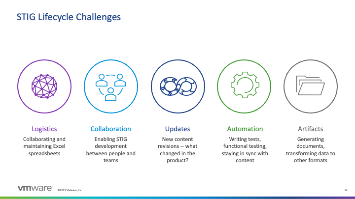

## 3. Security Technical Implementation Guides

A **Security Technical Implementation Guide (STIG)** is a set of requirements imposed by the US Department of Defense and implementation instructions for those requirements that are specific to a paticular software component. The components can be any piece of technology that needs a secure configuration -- operating systems, webservers, application runtimes, routers, and so on. STIGs are published by the Defense Information Systems Agency (DISA), but they're usually written by the software vendor, which naturally has the most domain knowledge about how to secure its product. DISA then peer reviews the vendor's draft content to ensure it meets its rigorous standards. We'll describe the process for working with DISA to formally publish a STIG later on.

STIGs are also expected to stay up-to-date alongside the software component it describes. STIGs are should be updated by the authors and released any time there is a serious change in the software component the STIG describes. Complicated STIGs for widely-used and often-updated components may be updated multiple times a year.

### Security Requirements Guides

STIGs are created based off of high-level, general guidance documents called **Security Requirements Guides (SRGs)**, also published by DISA. SRGs describe DoD-selected security requirements for entire categories of software components, and all STIG requirements are essentially sets of instructions for how to get a particular component to comply with a general SRG (or even a set of SRGs, for complex systems).

::: tip How much STIG are we talking?
STIGs can include hundreds of individual requirements depending on the complexity of the system being configured. At time of writing, the Windows Server 2019 STIG included 303 controls. We need a way to track and manage all of these easily!
:::

#### SRGs and STIGs - Example

For example, there is an SRG that covers operating systems in general (the aptly-named "General Purpose Operating System Security Requirements Guide"). That piece of guidance is full of requirements for an operating system -- *any* operating system -- to be considered reasonably secure. There is a requirement in that SRG (SRG ID: SRG-OS-000021-GPOS-00005) which states that "The operating system must enforce the limit of three consecutive invalid logon attempts by a user during a 15-minute time period."

This requirement is saying that an attacker shouldn't be able to brute force a user's password by throwing a high number of guesses at the system. Simple enough, right?

However, this guidance isn't particularly useful unless we know how to **implement it** on a particular operating system. That's where the STIG comes in. The STIG for, say, Red Hat 8 ("Red Hat Enterprise Linux 8 STIG") has its own requirement for limiting consecutive logon attempts (Rule ID: SV-230334r627750_rule) that cites the relevant SRG IDs that it satisfies. That STIG rule tells us *exactly how to configure Red Hat to satisfy this requirement*, down to which configuration files we need to edit.

You can think of the process of STIG authorship as *distilling* the high-level, general requirements of an SRG into a checklist that anybody can follow to lock down their component.

STIGs are ideally created by a team of subject matter experts on a particular piece of software, all of whom work together to close the gap between the SRG and their shiny new STIG.

### NIST Control Families and DISA Common Control Identifiers

TODO: expand on what the tags on STIGs are and what they align back to

### Challenges with the Traditional Process for STIG Authorship

Vulcan exists because writing STIGs is very time-consuming for reasons that rarely have to do with actual security research.

Before Vulcan, vendors could expect to take anywhere from *18 months to 2 years* to develop a STIG for a reasonably complex piece of software. An unacceptable amount of that time was locked up in document management activities -- simply keeping the author team all up-to-date with each other's work. STIG documents were often created using spreadsheets of requirements emailed back and forth between the authorship team. If you've ever spent hours editing a document only to realize that the rest of your team was editing a completely separate version, take that feeling and multiply it by 300 requirements.

The MITRE SAF© team, acting in collaboration with VMWare (which maintains roughly four dozen STIGs for its software components, at time of writing) and DISA, built the Vulcan webapp to move the STIG authorship workflow into the browser, and add in systems for peer review, role-based access control (RBAC) and a library of STIG and SRG content that can be used for reference in the creation of new STIGs. VMWare has reported that with experienced authors, Vulcan cut down the time to write a STIG down to a few weeks.

### So. . . Why Bother?

Software developers tend to ask themselves this frequently.

Why bother creating STIGs in the first place if it takes this much effort? Even with Vulcan speeding things up and taking on many management functions, creating a STIG takes quite a bit of time. Furthermore, there is a time cost inherent to maintaining the STIG over time, because every major change to a software component requires an update to the STIG as per DoD policy. Why go through the headace?

Recall that if you want to use your software anywhere under the Department of Defense's umbrella (and even in many civilian agencies!) you are **required** to comply with the Security Requirements Guides that apply to your system in order to recieve your Authority to Operate. Taking the long view, *the easiest way to pass security assessments is to write up baseline security guidance early and stick to it.* That is, you have to follow the SRG anyway, and STIGs are checklists on how to make your software follow the SRG. You're just writing all the security documentation you'd have to keep around anyway into one place.