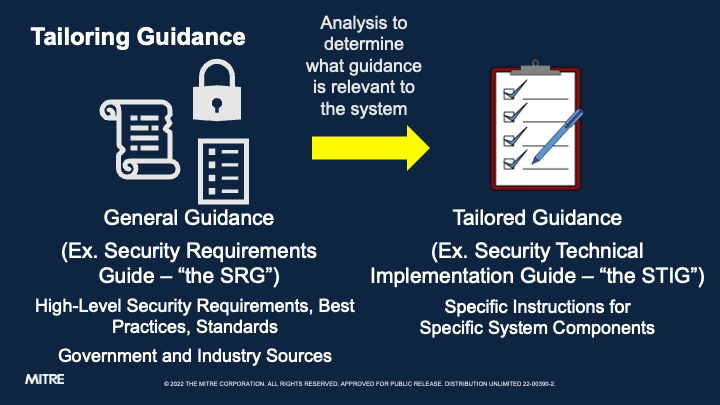
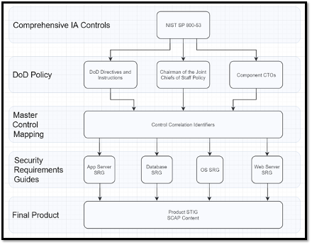
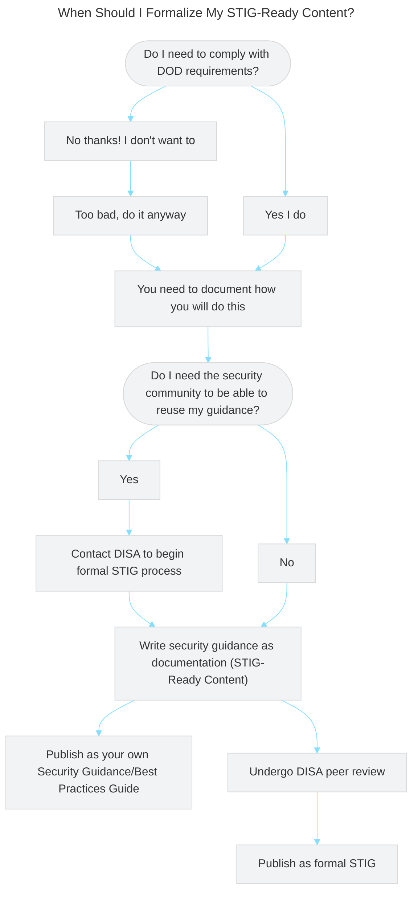
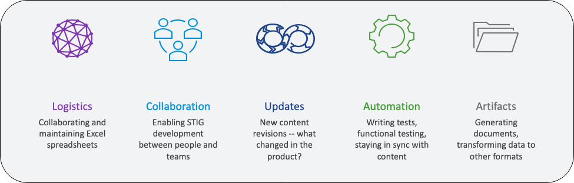

## 3. Security Technical Implementation Guides

A **Security Technical Implementation Guide (STIG)** is a set of requirements imposed by the US Department of Defense and implementation instructions for those requirements that are specific to a paticular software component. The components can be any piece of technology that needs a secure configuration -- operating systems, webservers, application runtimes, routers, and so on.

STIGs are published by the Defense Information Systems Agency (DISA), but they're usually written by software vendors, which naturally have the most domain knowledge about how to secure their products. DISA then peer reviews the vendor's draft content to ensure it meets its rigorous standards. We'll describe the process for working with DISA to formally publish a STIG later on.

STIGs are also expected to stay up-to-date alongside the software component they describe. STIGs must be updated by the authors and released any time there is a serious change in the software component the STIG describes. Complicated STIGs for widely-used and often-updated components may be updated multiple times a year.

::: note Are STIGs Familiar?
Have you ever been required to configure an application or system to STIG-standard before?
:::

### Security Requirements Guides

STIGs are created based off of high-level, general guidance documents called **Security Requirements Guides (SRGs)**, also published by DISA. SRGs describe DoD-selected security requirements for entire categories of software components, and all STIG requirements are essentially sets of instructions for how to get a particular component to comply with a general SRG (or even a set of SRGs, for complex systems).

::: note How much STIG are we talking?
STIGs can include hundreds of individual requirements depending on the complexity of the system being configured. At time of writing, the Windows Server 2019 STIG included 303 controls.

We need a way to track and manage all of these easily!
:::

#### SRGs and STIGs - Example

For example, there is an SRG that covers operating systems in general (the aptly-named "General Purpose Operating System Security Requirements Guide"). That piece of guidance is full of requirements for an operating system -- *any* operating system -- to be considered reasonably secure. There is a requirement in that SRG (SRG ID: SRG-OS-000021-GPOS-00005) which states that "The operating system must enforce the limit of three consecutive invalid logon attempts by a user during a 15-minute time period."

This requirement is saying that an attacker shouldn't be able to brute force a user's password by throwing a high number of guesses at the system. Simple enough, right?

However, this guidance isn't particularly useful unless we know how to **implement it** on a particular operating system. That's where the STIG comes in. The STIG for, say, Red Hat 8 ("Red Hat Enterprise Linux 8 STIG") has its own requirement for limiting consecutive logon attempts (Rule ID: SV-230334r627750_rule) that cites the relevant SRG IDs that it satisfies. That STIG rule tells us *exactly how to configure Red Hat to satisfy this requirement*, down to which configuration files we need to edit.

You can think of the process of STIG authorship as *distilling* the high-level, general requirements of an SRG into a checklist that anybody can follow to lock down their component.

STIGs are ideally created by a team of subject matter experts on a particular piece of software, all of whom work together to close the gap between the SRG and their shiny new STIG.

### Where Do All The Requirements Come From, Anyway?

Published directives from the DoD's Chief Information Officer (DoD CIO) describe the overall Risk Management Framework for DoD Systems (DoD RMF). The DoD RMF requires all information systems across the DoD to be categorized according to how much risk they represent to the organization if compromised. It also requires system owners to select controls from the National Institute of Standards and Technology's (NIST) security control families. You may be familiar with those control families from NIST Special Publication 800-53, because almost all US Government agencies (and quite a few companies) use them as the authoritative list that defines what security controls are.

To speed up the process of control selection, DISA created and published the Control Correlation Identifiers (CCIs), which describe *actions that can be taken* to cover the NIST security control families. CCIs are a bridge between the extremely high-level policy  documents that govern the whole DoD and the low-level documents (i.e. STIGs) that actually tell people how to implement that policy.

DISA also publishes SRGs, which describe *subsets* of CCIs that apply to general categories of information systems. This means that individual system owners do not have to figure out on their own which control families need to be covered for their system; they can instead say "I am deploying a router, so I must cover the requirements selected in the Router SRG."

As described before, an SRG can then be tailored into STIGs that give security guidance for individual pieces of software. The full chain of requirements to implementation therefore looks like this:

#### Now For The Good News

The good news is that you, the STIG content author, don't have to worry about SRGs or control selections all that much; the whole point of all the good work that DISA has done is that most of these mappings have been done for you. You are responsible for the last leg of the journey -- you know your requirements from the SRG, and now you need to figure out how to implement them as a configuration baseline.

### STIG Template Fields

Each requirement in a STIG will contain the following fields.

::: details SRG-Inherited Fields
These fields are imported unchanged from the SRG, so we do not need to worry about them too much as STIG content authors.
- **IA Control**: The NIST control family from which the requirement is sourced.
- **CCI**: A DISA-curated intermediary ID for tying the IA control to individual requirements.
- **SRG ID**: The ID of the SRG requirement this STIG requirement implements.
- **SRG Requirement**: A text description of the SRG requirement this STIG requirement implements.
- **SRG VulDiscussion**: Text field describing the risk incurred by not fulfilling this requirement.
- **SRG Check**: General implementation guidance for how to test if the requirement is met, not specific for any one component. An SRG Check might tell you to see if your router's password has not been changed from the default, for example, but it will not tell you how to do on on a Cisco router, specifically.
- **SRG Fix**: General implementation guidance for how to fix your system if the requirement is not currently met, not specific for any one component.
:::
::: details STIG-Specific Fields
These are the fields we will be responsible for.
- **VulDiscussion**: Text field describing how the vulnerability affects the component that is the specific focus of the STIG.
- **Status**: Field indicating whether the underlying SRG requirement is applicable to the component in question. It might not be. We will discuss this in further detail when we start writing requirements in Vulcan.
- **Check**: Specific instruction on how to validate the component's configuration settings. 
- **Fix**: Specific instructions on how to configure the component to comply with the requirement. 
:::

::: tip Check and Fix
Much of your time writing STIGs will be researching how to fill out the Check and the Fix fields, since those comprise the bulk of the information in STIGs that is not copied from the SRG.
:::

See DISA's Vendor STIG Process Guide section 4.1[^VendorSTIGProcessGuide] for further details on these fields.

### STIG-Ready Content

A piece of security guidance is not a formal STIG until it has been peer reviewed and published by DISA itself. Before publishing, your security guidance is considered **STIG-ready content**.

#### When Should I Get My Content Formally Published?

If all you are looking for is an Authority to Operate for the fancy system your team is making for your project, you may not need to undergo the formal process for peer reviewing and publishing your STIG-ready content through DISA. STIG-ready content, since it is tightly aligned to the requirements in its source SRG, is on its own an excellent foundation to use for security automation activities, such as building out automated hardening scripts and test suites.

If you are a software developer creating a product that you expect will be used by other projects within the DoD, it will likely be beneficial to you to formally publish a STIG for your product. Doing so will **greatly lower** the effort required for your software to be implemented by the Department -- you figure out security once, and no one else will have to reinvent the wheel.

### Challenges with the Traditional Process for STIG Authorship

Vulcan exists because writing STIGs is very time-consuming for reasons that rarely have to do with actual security research.

::: note STIG Authorship Challenges
Have you ever been part of an effort to write a STIG before?
:::

Before Vulcan, vendors could expect to take anywhere from *18 months to 2 years* to develop a STIG for a reasonably complex piece of software. An unacceptable amount of that time was locked up in document management activities -- simply keeping the author team all up-to-date with each other's work. STIG documents were often created using spreadsheets of requirements emailed back and forth between the authorship team. 

::: warning 
If you've ever spent hours editing a document only to realize that the rest of your team was editing a completely separate version, take that feeling and multiply it by 300 requirements.
:::

The MITRE SAF© team, acting in collaboration with VMWare (which maintains roughly four dozen STIGs for its software components, at time of writing) and DISA, built the Vulcan webapp to move the STIG authorship workflow into the browser.

Vulcan adds in systems for:
- Peer Review
- Role-based access control (RBAC)
- Library of STIG and SRG reference content
- Building automated tests alongside human-friendly guidance
- Document Version Control

VMWare has reported that with experienced authors, Vulcan cut down the time to write a STIG down to a few weeks. It also makes the problem of tracking and managing content *over time* much easier.

### So. . . Why Bother?

Software developers tend to ask themselves this frequently.

Why bother creating STIGs in the first place if it takes this much effort? Even with Vulcan speeding things up and taking on many management functions, creating a STIG takes quite a bit of time. Furthermore, there is a time cost inherent to maintaining the STIG over time, because every major change to a software component requires an update to the STIG as per DoD policy. Why go through the headache?

Recall that if you want to use your software anywhere under the Department of Defense's umbrella (and even in many civilian agencies!) you are **required** to comply with the Security Requirements Guides that apply to your system in order to recieve your Authority to Operate. Taking the long view, *the easiest way to pass security assessments is to write up baseline security guidance early and stick to it.* That is, you have to follow the SRG anyway, and STIGs are ultimately just checklists on how to make your software follow the SRG. You're just writing all the security documentation you'd have to keep around anyway into one place.

[^VendorSTIGProcessGuide]: "Vendor STIG Process", Version 4 Release 1. See Resources.