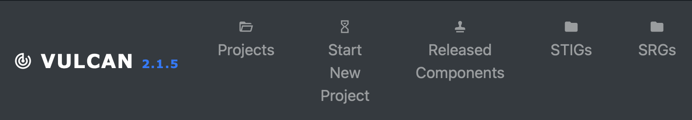

## 3. Security Resource Guidelines

Now we have some idea of what a STIG is. But where do they come from?

STIGs are created based off of high-level, general guidance documents called Security Requirements Guides (SRGs), also published by DISA. SRGs describe security requirements for entire categories of software components, and all STIG requirements are essentially sets of instructions for how to get a particular component to comply with a general SRG.

For example, there is an SRG that covers operating systems in general ("	General Purpose Operating System Security Requirements Guide"). That piece of guidance is full of requirements for an operating system -- *any* operating system -- to be considered reasonably secure. There is a requirement in that SRG (SRG ID: SRG-OS-000021-GPOS-00005) which states that "The operating system must enforce the limit of three consecutive invalid logon attempts by a user during a 15-minute time period."

This requirement is saying that an attacker shouldn't be able to brute force a user's password by throwing a high number of guesses at the system. Simple enough, right?

However, this guidance isn't particularly useful unless we know how to **implement it** on a particular operating system. That's where the STIG comes in. The STIG for, say, Red Hat 8 ("Red Hat Enterprise Linux 8 STIG") has its own requirement for limiting consecutive logon attempts (Rule ID: SV-230334r627750_rule) that cites the relevant SRG IDs that it satisfies. That STIG rule tells us exactly how to configure Red Hat to satisfy this requirement, down to which configuration files we need to edit.

### 3.1 Consider your applications requirements
- What is the **goal** of the application?
- What type of security guidelines does it need?

### 3.2 Choosing an SRG
- At the top of the page, click the "SRGs" button.

- You'll need to decide which high level guidance you want to base your STIG off of. Or you can upload your own, as long as it's in XCCDF format or an XML document.

*Note: For this course, the "Application_Security_Development_STIG" is going to be chosen.
