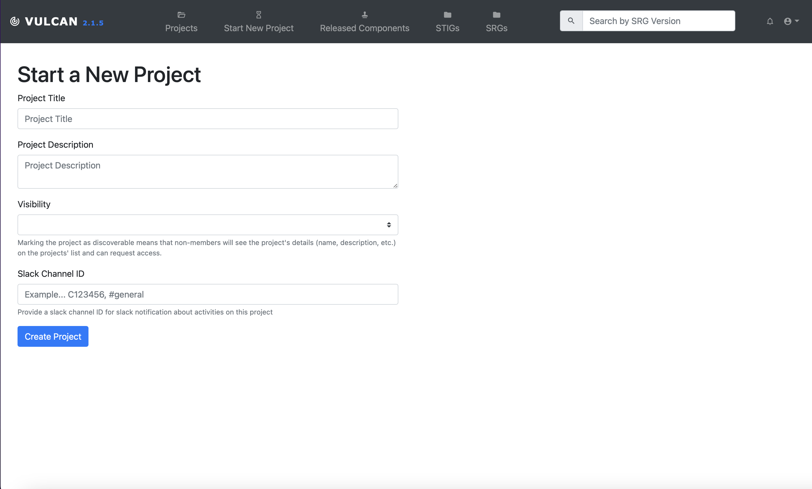

## 4. Starting The Project

### 4.1
- Now you can start your project, after outlining the needs of your application and choosing an SRG.

- At the top of the page, click the "Start New Project" button. 

- Name your project, give it a description, and choose its visibility.

### 4.2 Optional: Adding Members to Your Project
* Optional: Once your project has been created, there's a tab titled "Members" where you can add users to your project and assign them a role.
- The types of roles include:

*Viewer: Read only access to the Project or Component

*Author: Edit, comment, and mark Controls as requiring review. Cannot sign-off or approve changes to a Control. Great for individual contributors.

*Reviewer: Author and approve changes to a Control.

*Admin: Full control of a Project or Component. Lock Controls, revert controls, and manage members.
