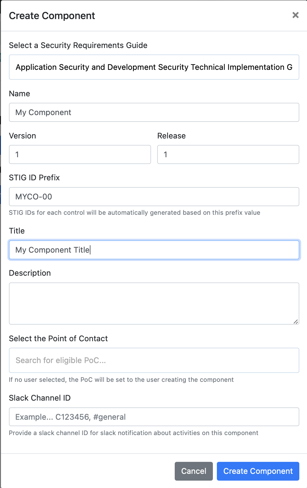
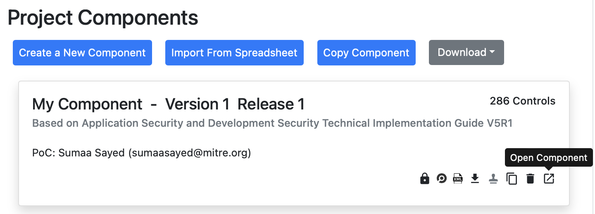
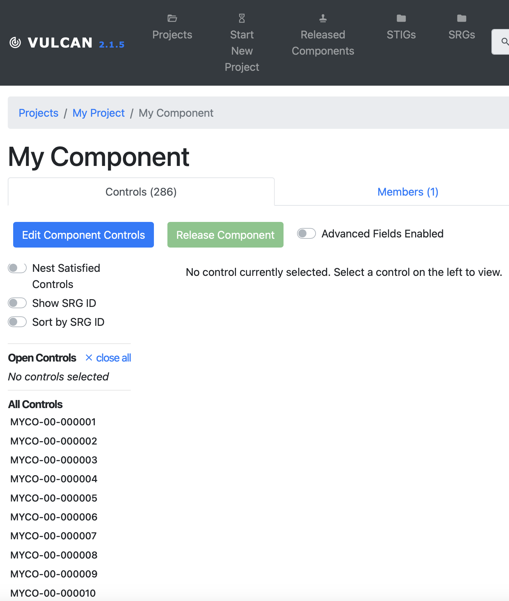

## 5. Components

### 5.1 What is a Component?
[add text here]

### 5.2 Creating a Component for Your Project
- Go to the "Components" tab on the page, and click "Create a New Component"
Here, you'll select the SRG of your choice, name the component, enter the version and release, a STIG ID prefix, and a title. 

- Optional: You can also enter a description, a point of contact, and a Slack Channel ID if you want.

- Once you're done, click "Create Component"

### 5.3 Opening Components
- After the component has been created, click the "Open Component" button

- The page should look something like this: 

- Note: On the left side of the page, scroll down a little, and there is a section titled "All Controls". These are all of the controls in the SRG chosen, and you can tailor them for your application. 

