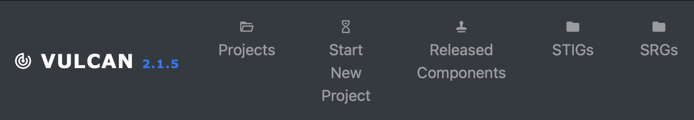

## 5. Components

### Consider Your Application's Requirements
- What is the **goal** of the application?
- What type of security guidelines does it need?

#### Choosing an SRG
- At the top of the page, click the "SRGs" button.

- You'll need to decide which high level guidance you want to base your STIG off of. Or you can upload your own, as long as it's in XCCDF format or an XML document.

*Note: For this course, the "Application_Security_Development_STIG" is going to be chosen.

### 5.1 What is a Component?
[add text here]

### 5.2 Creating a Component for Your Project
- Go to the "Components" tab on the page, and click "Create a New Component"
Here, you'll select the SRG of your choice, name the component, enter the version and release, a STIG ID prefix, and a title. 

- Optional: You can also enter a description, a point of contact, and a Slack Channel ID if you want.

- Once you're done, click "Create Component"

### 5.3 Opening Components
- After the component has been created, click the "Open Component" button

- The page should look something like this: 

- Note: On the left side of the page, scroll down a little, and there is a section titled "All Controls". These are all of the controls in the SRG chosen, and you can tailor them for your application. 

