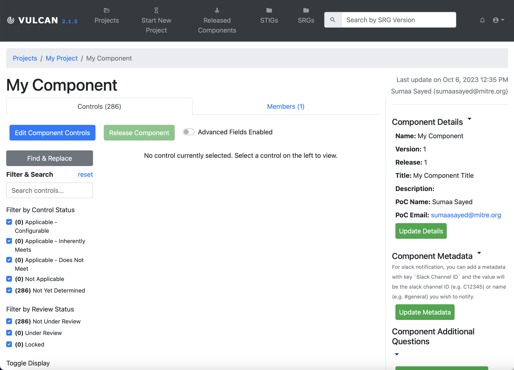

## 6. Tailoring Your Components

### 6.1
- For your application, you'll need to decide what controls will be appliable to your application, which ones need some tailoring, and which ones will not be applicable to your application.

### 6.2 Editing Components
- If you want to make any changes/edits to the controls, click the "Edit Component Controls" button at the top.

- For each control, its status can be updated to the following:

*Applicable – Configurable: The product requires configuration or the application of policy settings to achieve compliance.

*Applicable – Inherently Meets: The product is compliant in its initial state and cannot be subsequently reconfigured to a noncompliant state.

*Applicable – Does Not Meet: There are no technical means to achieve compliance.

*Not Applicable: The requirement addresses a capability or use case that the product does not support

### STIG Format
TODO: describe how to write a professional STIG, ergo being extremely clear about what counts as a finding, caveats for different deployment strategies, applicabilities, etc.