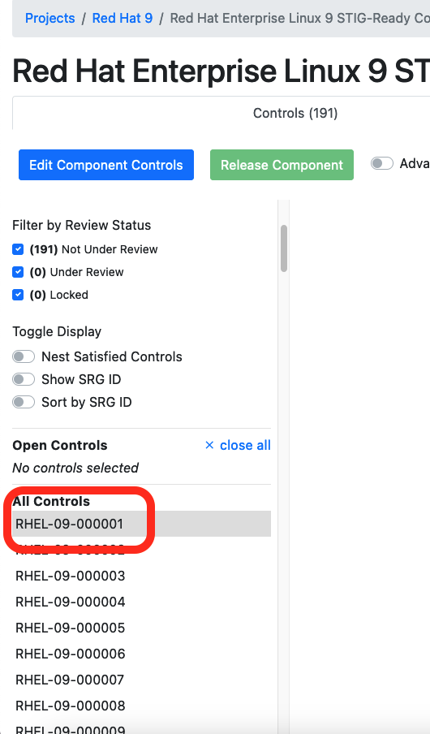

## 6.1 Editing Components

For your Component, you'll need to decide what requirements are appliable to your specific Component (hint: not all of them will be). Of the applicable requirements, you'll need to tailor them to give specific implementation guidance.

## 6.2 The Editing Window

1. Click the "Edit Component Controls" button at the top of your Vulcan window on the left hand side.

::: note Controls vs. Requirements
You may note that Vulcan refers to the STIG requirements as "controls." A **security control** is an action taken by an organization *in order to meet a security requirement.* 

STIGs are technically comprised of a set of *requirements,* but each requirement's main focus is describing a control to meet that requirement (i.e. the Check and Fix content).
:::

2. Now let's select a requirement. Let's start with RHEL-09-000001.

You'll see a view of the requirement's text fields, like the vulnerability discussion, the check text, and the fix text.

Note how all of these text fields are:
- Pre-populated with the underlying SRG data for the general requirement (in this case SRG-OS-000001-GPOS-00001)
- Grayed-out and uneditable at present.

We can't edit these text fields yet because we haven't yet told Vulcan if this requirement is even applicable to our Component. Let's fix that.

#### Requirement Statuses

The process of tailoring SRG requirements into specific STIG controls first requires you to determine which of the following statuses applies to each requirement[^Statuses]:

TODO -- upload the rest of the RHEL STIGs for reference

- **Applicable – Configurable**: The product requires configuration or the application of policy settings to achieve compliance.

- **Applicable – Inherently Meets**: The product is compliant in its initial state and cannot be subsequently reconfigured to a noncompliant state.

- **Applicable – Does Not Meet**: There are no technical means to achieve compliance.

- **Not Applicable**: The requirement addresses a capability or use case that the product does not support.

If you select any status other than "Applicable - Configurable" for a requirement, you'll need to fill out a few fields explaining why you did so.

3. Set the "Status" field of 

### STIG Format
TODO: describe how to write a professional STIG, ergo being extremely clear about what counts as a finding, caveats for different deployment strategies, applicabilities, etc.

[^Statuses]: Definitions from Table 4-1 in DISA's Vendor STIG Process Guide. See [Resources](TODO figure out how these dang local links work).