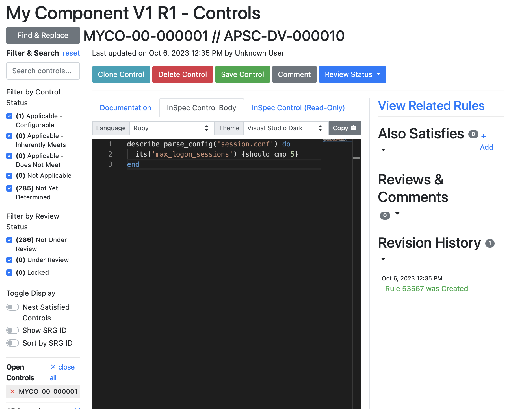
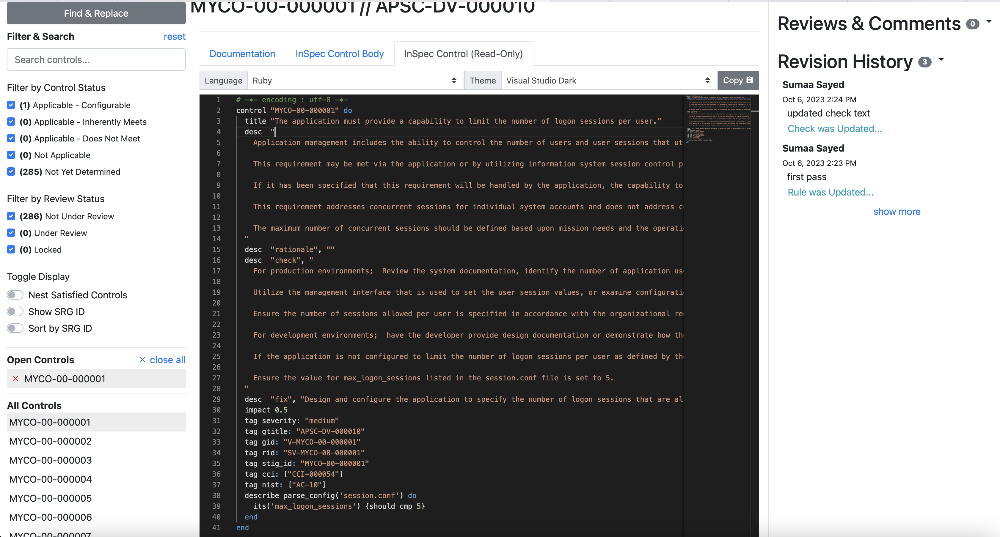

## 7. Automated Validation Tests

### 7.1 Writing Tests for Controls
- For the controls that are applicable, you can click the tab that says "InSpec Control Body" and write an automated validation test for the control.

- As an example, control MYCO-00-00001 requires that the application must limit the number of logon sessions per user. The test written in the example will parse through a file called "session.conf" and make sure that the max_logon_sessions variable/input is set to a value. In this example, it is set to 5.

### 7.2 Saving Controls & Revision History
- Once you are done with writing a test, be sure to click the "Save Control" button at the top.
- You can also see that the control changes were saved by looking on the right side of the page, under "Revision History". 
- To see the entire control, with the documentation and InSpec test, click the tab that says "InSpec Control (Read Only)"

