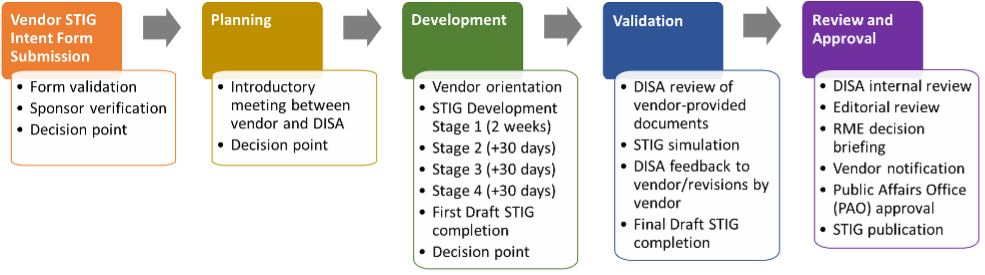

## 10.1 Formally Publishing a STIG

First and foremost - reach out early!

Note that DISA prefers to work with vendors early to help them select the SRG that their STIG should be written for.

enhancements: VMWare et al have used vulcan to publish needed artifacts much faster

Formalizing the STIG
    - All the stuff related to actually working with DISA to formalize and publish the STIG-ready content you wrote
    - Vendor Intent Process

TODO: note that in government contexts, even if there isn't a  STIG, you **still need to comply with the SRG**, and as such using Vulcan to create STIG-ready content is useful

### Vendor Intent Process

