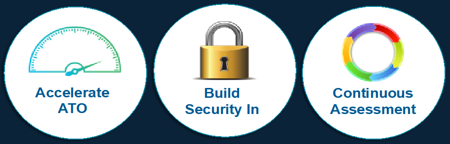

## 2. Traditional Security Validation Lifecycle

### 2.1 Consider your current status
- How frequently does the software get assessed?
- How long does it takes to assess?
- What is the biggest struggle for assessment?
- What would be your dream for changing the process you use to do security assessments?
- What are you hoping to get out of this course today?

### 2.2 The goals of the SAF
#### 1. Accelerate ATO
- Automate tailored security configuration testing in every build
- Aggregate all security assessment results in a single dashboard to show security status
#### 2. Build Security In
- Automate security control assessment aligned to common standards
- Implement security requirements within existing DevSecOps pipelines
#### 3. Continuous Assessment
- Visualize results of all ongoing assessments to understand risk over time
- Enable ongoing or continuous authorization to operate (cATO)

