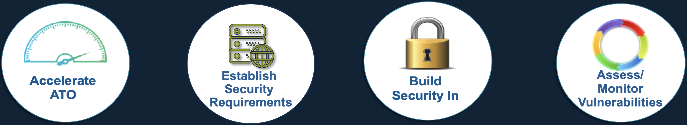

## 2. Traditional Security Validation Lifecycle

### 2.1 Consider your current status
1. What is your role in the security process of your organization?
2. How frequently and for how much time does the software get assessed?
3. What is the biggest challenge for maintaining and assessing socftware security?
4. What changes would improve software assessment in your context?
5. What do you want to learn from this training?

### 2.2 The goals of the SAF
#### 1. Accelerate ATO
- Automate tailored security configuration testing in every build
- Aggregate all security assessment results in a single dashboard to show security status
#### 2. Establish Security Requirements
#### 3. Build Security In
- Automate security control assessment aligned to common standards
- Implement security requirements within existing DevSecOps pipelines
#### 4. Assess/Monitor Vulnerabilities
- Visualize results of all ongoing assessments to understand risk over time
- Enable ongoing or continuous authorization to operate (cATO)

