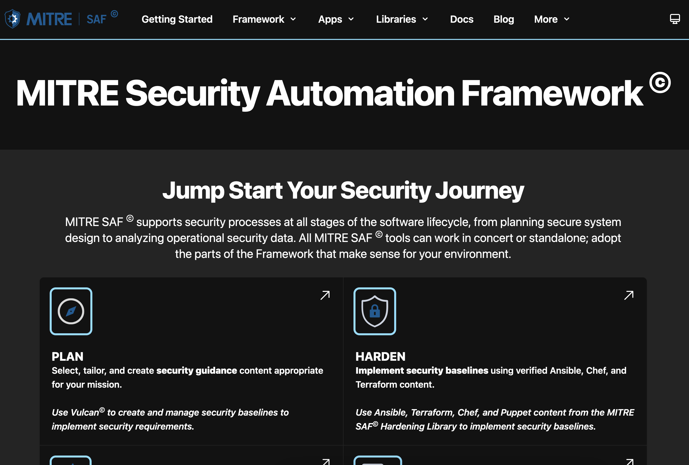

## 4. Start with Planning
The SAF's main pillars are Plan, Harden, Validate, Normalize, and Visualize. First, it is necessary to plan what components will be in your system and identify the security guidance available for those components. 

### 4.1 Identify your stack of components for the system
Your software system is composed of multiple components. i.e., Cloud Services, Virtualization Platforms, Operating Systems, Databases, Application Logic, and Web Servers.

The first step of any assessment is identifying the components for the system you are assessing.  
<!-- [[Graphic of Stack with Redhat 7, NGINX]] -->

### 4.2 What is the guidance?
There could be Security Technical Implementation Guides (STIGs), Security Requirements Guides (SRGs), Center for Internet Security (CIS) Benchmarks, or vendor guidance written for the components in your software stack. Being aware of these can help inform which profile to use. Additionally, note here any specific requirements for your organization that might differ from the specific published guidance. This will inform how to tailor the profiles later on.

### 4.3. Identify which profiles match these components

After we have identified the stack from the previous step you would then go to the [SAF site](saf.mitre.org). The site will look like this:  

Now, navigate to the [Validate page](https://saf.mitre.org/#/validate) to identify which profiles are currently written to validate against your stack:  

### 4.4. What if there is no profile?
- First, reach out to the SAF team at saf@groups.mitre.org to find out if there is a profile in development or otherwise available but not listed that could meet your needs.
- Second, if there is still no profile available, identify the security guidance to which the profile should comply and reach out to find out how to best create that profile. We help teams do this and provide training courses on that as well!
- Third, if there is no guidance available for your particular component, talk with us about developing the guidance using [MITRE's Vulcan application](https://vulcan.mitre.org/). A training course on security guidance development will be coming soon.