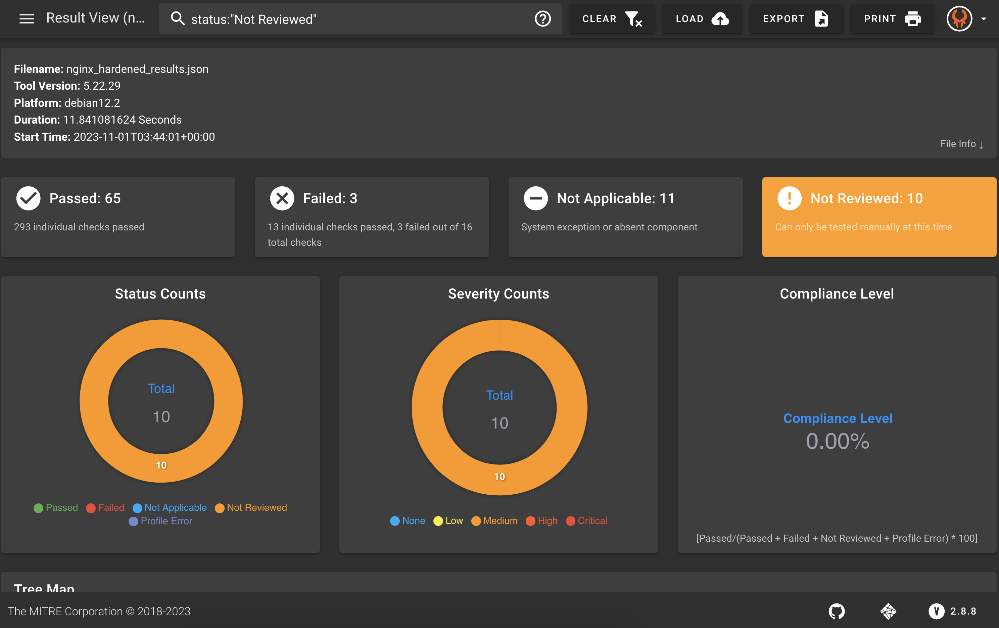
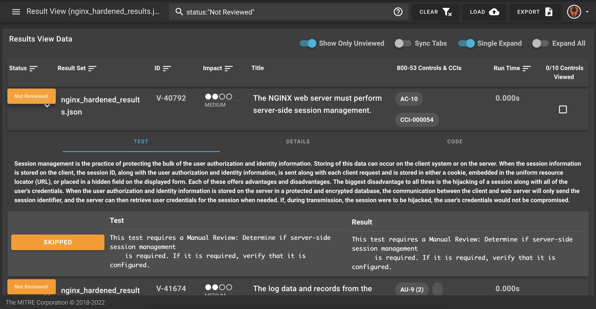

## 12. Manual Attestations

What about controls that cannot be automated and require manual review? You may have noticed that Heimdall displays controls in 4 statuses: `Passed`, `Failed`, `Not Applicable`, and `Not Reviewed`.

Controls may be `Not Reviewed` for multiple reasons. One major reason is that the control requires manual review. You can explore the details of the `Not Reviewed` controls to find out more.

### 12.1 Explore the Not Reviewed Controls

Look at the hardened results again in Heimdall. Go back to the menu in the top left to toggle off "Comparison View" and select on the hardened results.



Scroll down to see the details and learn why the controls were not reviewed.



You can see that for various reasons, many of these controls require manual review. If someone does that manual review, how can we show that in the data?

### 12.2 Manual Attestations Using SAF CLI

You have already seen the InSpec profiles and the Heimdall application that the SAF provides. Another feature of the SAF is the SAF CLI. This is a command line utility tool that helps with various steps in the security automation process. You can see all of the SAF CLI's capability [here](saf-cli.mitre.org), but we will look more at how we can use it to add manual attestation data to our overall results.

### 12.3 Get Familiar with SAF CLI

SAF CLI has been downloaded into your Codespaces lab environmnet, so it is available for you to use on the command line. Try out a few commands to see what you can do!

```sh
saf --version
```

```sh
saf help
```

```sh
saf attest help
```

### 12.4 Create Manual Attestation Data

After someone on your team completes the manual check that is required for your security control, record that information with the help of the SAF CLI.

```sh
saf attest create -o ./results/manual_attestation_results.json
```