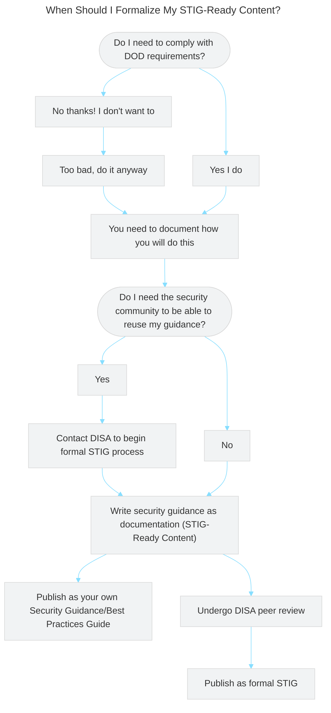
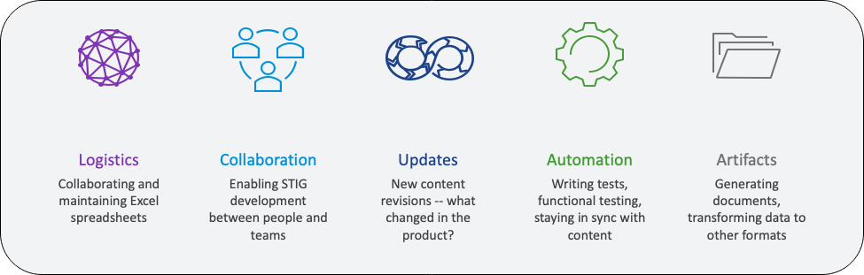

## 4.1 STIG Template Fields

Each STIG is a set of requirements and implementation guidance on how to meet them (which we will abbreviate as just a "STIG requirement"). Let's dive into the technical details that make up a STIG requirement.

Each requirement in a STIG will contain the following fields.

::: details SRG-Inherited Fields
These fields are imported unchanged from the SRG, so we do not need to worry about them too much as STIG content authors.
- **IA Control**: The NIST control family from which the requirement is sourced.
- **CCI**: A DISA-curated intermediary ID for tying the IA control to individual requirements.
- **SRG ID**: The ID of the SRG requirement this STIG requirement implements.
- **SRG Requirement**: A text description of the SRG requirement this STIG requirement implements.
- **SRG VulDiscussion**: Text field describing the risk incurred by not fulfilling this requirement.
- **SRG Check**: General implementation guidance for how to test if the requirement is met, not specific for any one component. An SRG Check might tell you to see if your router's password has not been changed from the default, for example, but it will not tell you how to do on on a Cisco router, specifically.
- **SRG Fix**: General implementation guidance for how to fix your system if the requirement is not currently met, not specific for any one component.
:::
::: details STIG-Specific Fields
These are the fields we will be responsible for.
- **VulDiscussion**: Text field describing how the vulnerability affects the component that is the specific focus of the STIG.
- **Status**: Field indicating whether the underlying SRG requirement is applicable to the component in question. It might not be. We will discuss this in further detail when we start writing requirements in Vulcan.
- **Check**: Specific instruction on how to validate the component's configuration settings. 
- **Fix**: Specific instructions on how to configure the component to comply with the requirement. 
:::
::: tip Check and Fix
Much of your time writing STIGs will be researching how to fill out the Check and the Fix fields, since those comprise the bulk of the information in STIGs that is not copied from the SRG.
:::
::: tip How Can I Examine STIGs?
We mentioned earlier that STIGs are distributed in XML format (Specifically, the files use the XCCDF XML schema).

There are several apps that allow you to crack open the XML for display:
- STIG Viewer: DISA's own application for STIG examination. You can download it fromo the [DOD Cyber Exchange](https://public.cyber.mil/stigs/downloads/) just like the STIGs themselves.
- Vulcan: Vulcan itself can of course be used to load and view XCCDF XML documents.
- [Heimdall](https://saf.mitre.org/apps/heimdall) (coming soon!): The MITRE SAF team is working to implement all of STIG Viewer's functionality into the Heimdall application, so that policy documents and scan data can be examined by the same application. 
:::

See DISA's Vendor STIG Process Guide section 4.1 for further details on these fields.

## 4.2 STIG-Ready Content

A piece of security guidance is not a formal STIG until it has been peer reviewed and published by DISA itself. Before publishing, your security guidance is considered **STIG-ready content**.

### 4.2.1 When Should I Get My Content Formally Published?

If all you are looking for is an Authority to Operate for the fancy system your team is making for your project, you may not need to undergo the formal process for peer reviewing and publishing your STIG-ready content through DISA. STIG-ready content, since it is tightly aligned to the requirements in its source SRG, is on its own an excellent foundation to use for security automation activities, such as building out automated hardening scripts and test suites.

If you are a software developer creating a product that you expect will be used by other projects within the DOD, it will likely be beneficial to you to formally publish a STIG for your product. Doing so will **greatly lower** the effort required for your software to be implemented by the Department -- you figure out security once, and no one else will have to reinvent the wheel.

## 4.3 Challenges with the Traditional Process for STIG Authorship

Vulcan exists because writing STIGs is very time-consuming for reasons that rarely have to do with actual security research.

::: note STIG Authorship Challenges
Have you ever been part of an effort to write a STIG before?
:::

Before Vulcan, vendors could expect to take anywhere from *18 months to 2 years* to develop a STIG for a reasonably complex piece of software. An unacceptable amount of that time was locked up in document management activities -- simply keeping the author team all up-to-date with each other's work. STIG documents were often created using spreadsheets of requirements emailed back and forth between the authorship team. 

::: warning 
If you've ever spent hours editing a document only to realize that the rest of your team was editing a completely separate version, take that feeling and multiply it by 300 requirements.
:::

The MITRE SAF© team, acting in collaboration with VMWare (which maintains roughly four dozen STIGs for its software components, at time of writing) and DISA, built the Vulcan webapp to move the STIG authorship workflow into the browser.

Vulcan adds in systems for:
- Peer Review
- Role-based access control (RBAC)
- Library of STIG and SRG reference content
- Building automated tests alongside human-friendly guidance
- Document Version Control

VMWare has reported that with experienced authors, Vulcan cut down the time to write a STIG down to a few weeks. It also makes the problem of tracking and managing content *over time* much easier.

### 4.3.1 So. . . Why Bother?

Software developers tend to ask themselves this frequently.

Why bother creating STIGs in the first place if it takes this much effort? Even with Vulcan speeding things up and taking on many management functions, creating a STIG takes quite a bit of time. Furthermore, there is a time cost inherent to maintaining the STIG over time, because every major change to a software component requires an update to the STIG as per DOD policy. Why go through the headache?

Recall that if you want to use your software anywhere under the Department of Defense's umbrella (and even in many civilian agencies!) you are **required** to comply with the Security Requirements Guides that apply to your system in order to recieve your Authority to Operate.

Taking the long view, *the easiest way to pass security assessments is to write up baseline security guidance early and stick to it.* That is, you have to follow the SRG anyway, and STIGs are ultimately just checklists on how to make your software follow the SRG. You're just writing all the security documentation you'd have to keep around anyway into one place.