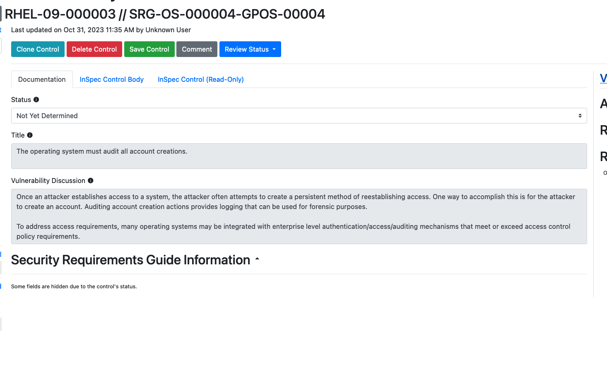
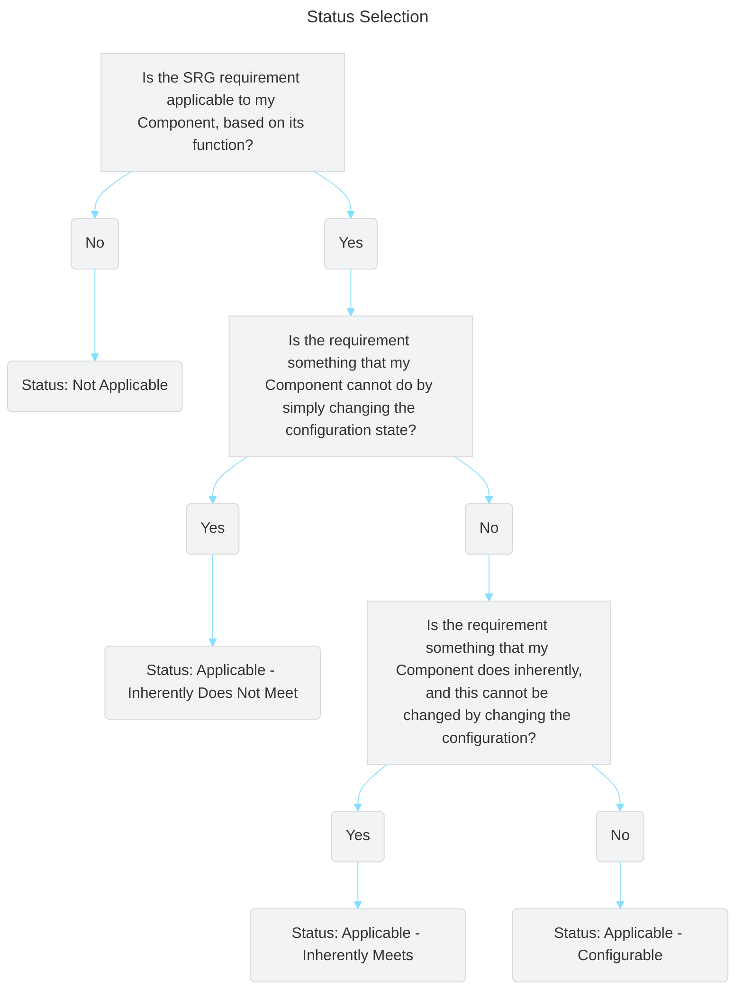
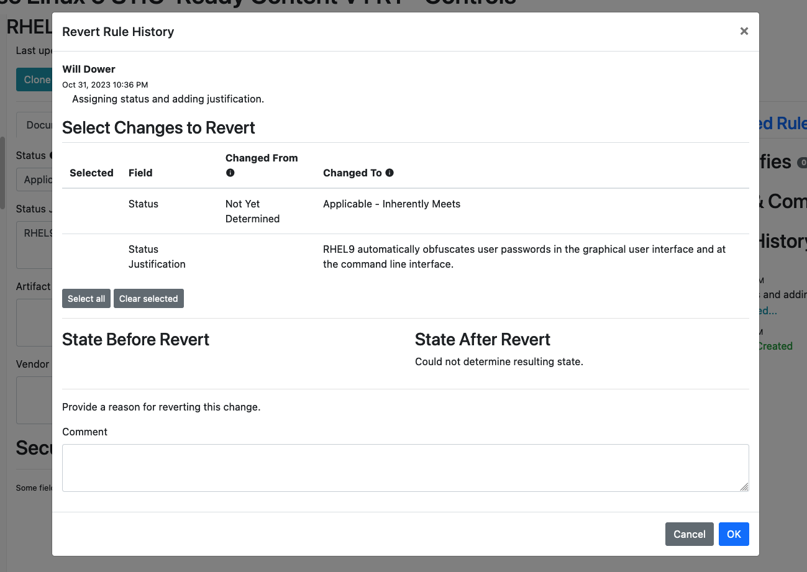

## 7.1 Editing Components

For your Component, you'll need to decide what requirements are appliable to your specific Component (hint: not all of them will be). Of the applicable requirements, you'll need to tailor them to give specific implementation guidance.

## 7.2 The Editing Window

1. Click the "Edit Component Controls" button at the top of your Vulcan window on the left hand side.

::: note Controls vs. Requirements
You may note that Vulcan refers to the STIG requirements as "controls." A **security control** is an action taken by an organization *in order to meet a security requirement.* 

STIGs are technically comprised of a set of *requirements,* but each requirement's main focus is describing a control to meet that requirement (i.e. the Check and Fix content).
:::

2. Now let's select a requirement. Let's start with RHEL-09-000003. (Normally, we'd start with number 1, but for this exercise we'll pick a simple requirement.)

You'll see a view of the requirement's text fields, like the vulnerability discussion, the check text, and the fix text.

Note how all of these text fields are:
- Pre-populated with the underlying SRG data for the general requirement (in this case SRG-OS-000004-GPOS-00004)
- Grayed-out and uneditable at present.

We can't edit these text fields yet because we haven't yet told Vulcan if this requirement is even applicable to our Component. Let's fix that.

## 7.3 Requirement Statuses

The process of tailoring SRG requirements into specific STIG controls first requires you to determine which of the following statuses applies to each requirement[^Statuses]:

- **Applicable – Configurable**: The product requires configuration or the application of policy settings to achieve compliance.

- **Applicable – Inherently Meets**: The product is compliant in its initial state and cannot be subsequently reconfigured to a noncompliant state.

- **Applicable – Does Not Meet**: There are no technical means to achieve compliance.

- **Not Applicable**: The requirement addresses a capability or use case that the product does not support.

If you select any status other than "Applicable - Configurable" for a requirement, you'll need to fill out a few fields explaining why you did so. We'll take a look at a requirement like that in a moment.

### 7.3.1 Picking a Status

Based on the above definitions, we can use the following workflow to determine the right status.

### 7.3.2 Our First Requirement Status
3. Let's pick a status for RHEL-09-000003. We will do this by reading the SRG requirement and determining if it applies to this particular component, and if so, if it is an innate feature of the system or not.

The requirement's title is *"The operating system must audit all account creations."*

::: details Based on the title, do you think this requirement applies to RHEL9 or not? If it applies, does RHEL9 need to be configured/can it be configured to do it?
This requirement does apply. RHEL9, like any other operating system, must have a functioning auditing system; no inherent aspect of RHEL would change this.

RHEL9, like all operating systems, has a built in auditing capability. The auditing capability is configurable (i.e. it is possible to have the system configured to *either* meet or not meet this requirement).
:::
::: tip How do we know all this about the system?
If you are not familiar with the RHEL9 auditing system, don't worry; it's just an example we're using for the class. We promise we will not quiz you on how the `auditd` service works.

If you have to develop STIG content for a project, it will concern a Component that you are familiar with enough to answer these questions (or are at least in a position to research).
:::
::: details Based on your decision, what status should we give this component?
We would consider this requirement **Applicable - Configurable.** The system is capable of complying with the SRG requirement, but only if properly configured.
:::

4. Based on our decision, let's edit the status field in the Component editing screen.
::: details Changing status

Hint: Most SRG requirements wind up being applicable to Components. A handful may be either Not Applicable, Inherently Met or Inherently Not Met. We still have to check.
:::

Note that once we select the status, the text fields become editable. Now we can tailor the general guidance from the SRG into specific guidance.

Before we do that, let's investigate a the Status field a bit more.

### 7.3.3 Another Requirement Status

5. Let's skip ahead and pick an example with a different status. On the sidebar, click on RHEL-09-000045.

Our title here is "The operating system must obscure feedback of authentication information during the authentication process to protect the information from possible exploitation/use by unauthorized individuals."

::: details Based on the title, do you think this requirement applies to RHEL9 or not? If it applies, does RHEL9 need to be configured/can it be configured to do it?
Yes, this requirement still applies. Like most requirements, RHEL9 doesn't have any quirks that would make this requirement not apply.

However, you may know that RHEL (and all Linux OSes) obscure user passwords when they are entered either into the GUI or on the terminal. This behavior is baked into the RHEL source code -- there is no way for a user to configure the system to not do this.

As such, the status should be **Applicable - Inherently Meets.**
:::

6. Let's once again update the status of our requirement to match what we picked.

::: details Updating Status

:::

Notice that this time, several of the fields in the Vulcan editing window changed.

## 7.4 Mitigations, Artifacts and Justifications

If a requirement is flagged as any of Not Applicable, Inherently Met, or Inherently Not Met, then we need to offer proof that this is the case, and give the end users guidance on how to mitigate the vulnerability if the requirement cannot be met.

If we select any of those statuses in Vulcan, we therefore get a different set of fields to complete. We can't describe them better than DISA can, so we will refer you to the Vendor STIG guide[^VendorSTIGProcessGuide] for the definitions of the new fields.

### 7.4.1 Mitigation

Per Per the Vendor STIG Process Guide section 4.1.15 -

"The Mitigation offers a method for minimizing risk. Mitigations do not eliminate the need for the requirement. 

The “Mitigation” field must be populated if the status of the requirement is Applicable – Does Not Meet.

After the mitigation, include a summary statement to address any impact to the overall risk associated with this requirement. 

Example summary statements:
- With the implementation of this mitigation, the overall risk can be decreased to a CAT [II or III].
- With the implementation of this mitigation, the overall risk is fully mitigated.
- Although the listed mitigation is supporting the security function, it is not sufficient to reduce the residual risk of this requirement.

An “Applicable – Does Not Meet” vulnerability may be fully mitigated by the application of another STIG check or by the underlying operating system. In these instances, include a statement in the Mitigation as shown in the example below. 

Examples of risk mitigated by other STIG requirements:
- This requirement is fully mitigated by the Apache Server 2.4 Windows Server STIG. The Apache Web Server accounts not used by installed features (e.g., tools, utilities, specific services) must not be created and must be deleted when the Apache web server feature is uninstalled. (AS24-W1-000280)
- This requirement is fully mitigated by the underlying operating system. (WN16-SO-000430)"

### 7.4.2 Artifacts

Per the Vendor STIG Process Guide section 4.1.16 -

"Populate this information for requirements that have a status of Applicable – Inherently Meets. The Artifact Description describes the artifacts or substantiating information that shows how the product inherently meets the requirement. 

All self-certification claims must be accompanied by supporting vendor documentation, which taken as a whole, provides DISA with reasonable assurance that the particular requirement has been met.

This field provides citations to the documentary evidence that describe how each requirement is satisfied. Examples of artifacts include:
- A test report describing the test procedures used to verify compliance and corresponding results, including the specific version of tools used to test and date of test.
- A published administrative manual or configuration guide explaining how compliance can be achieved.
- An attestation from the product developer that the product is compliant, accompanied by a brief statement describing the technical means by which compliance is achieved.
- Steps to verify the product cannot be configured to be out of compliance with the requirement.

Note: Blogs and email messages are not sufficient documentation to support an Applicable – Inherently Meets status."

### 7.4.3 Status Justification

Per the Vendor STIG Process Guide section 4.1.17 -

"For requirements that have a status of Not Applicable: 
- Explain in the Status Justification text why the requirement is not applicable. 
- The most common explanations are that the requirements concern a capability that is not present on the device (e.g., encryption of removable data storage media where the product does not support removable media) or the requirement pertains to an operational environment in which the product will not be placed (e.g., the requirement applies to classified processing when the product is intended only for unclassified applications).

For requirements that have a status of Applicable – Does Not Meet:
- Explain in the Status Justification text what function or feature is not present. 
- If some part of the requirement is achievable, the Status Justifications should explain what part of the requirement is unmet and what is met (e.g., the system can lock an account after certain failed logon attempts, but these failures are not limited to a specific window of time). 
- If no part of the requirement can be fulfilled, note this information. 
- Describe the residual risk after any mitigation is applied.

For requirements that have a status of Applicable – Inherently Meets
- List in the Status Justification text the specific feature of the product that supports this requirement and that cannot be changed. 
- Note the type of evidence used to establish compliance (e.g., test report, vendor documentation, or vendor attestation)."

::: warning What about the Vendor Comments field?
You may note that picking any status in Vulcan opens the Vendor Comments field for editing.

That field is purely stored in Vulcan and will not be included in any exports. It exists for the content authors to leave comments on the process of writing the requirement.

For example, an author may add their references for a control's Check or Fix text in the Vendor Comment field, since a reviewer might like to know how they arrived at their conclusions.
:::

### 7.4.4 Completing Our Requirement

We will not complete the Artifact field in RHEL-09-000045 because digging around in the RHEL9 source code is beyond the scope of this course.

7. However, let's be sure to enter in a Status Justification:

**RHEL9 automatically obfuscates user passwords in the graphical user interface and at the command line interface.**

Like so:

Hit "Save Control" when finished.

You'll be asked to fill out a short description of the change you made. If you are familiar with a source code manager like Git, this process is analogous to adding a commit message when you add code to version control.

## 7.5 Revision History

Once we save edits, we will see the Revision History on the right side of the screen automatically update:

Clicking the "Rule Was Updated" button will show a before and after view of what was changed by the edit.

You can even select changes to revert, again similar to how a source code manager lets you roll back changes.

::: tip Why would I revert changes?
Remember that writing requirements in Vulcan is intended to be done in groups. Authors can and do often disagree about how a requirement should be completed.

Having the ability to granularly revert edits -- and even just track what change was made, when, and by who -- is an important part of a collaborative workflow.
:::

[^Statuses]: Definitions from Table 4-1 in DISA's Vendor STIG Process Guide. See Resources.
[^VendorSTIGProcessGuide]: Sections 4.1.15 through 4.1.17 of the "Vendor STIG Process", Version 4 Release 1.