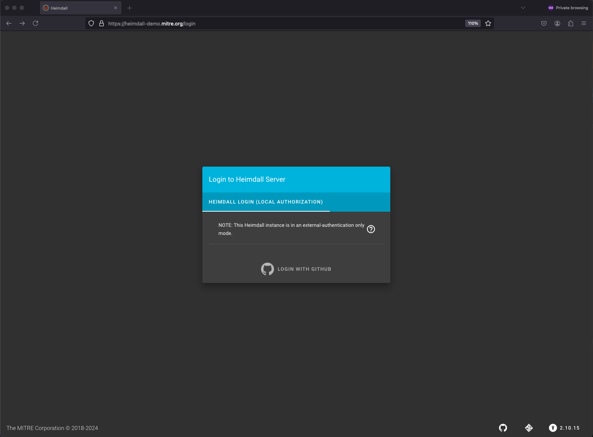
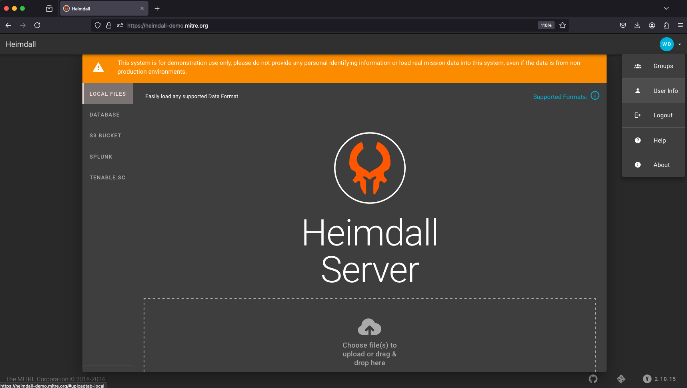
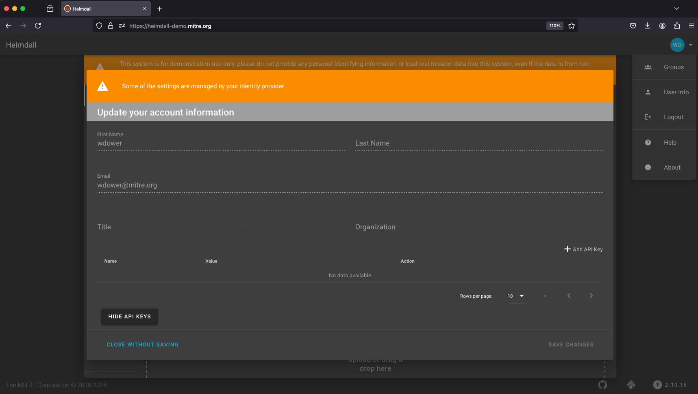
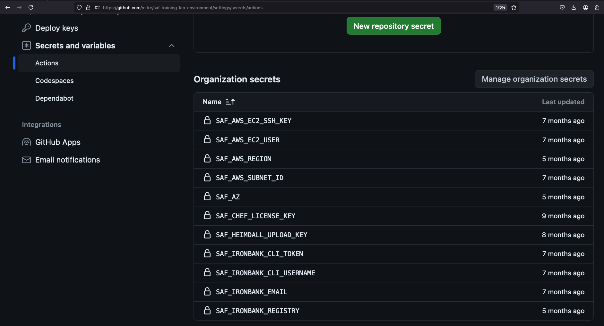
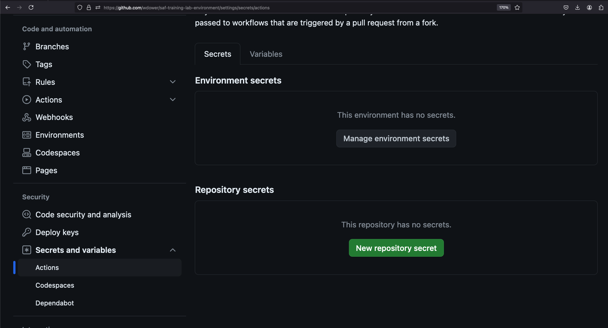
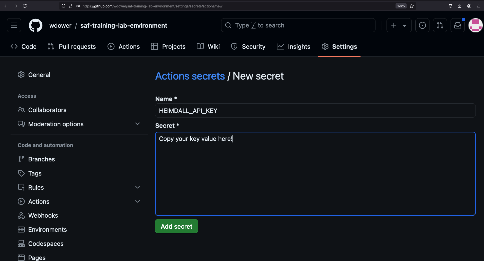

## More Pipeline Steps

Let's make this pipeline deploy, harden, validate, and verify an NGINX container.

### Prep Steps

First, we need to make sure that the node that runs our pipeline will have access to the executables it needs. By default, Gitub's runners have quite a bit of software pre-installed, including Docker and Ansible (see the full list [here](https://github.com/actions/runner-images/blob/main/images/linux/Ubuntu2004-Readme.md)). However, the Ubuntu image we are using does not have InSpec installed, nor does it have a copy of our test code. Let's add to our pipeline file to fix this.

::: code-tabs#shell
@tab Adding More Steps

``` yaml
- name: PREP - Install InSpec executable 
  run: curl https://omnitruck.chef.io/install.sh | sudo bash -s -- -P inspec -v 5

- name: PREP - Install SAF CLI
  run: npm install -g @mitre/saf

# checkout the profile, because that's where our profile is!
- name: PREP - Check out this repository  
  uses: actions/checkout@v3
```

@tab `pipeline.yml` after adding more steps

``` yaml
name: Demo Security Validation Gold Image Pipeline

# define the triggers for this action
on:                                             
  push:
    # trigger this action on any push to main branch
    branches: [ main, pipeline ]                

jobs:
  gold-image:
    name: Gold Image NGINX
    runs-on: ubuntu-20.04
    env:
       # so that we can use InSpec without manually accepting the license
      CHEF_LICENSE: accept  
       # path to our profile                   
      PROFILE: my_nginx                        
    steps:
      # updating all dependencies is always a good start
      - name: PREP - Update runner              
        run: sudo apt-get update

      - name: PREP - Install InSpec executable 
        run: curl https://omnitruck.chef.io/install.sh | sudo bash -s -- -P inspec -v 5

      - name: PREP - Install SAF CLI
        run: npm install -g @mitre/saf

      # checkout the profile, because that's where our profile is!
      - name: PREP - Check out this repository  
        uses: actions/checkout@v3
```

:::

The first new step installs the InSpec executable using the install instructions for Ubuntu as given [here](https://docs.chef.io/inspec/install/#cli-1). Remember that GitHub gives us a brand-new runner node every time we execute the pipeline; if we don't install it and it isn't on the pre-installed software list, it won't be available!

### Actions

The next step ("PREP - Check out this repository") is our first one to use an Action. Actions are pre-packaged pipeline steps published to the [GitHub Marketplace](https://github.com/marketplace?type=). Any project or developer can publish an Action to the Marketplace as part of the GitHub Actions ecosystem. Most other orchestration tools for pipelines have a similar plugin system.

We can use Actions as shortcuts in the same way we use InSpec resources to abstract out quite a bit of test code logic. Actions are invoked with the `uses` attribute in a step in place of the `run` attribute we have been using so far, which simply executes a terminal command.

This Action in particular is one of the most common -- [`checkout`](https://github.com/marketplace/actions/checkout). If called with no other attributes attached to it, it simply checks out and changes directory into the repository where the workflow file lives to the runner that is currently executing the workflow. We need to do this to make sure we have access to InSpec profile you created earlier!

### Linting

Most CI pipelines will also include a lint step, where the code is statically tested to make sure that it does not contain errors that we can spot before we even execute it, and to make sure it is conforming to a project style guide. For our purposes, it's a good idea to run the `inspec check` command to ensure that InSpec can recognize our tests as a real profile.

::: note We can run InSpec inside this runner now because we installed it in a prior step!
:::

Let's add the lint step:

::: code-tabs#shell
@tab Adding Lint Step

``` yaml
# double-check that we don't have any serious issues in our profile code
- name: LINT - Run InSpec Check           
  run: inspec check $PROFILE
```

@tab `pipeline.yml` after adding lint step

``` yaml
name: Demo Security Validation Gold Image Pipeline

# define the triggers for this action
on:                                             
  push:
    # trigger this action on any push to main branch
    branches: [ main, pipeline ]                

jobs:
  gold-image:
    name: Gold Image NGINX
    runs-on: ubuntu-20.04
    env:
       # so that we can use InSpec without manually accepting the license
      CHEF_LICENSE: accept  
       # path to our profile                   
      PROFILE: my_nginx                        
    steps:
      # updating all dependencies is always a good start
      - name: PREP - Update runner              
        run: sudo apt-get update

      - name: PREP - Install InSpec executable 
        run: curl https://omnitruck.chef.io/install.sh | sudo bash -s -- -P inspec -v 5

      - name: PREP - Install SAF CLI
        run: npm install -g @mitre/saf

      # checkout the profile, because that's where our profile is!
      - name: PREP - Check out this repository  
        uses: actions/checkout@v3

      # double-check that we don't have any serious issues in our profile code
      - name: LINT - Run InSpec Check           
        run: inspec check $PROFILE
```

:::

### Deploy Test Container

We now have `inspec exec` and the `my_nginx` profile available in our pipeline. Now we need the image we're going to harden.

Luckily, the Ubuntu runner we are using already has the Docker Engine installed, so we can deploy a container easily. We will deploy the same container image we have been using in this class so far. We will also name it `nginx` to keep things consistent, but recall that this container is running on a GitHub cloud runner, not inside your codespace like your local containers we've been using for prior classwork.

We'll also need to make sure that our test target has Python installed, since that's how Ansible will connect to it later to harden it.

(You didn't have to do that for your local NGINX container because the `build-lab.sh` script did all that config for you.)

::: code-tabs#shell
@tab Adding Deploy Steps

``` yaml
# launch a container as the test target
- name: DEPLOY - Run a Docker container from nginx
  run: docker run -dit --name nginx nginx:latest

# install dependencies on the container so that hardening will work
- name: DEPLOY - Install Python for our nginx container
  run: |
    docker exec nginx apt-get update -y
    docker exec nginx apt-get install -y python3
```

@tab `pipeline.yml` after adding deploy steps

``` yaml
name: Demo Security Validation Gold Image Pipeline

# define the triggers for this action
on:                                             
  push:
    # trigger this action on any push to main branch
    branches: [ main, pipeline ]                

jobs:
  gold-image:
    name: Gold Image NGINX
    runs-on: ubuntu-20.04
    env:
       # so that we can use InSpec without manually accepting the license
      CHEF_LICENSE: accept  
       # path to our profile                   
      PROFILE: my_nginx                        
    steps:
      # updating all dependencies is always a good start
      - name: PREP - Update runner              
        run: sudo apt-get update

      - name: PREP - Install InSpec executable 
        run: curl https://omnitruck.chef.io/install.sh | sudo bash -s -- -P inspec -v 5

      - name: PREP - Install SAF CLI
        run: npm install -g @mitre/saf

      # checkout the profile, because that's where our profile is!
      - name: PREP - Check out this repository  
        uses: actions/checkout@v3

      # double-check that we don't have any serious issues in our profile code
      - name: LINT - Run InSpec Check           
        run: inspec check $PROFILE

      # launch a container as the test target
      - name: DEPLOY - Run a Docker container from nginx
        run: docker run -dit --name nginx nginx:latest

      # install dependencies on the container so that hardening will work
      - name: DEPLOY - Install Python for our nginx container
        run: |
          docker exec nginx apt-get update -y
          docker exec nginx apt-get install -y python3
```

:::

::: tip Multiline `run` commands
You can run a multiline script in a single `run` step by passing it as a multiline string, which is denoted with a pipe character (`|`).
:::

### Hardening

Alright, if our pipeline makes it this far, then we have installed InSpec, pulled our profile, checked it for errors, and deployed a test target. It's time to harden the target.

In our case, we're going to borrow an open-source Ansible role for NGINX that is part of the [SAF Hardening Library](https://saf.mitre.org/libs/harden). If you took the [SAF User Class](../user/README.md), you might recognize this role as what you ran manually during the [Hardening](../user/10.md) section of that class. Again, we are borrowing some of the steps from the lab setup script and executing them against our runner system, for convenience.

Let's add the Hardening steps now.

::: code-tabs#shell
@tab Adding Harden Steps

``` yaml
# fetch the hardening role and requirements
- name: HARDEN - Fetch Ansible role
  run: |
    git clone --branch docker https://github.com/mitre/ansible-nginx-stigready-hardening.git || true
    chmod 755 ansible-nginx-stigready-hardening

- name: HARDEN - Fetch Ansible requirements
  run: ansible-galaxy install -r ansible-nginx-stigready-hardening/requirements.yml

# harden!
- name: HARDEN - Run Ansible hardening
  run: ansible-playbook --inventory=nginx, --connection=docker ansible-nginx-stigready-hardening/hardening-playbook.yml
```

@tab `pipeline.yml` after adding hardening steps

``` yaml
name: Demo Security Validation Gold Image Pipeline

# define the triggers for this action
on:                                             
  push:
    # trigger this action on any push to main branch
    branches: [ main, pipeline ]                

jobs:
  gold-image:
    name: Gold Image NGINX
    runs-on: ubuntu-20.04
    env:
       # so that we can use InSpec without manually accepting the license
      CHEF_LICENSE: accept  
       # path to our profile                   
      PROFILE: my_nginx                        
    steps:
      # updating all dependencies is always a good start
      - name: PREP - Update runner              
        run: sudo apt-get update

      - name: PREP - Install InSpec executable 
        run: curl https://omnitruck.chef.io/install.sh | sudo bash -s -- -P inspec -v 5

      - name: PREP - Install SAF CLI
        run: npm install -g @mitre/saf

      # checkout the profile, because that's where our profile is!
      - name: PREP - Check out this repository  
        uses: actions/checkout@v3

      # double-check that we don't have any serious issues in our profile code
      - name: LINT - Run InSpec Check           
        run: inspec check $PROFILE

      # launch a container as the test target
      - name: DEPLOY - Run a Docker container from nginx
        run: docker run -dit --name nginx nginx:latest

      # install dependencies on the container so that hardening will work
      - name: DEPLOY - Install Python for our nginx container
        run: |
          docker exec nginx apt-get update -y
          docker exec nginx apt-get install -y python3

      # fetch the hardening role and requirements
      - name: HARDEN - Fetch Ansible role
        run: |
          git clone --branch docker https://github.com/mitre/ansible-nginx-stigready-hardening.git || true
          chmod 755 ansible-nginx-stigready-hardening

      - name: HARDEN - Fetch Ansible requirements
        run: ansible-galaxy install -r ansible-nginx-stigready-hardening/requirements.yml

      # harden!
      - name: HARDEN - Run Ansible hardening
        run: ansible-playbook --inventory=nginx, --connection=docker ansible-nginx-stigready-hardening/hardening-playbook.yml
```

:::

### Validation

Time for the main event. Our gold image container should now be hardened, but we need to *prove it*.

Let's run InSpec:

::: code-tabs#shell
@tab Adding Validate Steps

``` yaml
- name: VALIDATE - Run InSpec
  # we dont want to stop if our InSpec run finds failures, we want to continue and record the result
  continue-on-error: true                
  run: |
    inspec exec $PROFILE \
    --input-file=$PROFILE/inputs-linux.yml \
    --target docker://nginx \
    --reporter cli json:results/pipeline_run.json

# attest
- name: VALIDATE - Apply an Attestation
  run: |
    saf attest apply -i results/pipeline_run.json attestation.json -o results/pipeline_run_attested.json

# save our results to the pipeline artifacts, even if the InSpec run found failing tests
- name: VALIDATE - Save Test Result JSON  
  uses: actions/upload-artifact@v4
  with:
    path: results/pipeline_run_attested.json
```

@tab `pipeline.yml` after adding validate steps

``` yaml
name: Demo Security Validation Gold Image Pipeline

# define the triggers for this action
on:                                             
  push:
    # trigger this action on any push to main branch
    branches: [ main, pipeline ]                

jobs:
  gold-image:
    name: Gold Image NGINX
    runs-on: ubuntu-20.04
    env:
       # so that we can use InSpec without manually accepting the license
      CHEF_LICENSE: accept  
       # path to our profile                   
      PROFILE: my_nginx                        
    steps:
      # updating all dependencies is always a good start
      - name: PREP - Update runner              
        run: sudo apt-get update

      - name: PREP - Install InSpec executable 
        run: curl https://omnitruck.chef.io/install.sh | sudo bash -s -- -P inspec -v 5

      - name: PREP - Install SAF CLI
        run: npm install -g @mitre/saf

      # checkout the profile, because that's where our profile is!
      - name: PREP - Check out this repository  
        uses: actions/checkout@v3

      # double-check that we don't have any serious issues in our profile code
      - name: LINT - Run InSpec Check           
        run: inspec check $PROFILE

      # launch a container as the test target
      - name: DEPLOY - Run a Docker container from nginx
        run: docker run -dit --name nginx nginx:latest

      # install dependencies on the container so that hardening will work
      - name: DEPLOY - Install Python for our nginx container
        run: |
          docker exec nginx apt-get update -y
          docker exec nginx apt-get install -y python3

      # fetch the hardening role and requirements
      - name: HARDEN - Fetch Ansible role
        run: |
          git clone --branch docker https://github.com/mitre/ansible-nginx-stigready-hardening.git || true
          chmod 755 ansible-nginx-stigready-hardening

      - name: HARDEN - Fetch Ansible requirements
        run: ansible-galaxy install -r ansible-nginx-stigready-hardening/requirements.yml

      # harden!
      - name: HARDEN - Run Ansible hardening
        run: ansible-playbook --inventory=nginx, --connection=docker ansible-nginx-stigready-hardening/hardening-playbook.yml

      - name: VALIDATE - Run InSpec
        # we dont want to stop if our InSpec run finds failures, we want to continue and record the result
        continue-on-error: true                
        run: |
          inspec exec $PROFILE \
          --input-file=$PROFILE/inputs-linux.yml \
          --target docker://nginx \
          --reporter cli json:results/pipeline_run.json

      # attest
      - name: VALIDATE - Apply an Attestation
        run: |
          saf attest apply -i results/pipeline_run.json attestation.json -o results/pipeline_run_attested.json

      # save our results to the pipeline artifacts, even if the InSpec run found failing tests
      - name: VALIDATE - Save Test Result JSON  
        uses: actions/upload-artifact@v4
        with:
          path: results/pipeline_run_attested.json
```

:::

You may notice that the step that runs InSpec sets an attribute called `continue-on-error` to `true`. We'll discuss why we do that in the next section.

You may also notice that we are adding in an attestation straight to our validation code right after we generate it! If you are unfamiliar with the attestation process, take a look at the [SAF User Class's section on Attestations](../user/12.md). To make a long story short, we are adding in a piece of data that confirms that a control that cannot be checked automatically by InSpec has in fact been validated.

::: note Where are we in the directory structure right now?!
Remember that we used the `checkout` action earlier, so the pipeline is currently running inside the root of our repo as it exists on the runner system. That's why we can refer to files in this repo by local paths (like the profile repo itself, and the `results` subdirectory).
:::

### The SAF CLI

In our `VALIDATE - Apply An Attestation` step, we invoke the SAF CLI.

The [SAF CLI](https://saf-cli.mitre.org/) is a key tool amongst the many that the SAF utilizes to help automate security processes. It is our custom-made, "kitchen-sink" utility - and it sees a lot of use in CI/CD pipelines. If you took the [SAF User Class](../user/README.md), you are already familiar with the SAF CLI's [attestation](../user/12.md) function.

This tool was installed alongside InSpec when you ran the `./build-lab.sh` script into your codespace. Note that we also installed it as a step in the pipeline. For general installation instructions, see the first link in the above paragraph.

#### SAF CLI Capabilities

SAF CLI is the "kitchen sink" tool that MITRE SAF uses for various helpful pipeline functions. We will take a quick aside here to describe its various capabilities, even though right now we are focused on its Attestation feature.

Some SAF CLI capabilities are listed in this diagram, but you can see all of them on the [SAF CLI documentation](https://saf-cli.mitre.org/).

In addition to the documentation site, you can view the SAF CLI's capabilities by running:

::: code-tabs

@tab Command

```sh
saf help
```

@tab Output

```sh
The MITRE Security Automation Framework (SAF) Command Line Interface (CLI) brings together applications, techniques, libraries, and tools developed by MITRE and the security community to streamline security automation for systems and DevOps pipelines

VERSION
  @mitre/saf/1.4.12 linux-x64 node-v18.20.4

USAGE
  $ saf [COMMAND]

TOPICS
  attest      [Attest]       Attest to 'Not Reviewed' control requirements (that can’t be tested automatically by security tools and hence require manual review), helping to
              account for all requirements
  convert     [Normalize]    Convert security results from all your security tools between common data formats
  emasser     [eMASS]        The eMASS REST API implementation
  generate    [Generate]     Generate pipeline thresholds, configuration files, and more
  harden      [Harden]       Implement security baselines using Ansible, Chef, and Terraform content: Visit https://saf.mitre.org/#/harden to explore and run hardening scripts
  plugins     List installed plugins.
  scan        [Scan]         Scan to get detailed security testing results: Visit https://saf.mitre.org/#/validate to explore and run inspec profiles
  supplement  [Supplement]   Supplement (ex. read or modify) elements that provide contextual information in the Heimdall Data Format results JSON file such as `passthrough` or
              `target`
  validate    [Validate]     Verify pipeline thresholds
  view        [Visualize]    Identify overall security status and deep-dive to solve specific security defects

COMMANDS
  convert   The generic convert command translates any supported file-based security results set into the Heimdall Data Format
  harden    Visit https://saf.mitre.org/#/harden to explore and run hardening scripts
  heimdall  Run an instance of Heimdall Lite to visualize your data
  help      Display help for saf.
  plugins   List installed plugins.
  scan      Visit https://saf.mitre.org/#/validate to explore and run inspec profiles
  summary   Get a quick compliance overview of an HDF file
  version
```

:::

You can get more information on a specific topic by running:

```sh
saf [TOPIC] -h
```

### Artifacts

We used the `--reporter json` flag when we invoked InSpec, so we should now have a report file sitting on the runner. We want to be able to access that file -- both so that we can read it ourselves, and so that we can do some later processing on it in later jobs if we want to.

That's why we used `upload-artifact`, another extremely common Action. This one makes whatever file or files you pass it available for download through the browser when we examine the pipeline run later, and also makes those files available to later jobs even if they take place on different runners in this workflow (by default, any files created by a runner do not persist when the workflow ends).

::: details Any Other Steps?
Let's do some brainstorming -- are there any other steps you'd like to insert into the pipeline? What else do you want to know about the profile or do with it?
:::

### Pushing to Our Visualization Tool

An extremely common activity to undertake in our pipeline is to push our test artifacts to some data store other than the pipeline itself. Usually, we want to push to long-term storage for security artifacts -- say, an S3 bucket, or a security management server -- so that we can track security over time. Pipeline software like GitHub's Actions feature often does not support this sort of long term storage.

We on the MITRE SAF team, of course, like using Heimdall as our long-term storage solution, because it also gives us a dashboard to examine the data. We can also use Heimdall's Comparison View to track how our pipeline runs have changed over time!

So let's add a step to the pipeline to automatically push our results artifact to a Heimdall Server. Luckily, MITRE SAF maintains the Heimdall Demo deployment to support this sort of use case.

#### The Heimdall API

Heimdall Server includes some built-in [API endpoints](https://saf.mitre.org/docs/api-ref) for pushing and pulling security data. Note that you can push any of the supported file formats that Heimdall can normalize; all of them will be converted to OHDF when you load them for viewing.

We're going to leverage Heimdall Demo and its API to build our pipeline.

::: tip Heimdall Demo
The MITRE SAF team hosts the Heimdall Demo server at <https://heimdall-demo.mitre.org>. This is a fully-featured deployment of Heimdall that we use as the data aggregator and dashboard for any pipelines that we build as part of our open-source work.

We deploy Heimdall Demo so that the community can play around with a full deployment.
:::
::: warning Don't push anything you don't want to share to Heimdall Demo!
In the SAF User and Beginner classes, we use Heimdall Lite, a Heimdall deployment that does not have long-term storage configured. This means that any data you upload to Heimdall doesn't actually leave your browser.

This is not true of Heimdall Demo. This version allows you to save data to the backend database that MITRE is hosting. **Don't save anything in Heimdall demo that is a "real" system scan of any of your organization's actual assets, or we (and potentially any other user) can see it!** Nothing we do in this class will require you to scan and report on anything other than ephemeral containers, so we can push that data with no issues.
:::

### Creating a Heimdall Demo User and API Key

If we're going to automatically push data to Heimdall, we need to create a user account first.

Luckily, you already have a GitHub account, and Heimdall has a GitHub auth integration:



Go ahead and log in. Once you  do, you can click on your user profile in the top left of the page and click on User Info to get to a screen where you are able to generate an API key for your user.





The API key is how we can authenticate to Heimdall Server as a valid user programmatically.

Make sure to copy and save that API key as if it were a password or other secure token. If you lose track of it, you'll need to generate a new one using the same process.

Now we have our API key. We need to make it available to our pipeline.

### Adding a Pipeline Secret

Most pipeline utilities have built-in capabilities for handling [secrets](https://docs.github.com/en/actions/security-for-github-actions/security-guides/using-secrets-in-github-actions), where a value can be saved to the pipeline such that it can be read by a pipeline process, but cannot be read by a human user. The "real" value of a pipeline secret will be obfuscated anywhere it might be printed in the pipeline output.

We use pipeline secrets to secure any variables that need to be referenced by our pipeline code, but should not be visible to anybody who happens to read the pipeline workflow code. For instance, our Heimdall API key.

GitHub has a section in the settings of each repo that describe the secrets that are accessible to that repo. You can define secrets for a single repo or for an entire organization on GitHub. For example, MITRE SAF created a number of secrets that are accessible to anyone who creates a repo inside the [MITRE organization](https://github.com/mitre) on GitHub.



For our purposes, we're going to add a single secret just to our own fork of the lab environment. In a browser tab, head to `https://github.com/<YOUR USERNAME/saf-training-lab-environment/settings/secrets/actions` -- your fork of the lab environment. You can find this page by clicking the Settings tab and then the 'Secrets and variables' section on your fork.

Scroll down until you see a button for adding a new repository secret. Click it, and copy in your Heimdall API key.





Note that once you add this secret, you can *overwrite* the value, or delete it entirely, but you can't *read* it.

However, we can now reference the secret name -- HEIMDALL_API_KEY -- inside our pipeline code. Let's add a step for this now.

::: code-tabs#shell
@tab Adding Validate Steps

``` yaml
# drop off the data with our dashboard
- name: VALIDATE - Upload to Heimdall
  continue-on-error: true
  run: |
    curl -# -s -F data=@results/pipeline_run_attested.json -F "filename=${{ github.actor }}-pipeline-demo-${{ github.sha }}.json" -F "public=true" -F "evaluationTags=${{ github.repository }},${{ github.workflow }}" -H "Authorization: Api-Key ${{ secrets.HEIMDALL_API_KEY }}" "https://heimdall-demo.mitre.org/evaluations"

```

@tab `pipeline.yml` after adding Heimdall push

``` yaml
name: Demo Security Validation Gold Image Pipeline

# define the triggers for this action
on:                                             
  push:
    # trigger this action on any push to main branch
    branches: [ main, pipeline ]                

jobs:
  gold-image:
    name: Gold Image NGINX
    runs-on: ubuntu-20.04
    env:
       # so that we can use InSpec without manually accepting the license
      CHEF_LICENSE: accept  
       # path to our profile                   
      PROFILE: my_nginx                        
    steps:
      # updating all dependencies is always a good start
      - name: PREP - Update runner              
        run: sudo apt-get update

      - name: PREP - Install InSpec executable 
        run: curl https://omnitruck.chef.io/install.sh | sudo bash -s -- -P inspec -v 5

      - name: PREP - Install SAF CLI
        run: npm install -g @mitre/saf

      # checkout the profile, because that's where our profile is!
      - name: PREP - Check out this repository  
        uses: actions/checkout@v3

      # double-check that we don't have any serious issues in our profile code
      - name: LINT - Run InSpec Check           
        run: inspec check $PROFILE

      # launch a container as the test target
      - name: DEPLOY - Run a Docker container from nginx
        run: docker run -dit --name nginx nginx:latest

      # install dependencies on the container so that hardening will work
      - name: DEPLOY - Install Python for our nginx container
        run: |
          docker exec nginx apt-get update -y
          docker exec nginx apt-get install -y python3

      # fetch the hardening role and requirements
      - name: HARDEN - Fetch Ansible role
        run: |
          git clone --branch docker https://github.com/mitre/ansible-nginx-stigready-hardening.git || true
          chmod 755 ansible-nginx-stigready-hardening

      - name: HARDEN - Fetch Ansible requirements
        run: ansible-galaxy install -r ansible-nginx-stigready-hardening/requirements.yml

      # harden!
      - name: HARDEN - Run Ansible hardening
        run: ansible-playbook --inventory=nginx, --connection=docker ansible-nginx-stigready-hardening/hardening-playbook.yml

      - name: VALIDATE - Run InSpec
        # we dont want to stop if our InSpec run finds failures, we want to continue and record the result
        continue-on-error: true                
        run: |
          inspec exec $PROFILE \
          --input-file=$PROFILE/inputs-linux.yml \
          --target docker://nginx \
          --reporter cli json:results/pipeline_run.json

      # attest
      - name: VALIDATE - Apply an Attestation
        run: |
          saf attest apply -i results/pipeline_run.json attestation.json -o results/pipeline_run_attested.json

      # save our results to the pipeline artifacts, even if the InSpec run found failing tests
      - name: VALIDATE - Save Test Result JSON  
        uses: actions/upload-artifact@v4
        with:
          path: results/pipeline_run_attested.json

      # drop off the data with our dashboard
      - name: VALIDATE - Upload to Heimdall
        continue-on-error: true
        run: |
          curl -# -s -F data=@results/pipeline_run_attested.json -F "filename=${{ github.actor }}-pipeline-demo-${{ github.sha }}.json" -F "public=true" -F "evaluationTags=${{ github.repository }},${{ github.workflow }}" -H "Authorization: Api-Key ${{ secrets.HEIMDALL_API_KEY }}" "https://heimdall-demo.mitre.org/evaluations"
```

:::
