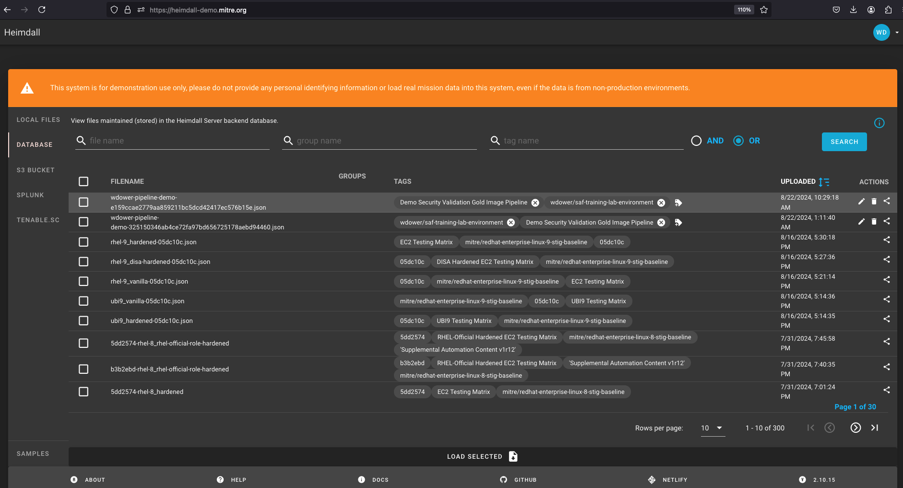

## Verification

At this point we have a much more mature workflow file. We have one more activity we need to do -- verification, or checking that the output of our validation run met our expectations.

Note that "meeting our expectations" does *not* automatically mean that there are no failing tests. In many real-world use cases, security tests fail, but the software is still considered worth the risk to deploy because of mitigations for that risk, or perhaps the requirement is inapplicable due to the details of the deployment. With that said, we still want to run our tests to make sure we are continually collecting data; we just don't want our pipeline to halt if it finds a test that we were always expecting to fail.

By default, the InSpec executable returns a code 100 if *any* tests in a profile run fail. Pipeline orchestrators, like most software, interpret any non-zero return code as a serious failure, and will halt the pipeline run accordingly unless we explicitly tell it to ignore errors. This is why the "VALIDATE - Run InSpec" step has the `continue-on-error: true ` attribute specified.

Our goal is to complete our InSpec scan, collect the result as a report file, and then parse that file to determine if we met our own *threshold* of security. We can do this with the SAF CLI.

### Updating the Workflow File

Let's add two steps to our pipeline to use the SAF CLI to understand our InSpec scan results before we verify them against a threshold. 

::: code-tabs#shell
@tab Adding Verify Steps
``` yaml
- name: VERIFY - Display our results summary 
  run: |
    saf view summary -i results/pipeline_run_attested.json

# check if the pipeline passes our defined threshold
- name: VERIFY - Ensure the scan meets our results threshold           
  run: |
    saf validate threshold -i results/pipeline_run_attested.json -F threshold.yml
```
@tab `pipeline.yml` after adding verify steps
``` yaml
name: Demo Security Validation Gold Image Pipeline

# define the triggers for this action
on:                                             
  push:
    # trigger this action on any push to main branch
    branches: [ main, pipeline ]                

jobs:
  gold-image:
    name: Gold Image NGINX
    runs-on: ubuntu-20.04
    env:
       # so that we can use InSpec without manually accepting the license
      CHEF_LICENSE: accept  
       # path to our profile                   
      PROFILE: my_nginx                        
    steps:
      # updating all dependencies is always a good start
      - name: PREP - Update runner              
        run: sudo apt-get update

      - name: PREP - Install InSpec executable 
        run: curl https://omnitruck.chef.io/install.sh | sudo bash -s -- -P inspec -v 5

      - name: PREP - Install SAF CLI
        run: npm install -g @mitre/saf

      # checkout the profile, because that's where our profile is!
      - name: PREP - Check out this repository  
        uses: actions/checkout@v3

      # double-check that we don't have any serious issues in our profile code
      - name: LINT - Run InSpec Check           
        run: inspec check $PROFILE

      # launch a container as the test target
      - name: DEPLOY - Run a Docker container from nginx
        run: docker run -dit --name nginx nginx:latest

      # install dependencies on the container so that hardening will work
      - name: DEPLOY - Install Python for our nginx container
        run: |
          docker exec nginx apt-get update -y
          docker exec nginx apt-get install -y python3

      # fetch the hardening role and requirements
      - name: HARDEN - Fetch Ansible role
        run: |
          git clone --branch docker https://github.com/mitre/ansible-nginx-stigready-hardening.git || true
          chmod 755 ansible-nginx-stigready-hardening

      - name: HARDEN - Fetch Ansible requirements
        run: ansible-galaxy install -r ansible-nginx-stigready-hardening/requirements.yml

      # harden!
      - name: HARDEN - Run Ansible hardening
        run: ansible-playbook --inventory=nginx, --connection=docker ansible-nginx-stigready-hardening/hardening-playbook.yml

      - name: VALIDATE - Run InSpec
        # we dont want to stop if our InSpec run finds failures, we want to continue and record the result
        continue-on-error: true                
        run: |
          inspec exec $PROFILE \
          --input-file=$PROFILE/inputs-linux.yml \
          --target docker://nginx \
          --reporter cli json:results/pipeline_run.json

      # attest
      - name: VALIDATE - Apply an Attestation
        run: |
          saf attest apply -i results/pipeline_run.json attestation.json -o results/pipeline_run_attested.json

      # save our results to the pipeline artifacts, even if the InSpec run found failing tests
      - name: VALIDATE - Save Test Result JSON  
        uses: actions/upload-artifact@v3
        with:
          path: results/pipeline_run_attested.json

      # drop off the data with our dashboard
      - name: VALIDATE - Upload to Heimdall
        continue-on-error: true
        run: |
          curl -# -s -F data=@results/pipeline_run_attested.json -F "filename=${{ github.actor }}-pipeline-demo-${{ github.sha }}.json" -F "public=true" -F "evaluationTags=${{ github.repository }},${{ github.workflow }}" -H "Authorization: Api-Key ${{ secrets.HEIMDALL_API_KEY }}" "https://heimdall-demo.mitre.org/evaluations"

      - name: VERIFY - Display our results summary 
        run: |
          saf view summary -i results/pipeline_run_attested.json
      
      # check if the pipeline passes our defined threshold
      - name: VERIFY - Ensure the scan meets our results threshold           
        run: |
          saf validate threshold -i results/pipeline_run_attested.json -F threshold.yml
```
:::

A few things to note here:
- We added the `summary` step because it will print us a concise summary inside the pipeline job view itself. That command takes one file argument; the results file we want to summarize.
- The `validate threshold` command, however, needs two files -- one is our report file as usual, and the other is a **threshold file**. 

#### Threshold Files

Threshold files are what we use to define what "passing" means for our pipeline, since like we said earlier, it's more complicated than failing the pipeline on a failed test.

Consider the following sample threshold file:

```yaml
# threshold.yml file
compliance:
  min: 80
passed:
  total:
    min: 1
failed:
  total:
    max: 2
```

This file specifies that we require a *minimum of 80% of the tests to pass.* We also specify that *at least one of them should pass, and that at maximum two of them can fail.*

::: info Threshold Files Options
To make more specific or detailed thresholds, check out [this documentation on generating theshold files](https://github.com/mitre/saf/wiki/Validation-with-Thresholds).

*NOTE: You can name the threshold file something else or put it in a different location. We specify the name and location only for convenience.* 
:::

This is a sample pipeline, so we are not too worried about being very stringent. For now, let's settle for running the pipeline with no *errors* (that is, as long as each test runs, we do not care if it passed or failed, but a source code error should still fail the pipeline).

Create a new file called `threshold.yml` in the main directory to specify the threshold for acceptable test results:

``` yaml
error:
  total:
    max: 0
```

::: note How could we change this threshold file to ensure that the pipeline run will fail?
:::

And with that, we have a complete pipeline file. Let's commit our changes and see what happens.

::: code-tabs#shell
@tab Committing And Pushing Code
``` sh
git add .github
git commit -s -m "finishing the pipeline"
git push origin main
```
@tab Output of Pushing Code
``` sh
$> git add .
$> git commit -s -m "finishing the pipeline"
[main e796abd] finishing the pipeline
 2 files changed, 14 insertions(+), 1 deletion(-)
 create mode 100644 threshold.yml
$> git push origin main
Enumerating objects: 10, done.
Counting objects: 100% (10/10), done.
Delta compression using up to 2 threads
Compressing objects: 100% (3/3), done.
Writing objects: 100% (6/6), 720 bytes | 720.00 KiB/s, done.
Total 6 (delta 2), reused 1 (delta 0), pack-reused 0
remote: Resolving deltas: 100% (2/2), completed with 2 local objects.
To https://github.com/wdower/saf-training-lab-environment
   c4d9c67..e796abd  main -> main
$>
```

Or similar.
:::

Let's hop back to our browser and take a look at the output:


There we go! All validation tests passed!

Note in the SAF CLI Summary step, we get a simple YAML output summary of the InSpec scan:


We see six critical-severity tests (remember how we set them all to `impact 1.0`?) passing, and no failures:
``` yaml
- profileName: my_nginx
  resultSets:
    - pipeline_run_attested.json
  compliance: 100
  passed:
    critical: 6
    high: 0
    medium: 0
    low: 0
    total: 6
  failed:
    critical: 0
    high: 0
    medium: 0
    low: 0
    total: 0
  skipped:
    critical: 0
    high: 0
    medium: 0
    low: 0
    total: 0
  error:
    critical: 0
    high: 0
    medium: 0
    low: 0
    total: 0
  no_impact:
    critical: 0
    high: 0
    medium: 0
    low: 0
    none: 0
    total: 0
```

Note also that our test report is avaiable as an artifact from the overall pipeline run summary view now:


From here, we can download that file and manually drop it off in something like Heimdall or feed into some other security process at our leisure. Luckily, we already automated that step. Let's check in with Heimdall Demo's Database View:



And voilà! We have a completed pipeline. We are launching our application, hardening it, testing it, processing the resulting data, and aggregating it into a dashboard.

::: tip Viewing the file in Heimdall
Heimdall is a very powerfull tool for examining security data. See more details in the [SAF User Class](../user/9.md)
:::

### What Else Can We Do With A Pipeline?

In a real use case, if our pipeline passed, we would next save our bonafide hardened image to a secure registry where it could be distributed to users. If the pipeline did not pass, we would have already collected data describing why, in the form of InSpec scan reports that we save as artifacts.

Other pipelines might flat out refuse to permit merging code into a repository branch, or alert the developer team if issues occur. The exact implementation is up to you and your needs for your work.