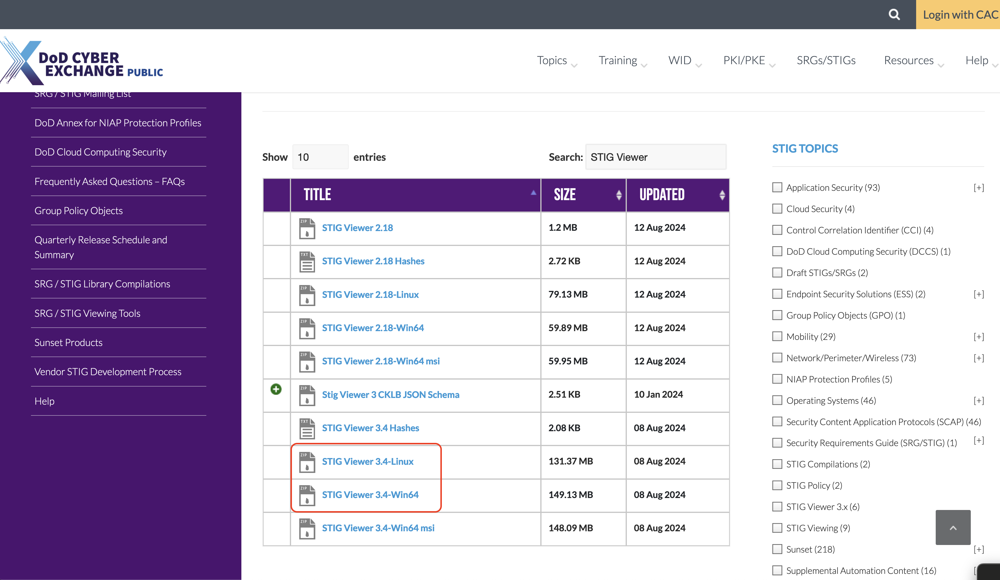
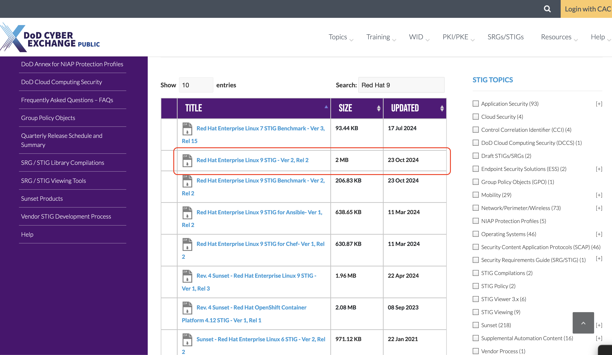
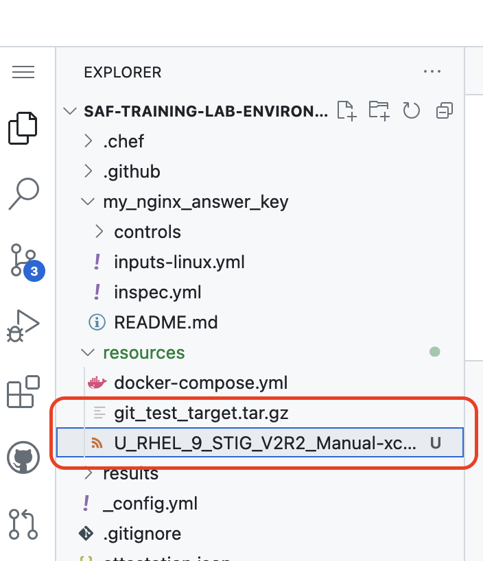

## From STIG to Profile

Recall from our initial example of an InSpec control that a real control will be tied back to a requirement from an upstream piece of security guidance documentation, like a CIS Benchmark or a STIG. All the context and metadata for that guidance should be added to the control's code via InSpec specific syntax. That way, as the test code is executed, the report that it generates will include all of the context for the test.

::: details InSpec control with many STIG-related tags

[redhat-enterprise-linux-9-stig-baseline/controls/SV-257791.rb](https://github.com/mitre/redhat-enterprise-linux-9-stig-baseline/blob/46fd72d144fcda10b07604df037db7f683b74225/controls/SV-257791.rb)

```ruby 
control 'SV-257791' do
  title 'RHEL 9 /boot/grub2/grub.cfg file must be owned by root.'
  desc 'The " /boot/grub2/grub.cfg" file stores sensitive system configuration. Protection of this file is critical for system security.'
  desc 'check', 'Verify the ownership of the "/boot/grub2/grub.cfg" file with the following command:

$ sudo stat -c "%U %n" /boot/grub2/grub.cfg

root /boot/grub2/grub.cfg

If "/boot/grub2/grub.cfg" file does not have an owner of "root", this is a finding.'
  desc 'fix', 'Change the owner of the file /boot/grub2/grub.cfg to root by running the following command:

$ sudo chown root /boot/grub2/grub.cfg'
  impact 0.5
  ref 'DPMS Target Red Hat Enterprise Linux 9'
  tag check_id: 'C-61532r925358_chk'
  tag severity: 'medium'
  tag gid: 'V-257791'
  tag rid: 'SV-257791r925360_rule'
  tag stig_id: 'RHEL-09-212030'
  tag gtitle: 'SRG-OS-000480-GPOS-00227'
  tag fix_id: 'F-61456r925359_fix'
  tag 'documentable'
  tag cci: ['CCI-000366']
  tag nist: ['CM-6 b']
  tag 'host'

  only_if('Control not applicable within a container', impact: 0.0) {
    !virtualization.system.eql?('docker')
  }

  grubfile = input('grub_conf_path')

  describe file(grubfile) do
    it { should exist }
    it { should be_owned_by 'root' }
  end
end
```

See how many tags we're adding? Best practice is to include the complete text of the requirement we are implementing as `desc` or `tag` fields in the control code itself. We have so much metadata in this control file that the actual `describe` block doesn't show up until 34 lines into the control!

We *really* do not want to stuck with writing all of these tags by hand. Instead, let's use the [SAF CLI](https://saf-cli.mitre.org) benchmark generator.

### Download STIG Requirements

First, let's discuss where all of that metadata comes from in the first place -- the baseline security guidance that we are automating using InSpec. We'll crack open a STIG XCCDF XML file to show you where the control metadata is sourced from.

::: note "XCCDF XML" file?! That's a lot of letters!
Yes, it is. Welcome to the wonderful world of government standard format names. See our glossary for more information on [XCCDF](../profile-dev-test/29.md).
:::

Download the latest STIG Viewer located here [STIG Viewer](https://public.cyber.mil/stigs/srg-stig-tools/).



Download the `Red Hat Enterprise Linux 9 STIG` located [here](https://public.cyber.mil/stigs/downloads/?_dl_facet_stigs=operating-systems%2Cunix-linux). (Note that the file will be downloaded to your local computer, _not_ your GitHub Codespaces environment.) The RHEL9 STIG is at version V2R2 at time of writing, but may have been updated by the time you downloaded. This will not affect how we use the STIG in this class.



You can then load the STIG document into STIG Viewer to examine the requirements in the real STIG. You could also upload that file to Vulcan for a similar view!

### Convert the STIG XCCDF Benchmark To an InSpec Stubs Profile

The SAF CLI has a function called `generate xccdf_benchmark2inspec_stub`, which can help you quickly convert an XCCDF Benchmark document into the start of an InSpec Profile. 

We already converted the XCCDF STIG Benchmark into a starter profile using the `saf generate inspec_profile` command with the appropriate flags, mapping file and other options. In a moment we will show you how to grab our pre-made profile that we generated with the SAF CLI.
:::

The SAF CLI has the `generate inspec_profile` sub-command which can help you quickly convert an XCCDF Benchmark document into the start of an InSpec Profile.

::: info SAF CLI InSpec Profile Stub Generator
The SAF CLI sub-command `xccdf_benchmark2inspec_stub` is an aliases to the new sub-command `inspec_profile`
:::

To learn how you can use the `saf generate inspec_profile` or any other `saf` cli command, go to the [saf-cli homepage](https://saf-cli.mitre.org/#generate) or use the help commands. An example help command to generate the stubs of the InSpec profile is below.

::: code-tabs#shell

@tab Command
```sh
saf generate inspec_profile --help
```

@tab Output
```sh
Generate a new skeleton profile based on a (STIG or CIS) XCCDF benchmark file

USAGE
  $ saf generate inspec_profile -X <[stig or cis]-xccdf-xml> [--interactive] [-L info|warn|debug|verbose] [-m <metadata-json>] [-s] [-T rule|group|cis|version] [-O <oval-xccdf-xml>] [-o
    <output-folder>]

FLAGS
  -O, --ovalDefinitions=<value>  Path to an OVAL definitions file to populate profile elements that reference OVAL definitions
  -T, --idType=<option>          [default: rule] Control ID Types: 'rule' - Vulnerability IDs (ex. 'SV-XXXXX'),
                                 'group' - Group IDs (ex. 'V-XXXXX'), 'cis' - CIS Rule IDs (ex. C-1.1.1.1),
                                 'version' - Version IDs (ex. RHEL-07-010020 - also known as STIG IDs)
                                 <options: rule|group|cis|version>
  -X, --xccdfXmlFile=<value>     (required) Path to the XCCDF benchmark file
  -m, --metadata=<value>         Path to a JSON file with additional metadata for the inspec.yml
                                 The metadata Json is of the following format:
                                 {"maintainer": string, "copyright": string, "copyright_email": string, "license": string, "version": string}
  -o, --output=<value>           [default: profile] The output folder to write the generated InSpec content (defaults to profile if unable to translate xccdf title)
  -s, --singleFile               Output the resulting controls to a single file - if false (default) each control is written to a file

GLOBAL FLAGS
  -L, --logLevel=<option>  [default: info] Specify level for logging (if implemented by the CLI command)
                           <options: info|warn|debug|verbose>
  -h, --help               Show CLI help
      --interactive        Collect input tags interactively (not available on all CLI commands)

DESCRIPTION
  Generate a new skeleton profile based on a (STIG or CIS) XCCDF benchmark file

ALIASES
  $ saf generate xccdf_benchmark2inspec_stub

EXAMPLES
  Base Command
    $ saf generate inspec_profile -X ./U_RHEL_6_STIG_V2R2_Manual-xccdf.xml

  Specifying OVAL and Output location
    $ saf generate inspec_profile -X ./U_RHEL_9_STIG_V1R2_Manual-xccdf.xml -O ./RHEL_9_Benchmark-oval.xml -o ./output/directory

```
:::

### How to Generate the InSpec Stub Profile
Take a look at the `resources` folder in your Codespace and you will note a file called `U_RHEL_9_STIG_V2R2_Manual-xccdf.xml`. That's a STIG definition file that we grabbed off of the DoD Cyber Exchange for you. (The file starts with 'U' because that is its classification marking -- 'unclassified.' Everything sourced from the DoD Cyber Exchange can be freely used like this.) .



Let's use the SAF CLI on that file to create an InSpec profile called `my_rhel9_stig_profile`.

::: code-tabs#shell

@tab Command
``` sh
saf generate xccdf_benchmark2inspec_stub -X resources/U_RHEL_9_STIG_V2R2_Manual-xccdf.xml -o my_rhel9_stig_profile
```

@tab Output
``` sh
[Dec-08-2024 20:40:31 +00:00] generate:xccdf_benchmark2inspec_stub Creating output folder with controls and libraries directories
[Dec-08-2024 20:40:31 +00:00] generate:xccdf_benchmark2inspec_stub Processing XCCDF Benchmark file: resources/U_RHEL_9_STIG_V2R2_Manual-xccdf.xml using rule id.
[Dec-08-2024 20:40:31 +00:00] generate:xccdf_benchmark2inspec_stub Writing inspec.yml file to: my_rhel9_stig_profile/inspec.yml
[Dec-08-2024 20:40:31 +00:00] generate:xccdf_benchmark2inspec_stub Writing control to: my_rhel9_stig_profile/controls/SV-257777.rb
[Dec-08-2024 20:40:31 +00:00] SV-257777 does not have a value for tag: documentable

< . . . a few lines of output per STIG control! >

[Dec-08-2024 20:40:32 +00:00] generate:xccdf_benchmark2inspec_stub Writing control to: my_rhel9_stig_profile/controls/SV-258241.rb
[Dec-08-2024 20:40:32 +00:00] SV-258241 does not have a value for tag: documentable
[Dec-08-2024 20:40:32 +00:00] generate:xccdf_benchmark2inspec_stub Writing control to: my_rhel9_stig_profile/controls/SV-258242.rb
[Dec-08-2024 20:40:32 +00:00] SV-258242 does not have a value for tag: documentable
```
:::

We added the `--logLevel=debug` flag so that you could see the SAF CLI touch each control in turn. You will end up with a new local directory InSpec "stub" profile  for Red Hat 9. The SAF CLI might note that some expected tags are not present for optional metadata; this is not an issue for the purposes of this class.

### Example "Stub" Control SV-230502

Let's take a look at one of the stub InSpec controls created by the `saf generate inspec_profile` command and the completed InSpec control.

::: code-tabs#shell

@tab Stub Generated InSpec Control

```ruby
control 'SV-257777' do
  title 'RHEL 9 must be a vendor-supported release.'
  desc 'An operating system release is considered "supported" if the vendor continues to provide security patches for the product. With an unsupported release, it will not be possible to resolve security issues discovered in the system software.

Red Hat offers the Extended Update Support (EUS) add-on to a Red Hat Enterprise Linux subscription, for a fee, for those customers who wish to standardize on a specific minor release for an extended period.'
  desc 'check', 'Verify that the version or RHEL 9 is vendor supported with the following command:

$ cat /etc/redhat-release 

Red Hat Enterprise Linux release 9.2 (Plow)

If the installed version of RHEL 9 is not supported, this is a finding.'
  desc 'fix', 'Upgrade to a supported version of RHEL 9.'
  impact 0.7
  ref 'DPMS Target Red Hat Enterprise Linux 9'
  tag check_id: 'C-61518r925316_chk'
  tag severity: 'high'
  tag gid: 'V-257777'
  tag rid: 'SV-257777r991589_rule'
  tag stig_id: 'RHEL-09-211010'
  tag gtitle: 'SRG-OS-000480-GPOS-00227'
  tag fix_id: 'F-61442r925317_fix'
  tag 'documentable'
  tag cci: ['CCI-000366']
  tag nist: ['CM-6 b']
end
```

@tab Completed InSpec Control From the Published SAF RHEL9 Profile

```ruby
control 'SV-257777' do
  title 'RHEL 9 must be a vendor-supported release.'
  desc 'An operating system release is considered "supported" if the vendor continues to provide security patches for the product. With an unsupported release, it will not be possible to resolve security issues discovered in the system software.

Red Hat offers the Extended Update Support (EUS) add-on to a Red Hat Enterprise Linux subscription, for a fee, for those customers who wish to standardize on a specific minor release for an extended period.'
  desc 'check', 'Verify that the version or RHEL 9 is vendor supported with the following command:

$ cat /etc/redhat-release

Red Hat Enterprise Linux release 9.2 (Plow)

If the installed version of RHEL 9 is not supported, this is a finding.'
  desc 'fix', 'Upgrade to a supported version of RHEL 9.'
  impact 0.7
  ref 'DPMS Target Red Hat Enterprise Linux 9'
  tag severity: 'high'
  tag gtitle: 'SRG-OS-000480-GPOS-00227'
  tag gid: 'V-257777'
  tag rid: 'SV-257777r925318_rule'
  tag stig_id: 'RHEL-09-211010'
  tag fix_id: 'F-61442r925317_fix'
  tag cci: ['CCI-000366']
  tag nist: ['CM-6 b']
  tag 'host'
  tag 'container'

  release = os.release

  # Note that versions 9.0 and 9.2 of RHEL9 are within the EUS window at
  # time of writing.

  # 9.1 is not a EUS-supported release and is no longer officially supported
  # by Red Hat. The date given for the expiration for 9.1 is based on the
  # RHEL9 Planning Guide diagram found on Red Hat's Life Cycle page:
  # https://access.redhat.com/support/policy/updates/errata/#Life_Cycle_Dates

  EOMS_DATE = {
    /^9\.0/ => '31 May 2024',
    /^9\.1/ => 'April 1, 2023',
    /^9\.2/ => 'May 31, 2025',
    /^9\.4/ => 'May 31, 2026'
  }.find { |k, _v| k.match(release) }&.last

  describe "The release \"#{release}\"" do
    if EOMS_DATE.nil?
      it 'is a supported release' do
        expect(EOMS_DATE).not_to be_nil, "Release '#{release}' has no specified support window"
      end
    else
      it 'is still within the support window' do
        expect(Date.today).to be <= Date.parse(EOMS_DATE)
      end
    end
  end
end

```
:::

::: warning Where did the metadata tags come from?
From the structured data inside the published STIG document's XCCDF XML file. The `saf generate` tool simply reformats it into an InSpec control. All of our metadata is present, but there are no `describe` blocks in the initial stub profile; _that_ content is not something we can grab straight from the STIG from an XML tag.
:::
::: warning Where did the describe block come from?
From the real [MITRE SAF RHEL9 InSpec profile](https://github.com/mitre/redhat-enterprise-linux-9-stig-baseline/blob/46fd72d144fcda10b07604df037db7f683b74225/controls/SV-257777.rb). You may recognize that we wrote the `describe` blocks for this control using RSpec `expect` syntax as explained in [Section 7](../beginner/07.md). It's still recognizably just an *entity* and some *expectations* wrapped in a `describe` block.
:::
You may note that these InSpec controls feature a set of metadata tags -- impact, severity, and alignment back to requirements such as a NIST control family. All of that metadata was taken from the original XCCDF document that we used to create this profile; the SAF CLI automatically added it to the profile controls. These tags are the reason that tools like Heimdall can sort and display data in high fidelity. This is the benefit of using the SAF CLI to generate profiles straight off of the original benchmark documentation where possible -- tagging the controls with the requirement that they are testing means that reading a control will tell you not only _what_ you are testing, but _why_!

::: tip STIGs
For more background on STIGs, see the [SAF Guidance content](../guidance/03.md).
:::
