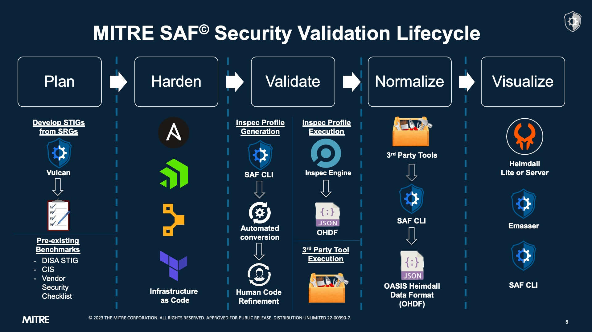

## Class Objectives

The purpose of this class is to teach the fundamentals of security validation content development via hands-on examples utilizing InSpec profiles. This class will also show participants how to visualize and analyze the security data produced by the InSpec tool using the Heimdall application.

### Objectives:

-	Describe the InSpec framework and its capabilities
-	Describe the architecture of an InSpec profile
-	Build an InSpec profile to transform security policy into automated security testing
-	Inherit controls from existing profile baselines into your profiles to avoid rework
-	Run an InSpec profile against a target - a component of an application stack
-	View and analyze InSpec results
-	Report Results
-	Create concise, human-readable control output using RSpec syntax in InSpec profiles

## InSpec 101

The MITRE SAF team writes quite a bit of InSpec content for real-world use cases. We prefer InSpec for several reasons.

- Open-source (see the source code on GitHub)
- Strong developer community
- Allows users to define machine-readable compliance and security requirements
- Easy to create, validate, and read content
- Cross-platform (Windows, Linux, Mac)
- Agnostic to other DevOps tools and techniques
- Integrates into multiple configuration management tools

::: note Does this mean InSpec is the only validation tool I should ever learn to use?
No. InSpec is powerful, but it cannot accomplish every type of security testing that we will need to do for a complex system. No single tool can do that.
:::

### The Lab Environment

This class will use GitHub Codespaces for a consistent environment for all students. See instructions for setting up your own lab environment [here](../../resources/02.md).

## The Road to Security Automation

InSpec is one of the primary tools in the Security Automation workflow. It integrates easily with orchestration and configuration management tools found in the DevOps world.

As you can see from the picture below, the process of developing automated security tests is a bit of a journey -- we need to start with human-language requirements documents like SRGs, STIGs, or CIS Benchmark and then implement them as code. We need that code to record test results in a standardized format so that we can easily export our security data somewhere people can use it to make decisions (like the Heimdall visualization app, which we will discuss later).

This challenge is what the [MITRE SAF (Security Automation Framework)](https://saf.mitre.org) was developed to simplify -- to make the journey from a security guidance document to an automated test profile to a report on security posture easier to navigate.

We hope that during this class you will become comfortable with the tools, parts, and processes involved in the end-to-end process, and gain the confidence to start automating your compliance journey with the information presented here.  

Let's get started!
