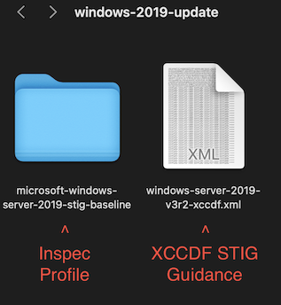
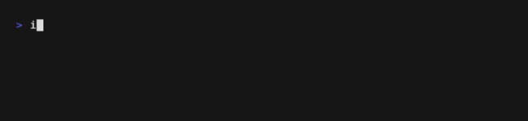
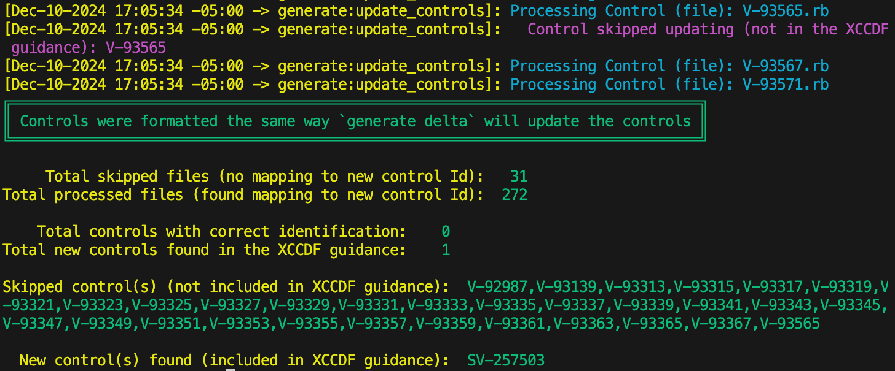
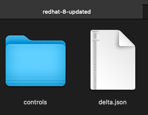
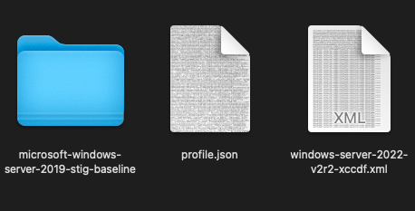

## 4.1 Use Cases for Running Delta

There are several situations that warrant the use of the delta process. These are broken down into the following use cases:

1. [Use Case 1](#411-use-case-1) - Check and update control IDs and metadata based on new guidance (run update controls)

3. [Use Case 2](#415-use-case-2) - Generate stubs for new controls found in the XCCDF Benchmark file (run Delta without fuzzy matching)

4. [Use Case 3](#414-use-case-3) - No mappings were found using update controls (run Delta with fuzzy matching)


### 4.1.1 Use Case 1

Updated guidances sometimes modifies the control identification (ID) values of a given control. To make these modifications from baseline X to baseline Y, use the update controls process with the provided XCCDF STIG guidance file. The process checks if the new guidance changes the control numbers and updates the internal metadata if necessary (testing code is retained).

Suppose we want to update our [Windows Server 2019 inspec profile repository](https://github.com/mitre/microsoft-windows-server-2019-stig-baseline/) from [version 1 release 3](https://github.com/mitre/microsoft-windows-server-2019-stig-baseline/releases/tag/1.3.0) to version 3 release 2.

#### Step 1: Collect necessary files:
1. Download or clone the Windows Server 2019 profile repository to your system.
2. Download the [latest STIG](https://public.cyber.mil/stigs/downloads/) place the XCCDF XML file into your working directory.


#### Step 2: Generate a profile summary
Use the `inspec json` command to generate a profile summary of the inspec profile



#### Step 3: Run Update Controls
Use the `update_controls4delta` method using the profile summary file, the STIG guidance file, and the controls directory for the inspec profile as inputs.
```sh
saf generate update_controls4delta \
-X ./windows-server-2019-v3r2-xccdf.xml \
-J ./profile.json \
-c ./microsoft-windows-server-2019-stig-baseline/controls
```


The output should look like this:



From these results we can gather that:
1. Thirty-one (31) controls were skipped, because they are not present in the STIG guidance. This indicates that these controls were deleted in the recent revision.
2. Two-hundred-seventy-two (272) controls have had their control IDs updated. Any metadata changes have also been made to the controls as well.
3. Zero (0) controls were found to have the correct identification. This indicated that the STIG guidance renamed all mapped controls.
4. One (1) new control was found in the STIG guidance. It is important to note that `update_controls4delta` does not generate this control for you.

**Process:** Run `update_controls4delta`

[return to top](#41-use-cases-for-running-delta)

### 4.1.4 Use Case 2

New guidance often contains new controls that weren't previously defined. In this case, running the delta process generates the control stubs with all metadata, except for the describe block (code) content.

Suppose we want to update our [RedHat Enterprise Linux 8 STIG Baseline](https://github.com/mitre/redhat-enterprise-linux-8-stig-baseline) from [Version 1 Release 14](https://github.com/mitre/redhat-enterprise-linux-8-stig-baseline/releases/tag/v1.14.1) to version 2 release 1.

#### Step 1: Collect necessary files


This include the profile summary JSON file generated used `cinc-auditor json redhat-enterprise-linux-8-stig-baseline > profile.json`

#### **OPTIONAL**: Run update_controls4delta
Running the update controls command on this profile can give us information on what needs to be updated:
```sh
saf generate update_controls4delta \
-X rhel_8_xccdf.xml \
-J profile.json \
-c ./redhat-enterprise-linux-8-stig-baseline/controls
```


From this we can gather:
1. No existing controls needed to be renamed in the new STIG guidance (366 controls with correct identification, 0 processed files).
2. Nine (9) controls were removed in the updated STIG guidance (9 skipped files).
3. One (1) new control was found in the updated STIG guidance. 

From this output, we know that the Delta command needs to be run, because Delta is able to generate files for new controls and make any changes needed to the other controls.

#### Step 2: Run Delta

Use the `delta` command to perform a delta on the profile and the STIG guidance file:
```sh
saf generate delta \
-X ./rhel_8_V2R1_xccdf.xml \
-J ./profile.json \
-r ./report.md -o ./redhat-8-updated/
```
In this case, we will be outputting a report file to `report.md` and the updated inspec profile to the `./redhat-8-updated/` directory.

You should receive the following output:


The `["+","SV-268322"]` indicates that a new control was created with the ID SV-258322.

After running the command, you should see the following:


1. `redhat-8-updated` directory: A folder container the updated inspec profile.

    

    a. A `controls` directory containing all of the updated and new controls in the STIG guidance file. This does NOT contain removed controls so no further modifications need to be done.
    b. A delta.json file containing a JSON formatted summary of the delta process.
2. `report.md`: Markdown report containin formatted version of delta.json summary results.
3. `saf-cli.log` a log of the SAF CLI output from running the command

**Process:** Run `delta`

[return to top](#41-use-cases-for-running-delta)

### 4.1.5 Use Case 3

Running update controls may result in no controls being updated or no mappings being found from baseline X to baseline Y. This could be due to the baselines belonging to different platforms, or too many revisions were released between the two baselines, creating no way to map between them. In this case, use Delta with fuzzy matching.

In this use case, we will be mapping the Windows Server 2019 STIG profile using the Windows Server 2022 STIG guidance in order to determine how much of our old profile we can use for this new profile. The controls between these two profiles share no similarities, and there are no legacy tags in which we can correlate them together. To find out how much of our old profile we can use, do the following:

#### Step 1: Collect necessary files


#### Step 2: Run the delta command with fuzzy matching

To enable fuzzy matching, use the `-M` flag and specify the controls directory using the `-c` flag:
```sh
saf generate delta \
-X ./windows-server-2022-v2r2-xccdf.xml \
-J ./profile.json -r ./report.md \
-o ./windows-server-2022-stig-baseline \
-M -c ./microsoft-windows-server-2019-stig-baseline/controls
```

The output is long, but what's important is the results and statistics section:


We can observe that:
1. Delta found 266 total matches and mapped these matched controls over into the new profile.
2. Delta was unable to find matches for 6 of the controls in the Windows Server 2022 STIG guidance (No Match Controls).

Of the 273 controls specified by the Windows Server 2022 STIG guidance, delta found mappings for 266 of them. This means that about 97% of the Windows Server 2019 profile was able to be used for the Windows Server 2022 profile.

Similar to use case 2, there should be the same generated files:
1. `windows-server-2022-stig-baseline` directory containing a `controls` directory with the mapped controls and updated metadata and a `delta.json` file containing a summarized report of the delta process.
2. `report.md`
3. `saf-cli.log`


**Process:** Run `delta`

[return to top](#41-use-cases-for-running-delta)
