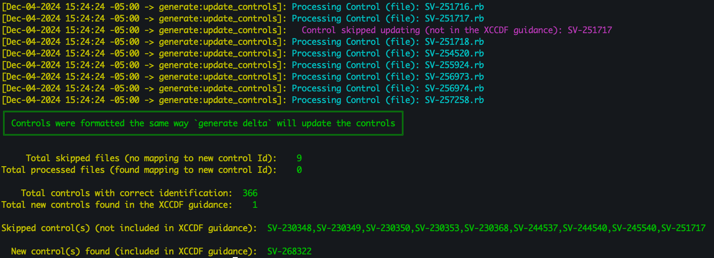

## 5.1 Logging Capabilities of Delta

### 5.1.1 CLIProcessOutput.log

This log provides a detailed output of the command execution, including additional information and metadata.

[Example Log File Output](../../assets/downloads/CliProcessOutput.log)

### 5.1.2 delta.json

This JSON file is automatically generated and saved in the same directory as the outputted profile controls. It summarizes the results of the delta process.

The results are summarized at the top of the report according to the type of change:

1. **addedControlIDs**: A list of new controls added to the profile.
2. **removedControlIDs**: A list of controls removed from the profile.
3. **renamedControlIDs**: A list of controls that had their IDs changed.
4. **changedControlIDs**: A list of controls with changes to the metadata.

Details of the changes are provided afterwards as follows:

1. **addedControls**: The contents of each control that was added to the profile.
2. **changedControls**: The parts of each control that were modified or replaced during the command execution.

[Example delta.json file](../../assets/downloads/delta.json)

### 5.1.3 Report Markdown File (.md)

Specified by the report flag (`-r`), this generates a markdown formatted report containing the same information found in the delta.json file.

[Example Report Markdown File](../../assets/downloads/report)

## 5.2 Logging Capabilities of Update Controls

The logging output of `update_controls4delta` provides information on which controls were found to require a name change, as well as additional statistics on skipped controls.

