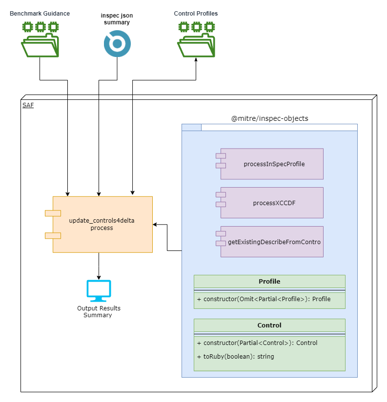
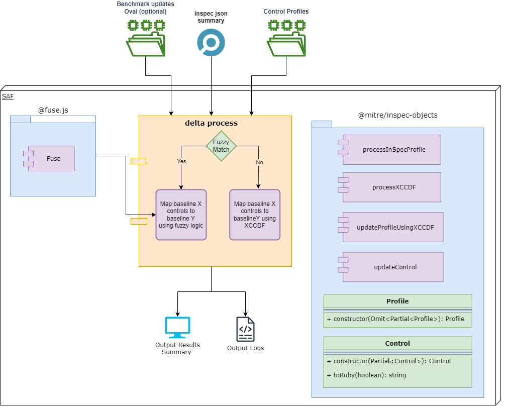

## 7. Additional Technical Details

- **Download New Guidance:** Download the appropriate profile from the [DISA Document Library](https://public.cyber.mil/stigs/downloads/). Unzip the downloaded folder and identify the `<name>xccdf.xml` file.
- **Create the InSpec Profile JSON File:** Clone or download the InSpec profile locally. Run the `inspec json` or `cinc-auditor json` command to create the InSpec Profile JSON file to be used in the `saf generate delta` command.

### update_controls4delta process

### delta Process

### Scope of Changes by Delta

Delta does not modify the Ruby/InSpec code within the control, leaving it intact. Instead, it replaces the 'control metadata' using the content from the supplied XCCDF guidance document. This applies to controls that map from baseline X to baseline Y.

