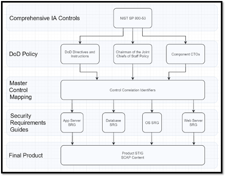

## 3.1 Security Technical Implementation Guides

A **Security Technical Implementation Guide (STIG)** is a set of requirements imposed by the US Department of Defense and implementation instructions for those requirements that are specific to a paticular software component. The components can be any piece of technology that needs a secure configuration -- operating systems, webservers, application runtimes, routers, and so on.

STIGs are published by the Defense Information Systems Agency (DISA), but they're usually written by software vendors, which naturally have the most domain knowledge about how to secure their products. DISA then peer reviews the vendor's draft content to ensure it meets its rigorous standards. We'll describe the process for working with DISA to formally publish a STIG later on.

STIGs are also expected to stay up-to-date alongside the software component they describe. STIGs must be updated by the authors and released any time there is a serious change in the software component the STIG describes. Complicated STIGs for widely-used and often-updated components may be updated multiple times a year.

::: note Are STIGs Familiar?
Have you ever been required to configure an application or system to STIG-standard before?
:::

## 3.2 Security Requirements Guides

STIGs are created based off of high-level, general guidance documents called **Security Requirements Guides (SRGs)**, also published by DISA. SRGs describe DOD-selected security requirements for entire categories of software components, and all STIG requirements are essentially sets of instructions for how to get a particular component to comply with a general SRG (or even a set of SRGs, for complex systems). STIGs are instructions for security that can be followed even by people who are not experts in the technology in question.

::: note How much STIG are we talking?
STIGs can include hundreds of individual requirements depending on the complexity of the system being configured. At time of writing, the Windows Server 2019 STIG included 303 controls.

We need a way to track and manage all of these easily!
:::

### 3.2.1 SRGs and STIGs - Example

For example, there is an SRG that covers operating systems in general (the aptly-named "General Purpose Operating System Security Requirements Guide"). That piece of guidance is full of requirements for an operating system -- *any* operating system -- to be considered reasonably secure. There is a requirement in that SRG (SRG ID: SRG-OS-000021-GPOS-00005) which states that "The operating system must enforce the limit of three consecutive invalid logon attempts by a user during a 15-minute time period."

This requirement is saying that an attacker shouldn't be able to brute force a user's password by throwing a high number of guesses at the system. Simple enough, right?

However, this guidance isn't particularly useful unless we know how to **implement it** on a particular operating system. That's where the STIG comes in. The STIG for, say, Red Hat 8 ("Red Hat Enterprise Linux 8 STIG") has its own requirement for limiting consecutive logon attempts (Rule ID: SV-230334r627750_rule) that cites the relevant SRG IDs that it satisfies. That STIG rule tells us *exactly how to configure Red Hat to satisfy this requirement*, down to which configuration files we need to edit.

You can think of the process of STIG authorship as *distilling* the high-level, general requirements of an SRG into a checklist that anybody can follow to lock down their component.

STIGs are ideally created by a team of subject matter experts on a particular piece of software, all of whom work together to close the gap between the SRG and their shiny new STIG.

## 3.3 Where Do All The Requirements Come From, Anyway?

Published directives from the DOD's Chief Information Officer (DOD CIO) describe the overall Risk Management Framework for DOD Systems (DOD RMF). The DOD RMF requires all information systems across the DOD to be categorized according to how much risk they represent to the organization if compromised. It also requires system owners to select controls from the National Institute of Standards and Technology's (NIST) security control families.

::: note NIST Control Families 
You may be familiar with the control families from [NIST Special Publication 800-53](https://csrc.nist.gov/pubs/sp/800/53/r5/upd1/final), because almost all US Government agencies (and quite a few companies) use them as the authoritative list that defines what security controls are.
:::

To speed up the process of control selection, DISA created and published the **Control Correlation Identifiers (CCIs)**, which describe *actions that can be taken* to cover the NIST security control families. CCIs are a bridge between the extremely high-level policy  documents that govern the whole DOD and the low-level documents (i.e. STIGs) that actually tell people how to implement that policy.

DISA also publishes the SRGs, which describe *subsets* of CCIs that apply to general categories of information systems. This means that individual system owners do not have to figure out on their own which control families need to be covered for their system; they can instead say "I am deploying a router, so I must cover the requirements selected in the Router SRG."

As described before, an SRG can then be tailored into STIGs that give security guidance for individual pieces of software. The full chain of requirements to implementation therefore looks like this:

### 3.3.1 Now For The Good News

The good news is that you, the STIG content author, don't have to worry about SRGs or control selections all that much; the whole point of all the good work that DISA has done is that most of these mappings have been done for you. You are responsible for the last leg of the journey -- you know your requirements from the SRG, and now you need to figure out how to implement them as a configuration baseline.
