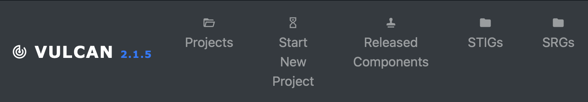
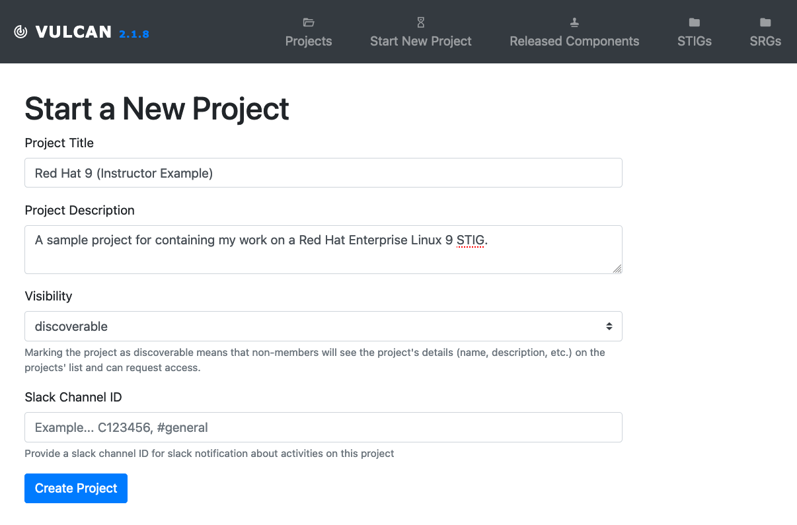

## 5.1 Using Vulcan

Let's walk though the process for building STIG-ready content from the beginning using the Vulcan application. We will use our [demonstration instance of Vulcan](https://vulcan-br-training.herokuapp.com/) that the MITRE SAF team created for this training class (please note that this instance will be regularly reset for each training course).

### 5.1.1 Our Use Case

For the purposes of this class, let's assume the role of a security engineer who has been tasked to write STIG-ready content for the Red Hat Enterprise Linux 9 (RHEL9) operating system.

DISA has already published a RHEL9 STIG, so we will be able to compare our content to the real thing if we wish.

### 5.1.2 Logging In

1. Access the Vulcan training instance using the link above.

If you haven't yet registered an account with this instance, do so now.

### 5.1.3 Starting a New Project

After logging in, you will reach the Projects screen.

Vulcan categorizes security guidance content into **Projects**. Each project can include multiple **Components**, where a component is a single piece of security guidance (for instance, a single STIG document). A Project can contain multiple versions of the same component (for instance, multiple releases of the STIG for the same software).

We need a new Project as a workspace to write our STIG-ready content.

2. In the top navbar, you'll see the Start a New Project button. 

Click it and begin to fill out the details for our project. You can make the Title and Description of your project whatever you want, but be sure to set the Visibility of the project to "discoverable," because you'll want your colleagues to be able to peer review your work later.

3. When you are finished, click Create Project. You'll be taken to the Project view for the workspace you just created, which is currently emtpy. We should fix that.

### 5.1.4 Role-Based Access Control

Before we create a Component, though, let's configure Role-Based Access Control (RBAC).

5. Click the Members tab in the Project view to control access. Projects enforce RBAC to ensure that each author in a Vulcan instance can be restricted to only the content they need to be able to edit.

In a new Project, you'll be the only member at first. You can add a new member with a Role of:

::: details Viewer
Read only access to the Project or Component
:::
::: details Author
Edit, comment, and mark Controls as requiring review. Cannot sign-off or approve changes to a Control. Great for individual contributors.
:::
::: details Reviewer
Write and approve changes to a Control.
:::
::: details Admin
Full control of a Project or Component. Lock Controls, revert controls, and manage members. You'll note that the Project's creator is automatically an admin.
:::
::: tip Adding Colleagues
If you have any colleagues taking the class with you, you may want to add them as a reviewer now (note that you can only add members to a project if they have registered to the Vulcan instance already).
:::
::: warning Should I Be An Author Or A Reviewer?
Reviewers are able to approve requirements written by other members. Depending on how your team operates, you may want to have many authors with one final reviewer role, or you may want to have every member be a reviewer. It's up to you.

Only the Admin role can bypass the peer review process to lock (finalize) their own requirements. Try not to dole out the Admin role too often; it's best practice to force all requirements to undergo peer review.
:::