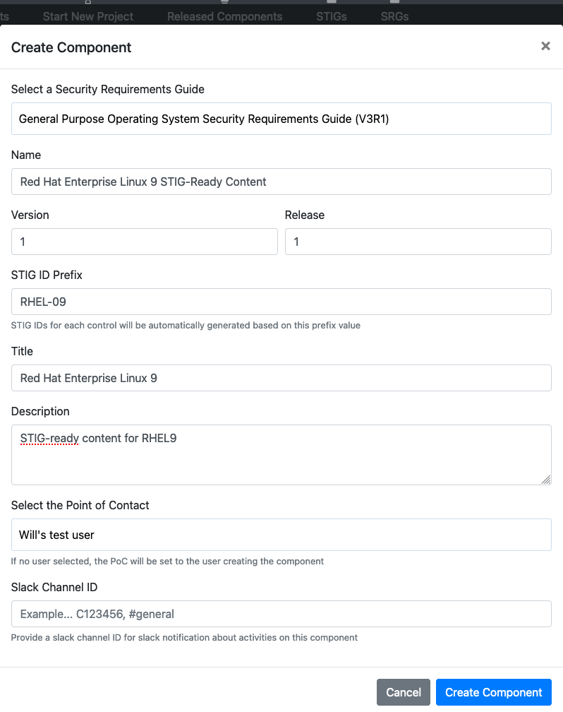
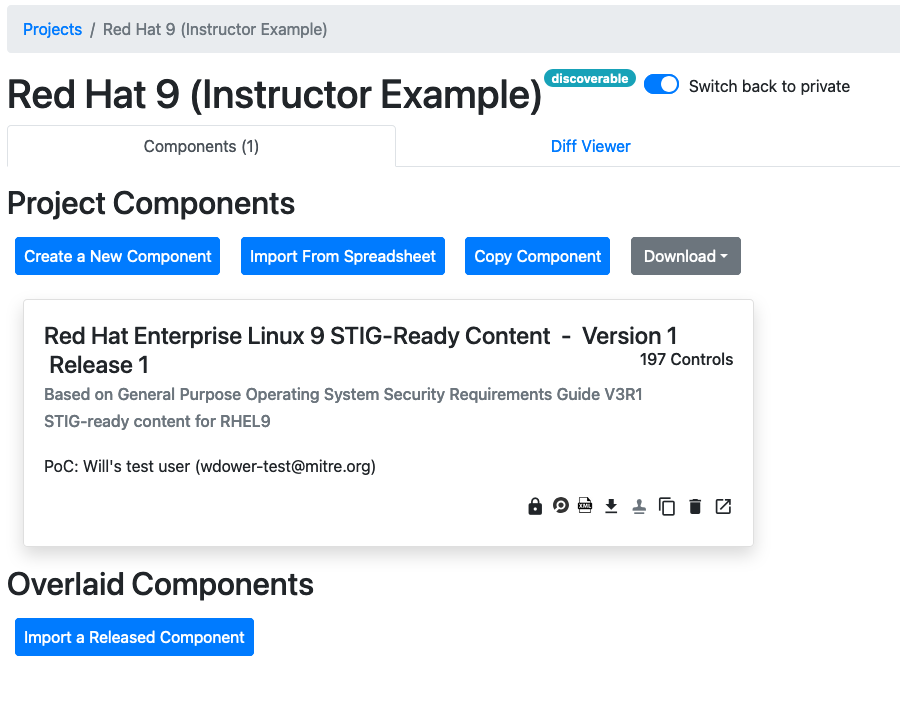

## 6.1 Components

We have our project created and have allowed access to everyone who needs it. Now let's create ourselves a Component.

### 6.1.1 Consider Your Component's Requirements

The first thing we need to do when building a Component is determine what set of requirements applies to it.

A helpful question to keep in mind for this decision is **"What is the *purpose* of the software you are securing? What is its role?"** This will determine what guidance document we want to use as a foundation for our content.

### 6.1.2 Choosing a Foundation

Let's take a look at the options we have for a foundation.

You'll see options in the top navbar of Vulcan for "SRGs" and "STIGs." These links lead to the lists of security guidance documents already saved to Vulcan. We can use any of these as a template for our own content.

1. At the top of the page, click the "SRGs" button.

We have pre-loaded this Vulcan instance with a few SRGs to get us started. Since we're writing content for the RHEL9 operating system, we're going to want to use the General Purpose Operating System Security Requirements Guide.

::: note DISA and SRG selection
Note that if you intend to formally publish your STIG, DISA will tell you which one to use based off the description of your software that you give them.
:::
::: tip Application STIGs
Applications (as opposed to software like operating systems, webservers and routers) that undergo the STIG process all should be using the Application Security and Development STIG as a foundation document.

Remember that a STIG can itself be used as the foundation for a tailored security baseline document!
:::

## 6.2 Creating a Component for Your Project

Let's create a new Component to track our RHEL9 work.

1. Go to your project page and select the "Components" tab.
2. Click "Create a New Component."

Here, you'll select the SRG we decided on earlier.

3. Fill out some metadata for the Component.
    - Base SRG
    - Component Name
    - Version and Release (since this is a brand-new component we will use "1" for both)
    - STIG ID prefix
    - Title
    - Description*
    - Point of Contact*
    - Slack Channel ID*

*Optional.

::: note STIG ID Prefixes
If you intend to formally publish your STIG, DISA will eventually assign these for you. These are just a placeholder value for now to allow us to track requirements inside Vulcan itself.
:::

4. Once you're done, click "Create Component." You'll see a card added to your project to represent your new Component.

::: tip Other Ways of Loading Components
Vulcan allows you to import Components as well as creating them brand-new. You are able to load from your own released Components in your Vulcan instance, or even from a spreadsheet.
:::

## 6.3 Examining the Component

Let's crack open what we just created.

6. Click the "Open Component" button.

### 6.3.1 Layout of the Component View

The page should look something like this: 

6. On the left side of the page, scroll down to the section titled "All Controls". These are all of the requirements in the SRG we selected earlier.

On the right-hand side of the Vulcan window, if we don't have a requirement selected, we can see metadata about the overall Component, including an edit history.

The left-hand side of the Vulcan window shows us the list of each requirement in the Component, and can be filtered by keyword, control status (which we will discuss in the next section) or review status. Note that each control is labeled with the STIG ID prefix that you gave this Component earlier. You can click on the requirement IDs in this view to see their contents.

When first created, a new Component's requirements will all be exact copies of the SRG or other underlying document we used as a foundation. Our job is to edit these controls to make them *specific*, *actionable* implementation guidance.