## 7.1 Editing Components

For your Component, you'll need to decide what requirements are applicable to your specific piece of software (hint: not all of them will be). Of the applicable requirements, you'll need to tailor them to give specific implementation guidance.

Let's practice.

## 7.2 The Editing Window

Click the "Edit Component Controls" button at the top of your Vulcan window on the left hand side.

::: note Controls vs. Requirements
You may note that Vulcan refers to the STIG requirements as "controls." A **security control** is an action taken by an organization *in order to meet a security requirement.* 

STIGs are technically comprised of a set of *requirements,* but each requirement's main focus is describing a control to meet that requirement (i.e. the Check and Fix content).

Many organizations tend to conflate these terms.
:::

Now let's select a requirement. On the left-hand side of the Vulcan Component view you will see a list of every single requirement Let's start with RHEL-09-000004. (Normally, we'd start with number 1, but for this exercise we're picking a simple example.)

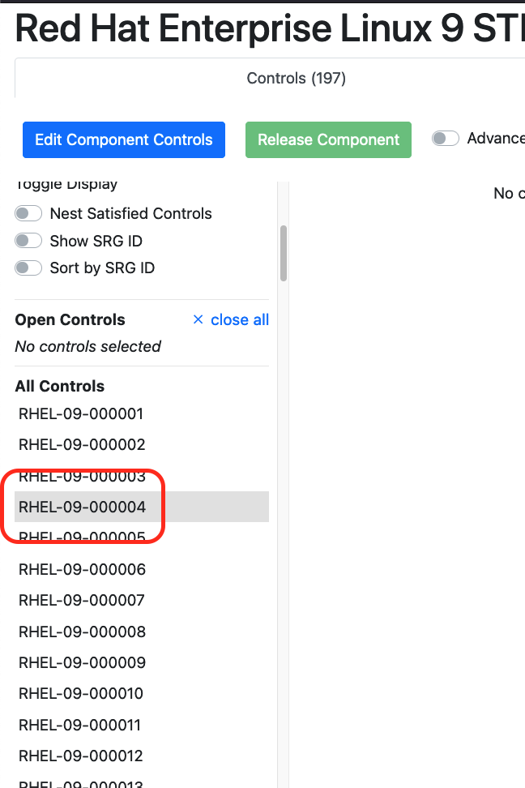

You'll see a view of the requirement's text fields, like the vulnerability discussion, the check text, and the fix text.

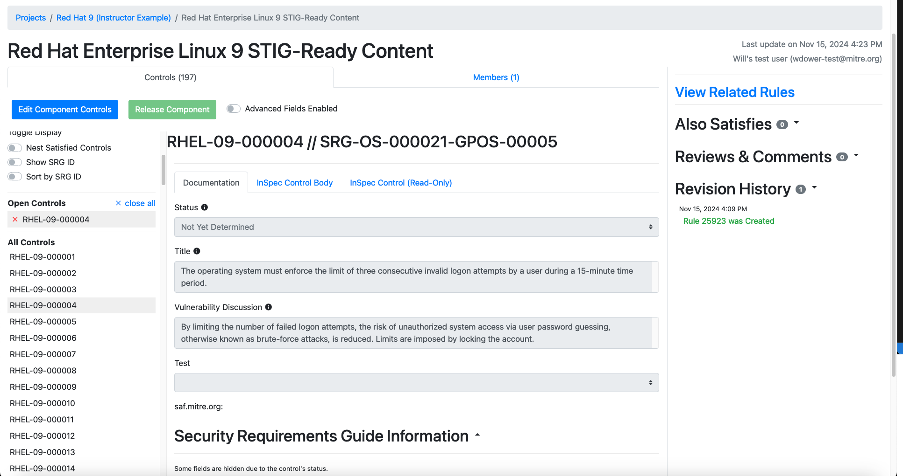

Note how all of these text fields are:
- Pre-populated with the underlying SRG data for the general requirement (in this case `SRG-OS-000021-GPOS-00005`)
- Grayed-out and uneditable at present.

We can't edit these text fields yet because we haven't yet told Vulcan if this requirement is even applicable to our Component. Let's fix that.

## 7.3 Requirement Statuses

The process of tailoring SRG requirements into specific STIG controls first requires you to determine which of the following statuses applies to each requirement[^Statuses]:

- **Applicable – Configurable**: The product requires configuration or the application of policy settings to achieve compliance.

- **Applicable – Inherently Meets**: The product is compliant in its initial state and cannot be subsequently reconfigured to a noncompliant state.

- **Applicable – Does Not Meet**: There are no technical means to achieve compliance.

- **Not Applicable**: The requirement addresses a capability or use case that the product does not support.

(Note that these definitions come straight from DISA's "Vendor STIG Process" document, so what we call "Components" they call "products.")

If you select any status other than "Applicable - Configurable" for a requirement, you'll need to fill out a few fields explaining why you did so. We'll take a look at a requirement like that in a moment.

### 7.3.1 Picking a Status

Based on the above definitions, we can use the following workflow to determine the right status.

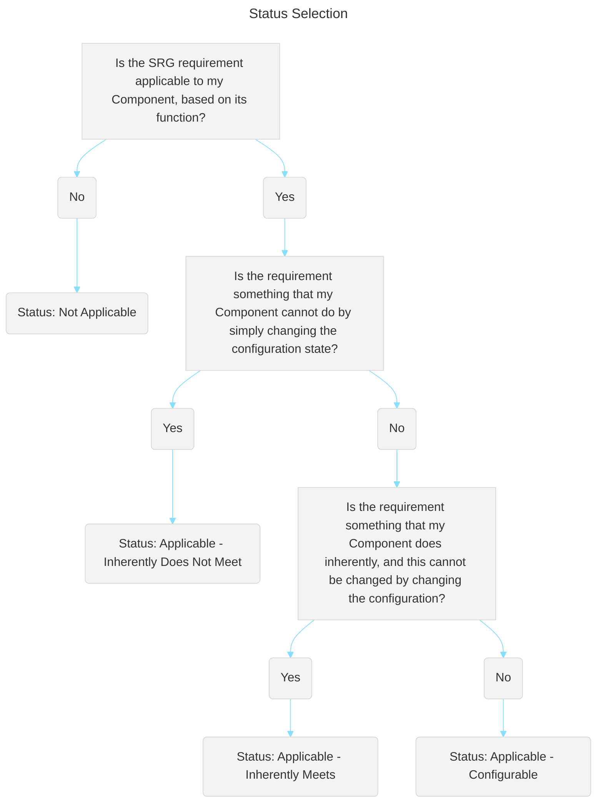

### 7.3.2 Our First Requirement Status

Let's pick a status for RHEL-09-000004. We will do this by reading the SRG requirement and determining if it applies to this particular component, and if so, if it is an innate feature of the system or not.

The requirement's title is *"The operating system must enforce the limit of three consecutive invalid logon attempts by a user during a 15-minute time period."*

::: details Based on the title, do you think this requirement applies to RHEL9 or not? If it applies, does RHEL9 need to be configured/can it be configured to do it?
This requirement does apply. RHEL9, like any other operating system, must be able to lock down an account to stop someone from simply brute-forcing the password.

RHEL9, luckily, has a built-in capability to do this. RHEL's `authselect` utility can turn on the faillock feature. Note that this requirement is considered configurable (i.e. it is possible to have the system configured to *either* meet or not meet this requirement).
:::
::: tip How do we know all this about the system?
If you are not familiar with the RHEL9 auditing system, don't worry; it's just an example we're using for the class. We promise we will not quiz you on how the `authselect` utility works.

If you have to develop STIG content for a project, it will concern a Component that you are familiar with enough to answer these questions (or are at least in a position to research).
:::
::: details Based on your decision, what status should we give this component?
We would consider this requirement **Applicable - Configurable.** The system is capable of complying with the SRG requirement, but _only if properly configured_.
:::

Based on our decision, let's edit the status field in the Component editing screen.
::: details Changing status
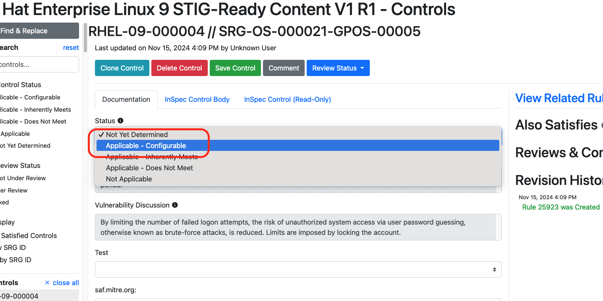

In the wild, it may be the case that most SRG requirements wind up being to Configurable - Applicable to your Component, and only a handful may be either Not Applicable, Inherently Met or Inherently Not Met. Or vice versa; many applications writing up guidance based on the ASD STIG realize that most of those requirements are not applicable to their simple web apps.

We still have to check each one to be sure!
:::

Note that once we select the status, the text fields become editable. Now we can tailor the general guidance from the SRG into specific guidance.

Before we do that, let's investigate a the Status field a bit more.

### 7.3.3 Another Requirement Status

Let's double back and pick an example with a different status. On the sidebar, click on RHEL-09-000045.

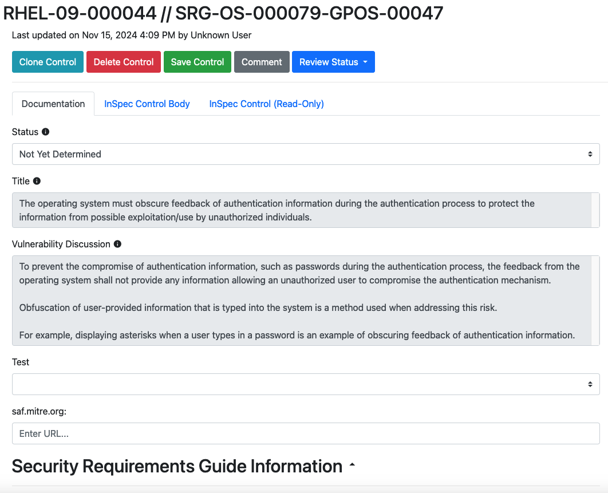

Our title here is "The operating system must obscure feedback of authentication information during the authentication process to protect the information from possible exploitation/use by unauthorized individuals."

::: details Based on the title, do you think this requirement applies to RHEL9 or not? If it applies, does RHEL9 need to be configured/can it be configured to do it?
Yes, this requirement still applies. Like most requirements, RHEL9 doesn't have any quirks that would make this requirement not apply.

However, you may know that RHEL (and all Linux OSes) obscure user passwords when they are entered either into the GUI or on the terminal. This behavior is baked into the RHEL source code -- there is no way for a user to configure the system to not do this.

As such, the status should be **Applicable - Inherently Meets.**
:::

Let's once again update the status of our requirement to match what we picked.

::: details Updating Status
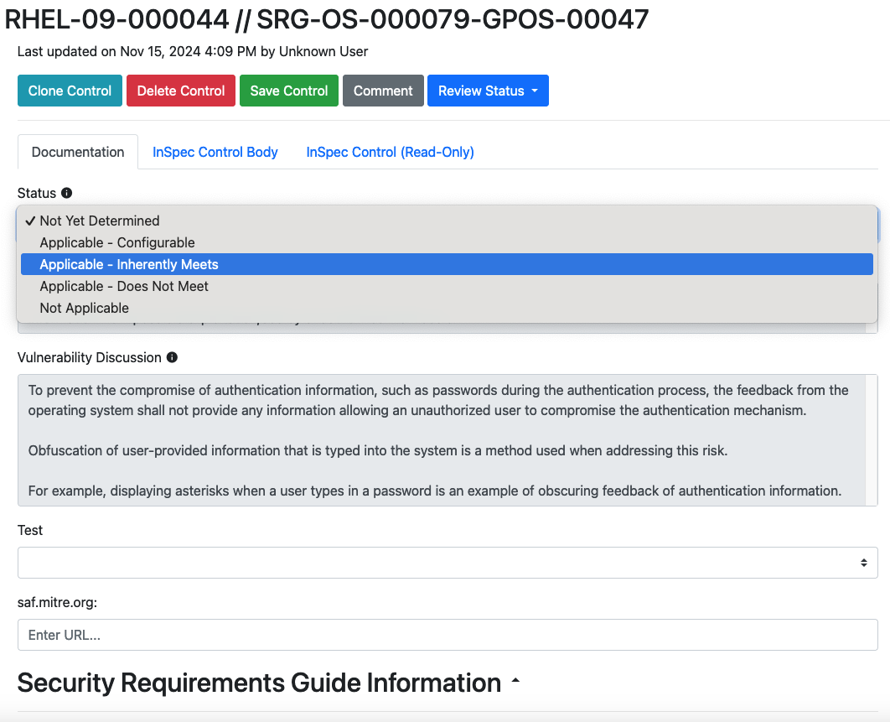
:::

Notice that this time, several of the fields in the Vulcan editing window changed.

## 7.4 Mitigations, Artifacts and Justifications

If a requirement is flagged as any of Not Applicable, Inherently Met, or Inherently Not Met, then we need to offer proof that this is the case, and give the end users guidance on how to mitigate the vulnerability if the requirement cannot be met.

If we select any of those statuses in Vulcan, we therefore get a different set of fields to complete. We can't describe them better than DISA can, so we will refer you to the Vendor STIG guide[^VendorSTIGProcessGuide] for the definitions of the new fields.

### 7.4.1 Mitigation

Per Per the Vendor STIG Process Guide section 4.1.15 -

"The Mitigation offers a method for minimizing risk. Mitigations do not eliminate the need for the requirement. 

The “Mitigation” field must be populated if the status of the requirement is Applicable – Does Not Meet.

After the mitigation, include a summary statement to address any impact to the overall risk associated with this requirement. 

Example summary statements:
- With the implementation of this mitigation, the overall risk can be decreased to a CAT [II or III].
- With the implementation of this mitigation, the overall risk is fully mitigated.
- Although the listed mitigation is supporting the security function, it is not sufficient to reduce the residual risk of this requirement.

An “Applicable – Does Not Meet” vulnerability may be fully mitigated by the application of another STIG check or by the underlying operating system. In these instances, include a statement in the Mitigation as shown in the example below. 

Examples of risk mitigated by other STIG requirements:
- This requirement is fully mitigated by the Apache Server 2.4 Windows Server STIG. The Apache Web Server accounts not used by installed features (e.g., tools, utilities, specific services) must not be created and must be deleted when the Apache web server feature is uninstalled. (AS24-W1-000280)
- This requirement is fully mitigated by the underlying operating system. (WN16-SO-000430)"

### 7.4.2 Artifacts

Per the Vendor STIG Process Guide section 4.1.16 -

"Populate this information for requirements that have a status of Applicable – Inherently Meets. The Artifact Description describes the artifacts or substantiating information that shows how the product inherently meets the requirement. 

All self-certification claims must be accompanied by supporting vendor documentation, which taken as a whole, provides DISA with reasonable assurance that the particular requirement has been met.

This field provides citations to the documentary evidence that describe how each requirement is satisfied. Examples of artifacts include:
- A test report describing the test procedures used to verify compliance and corresponding results, including the specific version of tools used to test and date of test.
- A published administrative manual or configuration guide explaining how compliance can be achieved.
- An attestation from the product developer that the product is compliant, accompanied by a brief statement describing the technical means by which compliance is achieved.
- Steps to verify the product cannot be configured to be out of compliance with the requirement.

Note: Blogs and email messages are not sufficient documentation to support an Applicable – Inherently Meets status."

### 7.4.3 Status Justification

Per the Vendor STIG Process Guide section 4.1.17 -

"For requirements that have a status of Not Applicable: 
- Explain in the Status Justification text why the requirement is not applicable. 
- The most common explanations are that the requirements concern a capability that is not present on the device (e.g., encryption of removable data storage media where the product does not support removable media) or the requirement pertains to an operational environment in which the product will not be placed (e.g., the requirement applies to classified processing when the product is intended only for unclassified applications).

For requirements that have a status of Applicable – Does Not Meet:
- Explain in the Status Justification text what function or feature is not present. 
- If some part of the requirement is achievable, the Status Justifications should explain what part of the requirement is unmet and what is met (e.g., the system can lock an account after certain failed logon attempts, but these failures are not limited to a specific window of time). 
- If no part of the requirement can be fulfilled, note this information. 
- Describe the residual risk after any mitigation is applied.

For requirements that have a status of Applicable – Inherently Meets
- List in the Status Justification text the specific feature of the product that supports this requirement and that cannot be changed. 
- Note the type of evidence used to establish compliance (e.g., test report, vendor documentation, or vendor attestation)."

::: warning What about the Vendor Comments field?
You may note that picking any status in Vulcan opens the Vendor Comments field for editing.

That field is purely stored in Vulcan and will not be included in any exports. It exists for the content authors to leave comments on the process of writing the requirement.

For example, an author may add their references for a control's Check or Fix text in the Vendor Comment field, since a reviewer might like to know how they arrived at their conclusions.
:::

### 7.4.4 Completing Our Requirement

We will not complete the Artifact field in RHEL-09-000045 because digging around in the RHEL9 source code is beyond the scope of this course.

However, let's be sure to enter in a Status Justification:

**RHEL9 automatically obfuscates user passwords in the graphical user interface and at the command line interface.**

Like so:

Hit "Save Control" when finished.

You'll be asked to fill out a short description of the change you made. If you are familiar with a source code manager like Git, this process is analogous to adding a commit message when you add code to version control.

## 7.5 Revision History

Once we save edits, we will see the Revision History on the right side of the screen automatically update:

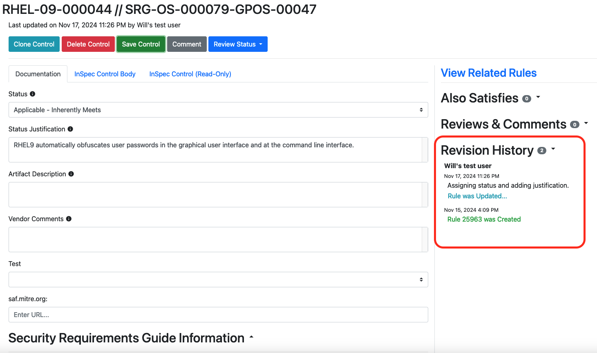

Clicking the "Rule Was Updated" button will show a before and after view of what was changed by the edit.

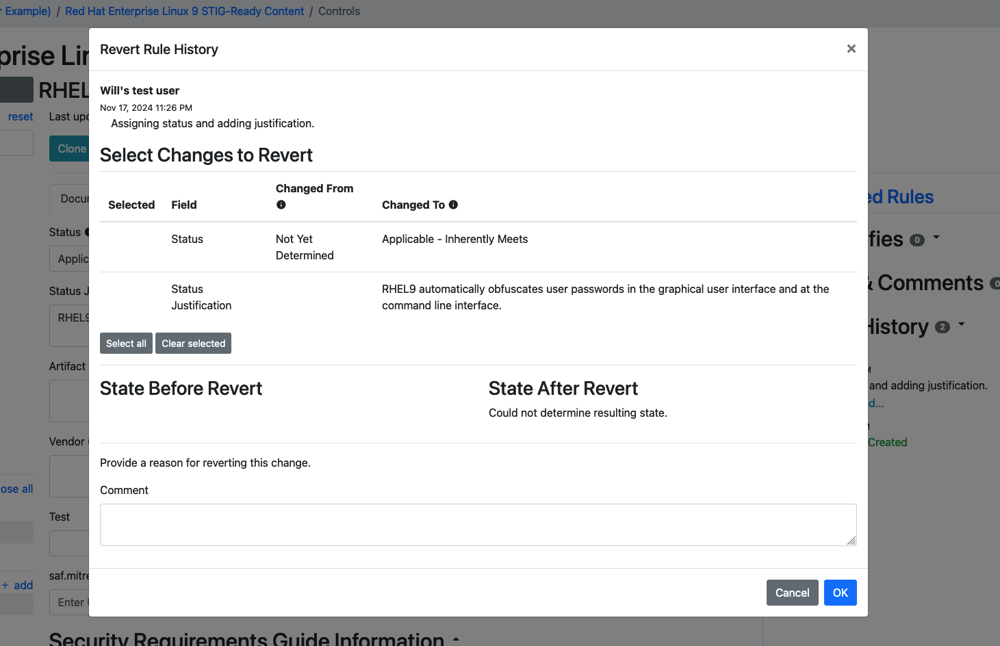

You can even select changes to revert, again similar to how a source code manager lets you roll back changes.

::: tip Why would I revert changes?
Remember that writing requirements in Vulcan is intended to be done in groups. Authors can and do often disagree about how a requirement should be completed.

Having the ability to granularly revert edits -- and even just track what change was made, when, and by who -- is an important part of a collaborative workflow.
:::

## 7.6 Combining Requirements

Remember how we said earlier that SRG requirements do not always have one-to-one equivalents in STIG documents? So far, we have noted that STIG requirements are distilled down from a more general SRG requirement. However, STIG authors often learn during the authorship process that a single STIG check will cover more than one SRG requirement, or that a single SRG requirement is better covered by several STIG checks. Therefore, in Vulcan, we sometimes need to indicate that one requirement in our security guidance covers multiple SRG controls, and sometimes we need to create a brand new requirement entirely.

Let's use the RHEL9 STIG -- the _real_ RHEL9 STIG -- as an example. The RHEL9 STIG document is conveniently loaded into the training instance of Vulcan for us to examine. Check out the STIG option on the top navbar.

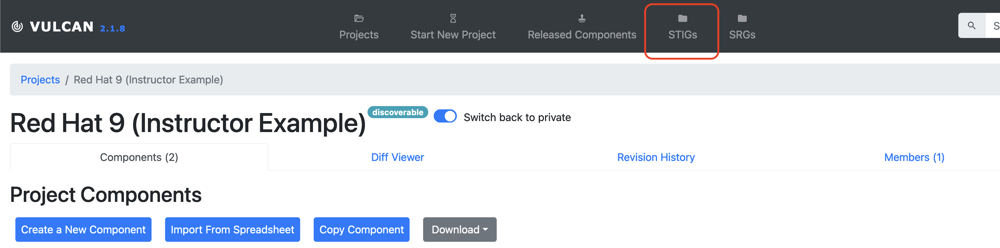

You can filter for RHEL and select the published RHEL9 STIG for easy viewing. (If you are running your own Vulcan locally, your instance admin user is able to upload the raw XCCDF document for the STIG on the same tab.)

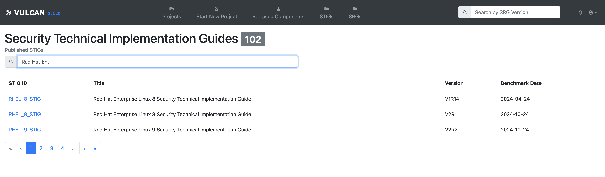

On the side of the page we see a search bar we can use to find individual components. We, the instructors, already know a good example for what we're talking about, so let's go ahead and search for the real STIG identifier `RHEL-09-211020`.

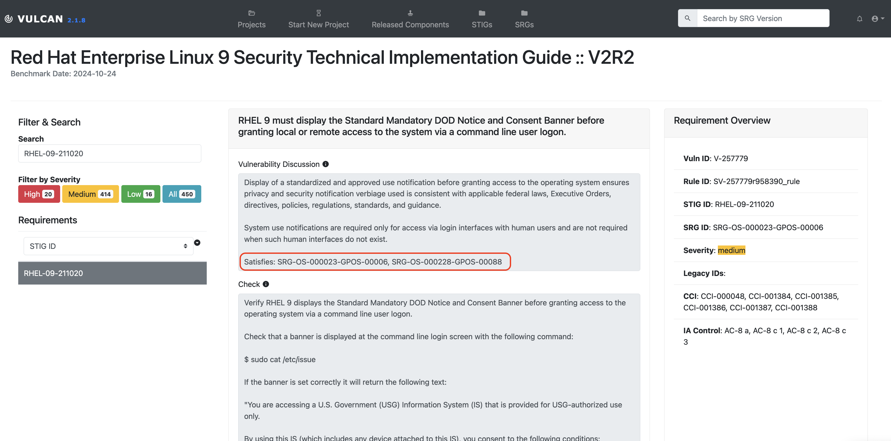

::: note Wait, why does the real STIG use different IDs for each requirement?
Recall that the IDs for our requirements were automatically generated sequentially from the SRG. We noted that a real, published STIG will have DISA use its own formula to apply STIG IDs. Our numbers and theirs will not match one-to-one and that is not a problem for the purposes of this class.
:::

`RHEL-09-211020` states that "RHEL 9 must display the Standard Mandatory DOD Notice and Consent Banner before granting local or remote access to the system via a command line user logon." If you've ever logged into a government computer (or even most corporate ones) you've probably seen a disclaimer like this that warns you that the organization owns this computer and you shouldn't put anything on it that you don't want to show up in a log aggregator.

The vulnerability discussion text states that this requirement _also_ satisfies several other SRG requirements. We can 

On our search bar, we can also switch to searching by SRG ID. Let's search for one of the SRG IDs we have already implemented in this class -- recall that our very own `RHEL-09-000004` requirement maps back to the upstream `SRG-OS-000021-GPOS-00005`. Let's search for that ID and see what the actual STIG authors for RHEL9 did for this one.

We can see a whole bunch of STIG requirements that cover this SRG control. If we take a look at each in turn we'll see that each of them is a unique check for a different system setting in RHEL9 that, when taken in aggregate, satisfy `SRG-OS-000021-GPOS-00005`.

::: note So how do I know which requirements are appropriate to combine or split apart?
There are no hard and fast rules for when we need to do this. It's up to you as the security guidance author to decide what makes a more logically organized document. 

However, a good rule of thumb is that you should mark a STIG requirement as satisfying multiple SRG requirements when the STIG requirement's Check Text test would be necessary to run in order to satisfy a different SRG requirement. Similarly, if your Check Text procedure in one STIG requirement involves testing multiple discrete settings of a system, then you may wish to split them into multiple STIG requirements. 
:::
::: warning Does that mean I can make just a few giant requirements in my security guidance to cover all the upstream SRG requirements?
No. We are _not_ saying that you should combine all of your requirements together without putting some thought into it.

Remember than people other than you and your team will need to understand the requirements you write. When in doubt, don't combine requirements. It's better to have requirements that are too specific than not enough.
:::

Now that we have poked around the real STIG for a while, let's discuss how to combine requirements in Vulcan.

## 7.6.1 The 'Also Satisfies' Feature

Head back to your Component and make sure you are in editing mode. Let's take a look at requirement `RHEL-09-000005`.

Looks familiar, right? This requirement is based off of the same SRG ID as the real STIG's banner text requirement.

Next, look at requirement `RHEL-09-000006`.

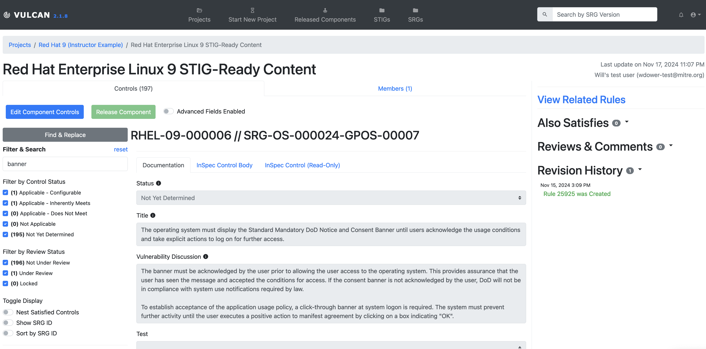

This requirement also deals with the banner message. The only difference between this requirement and the previous one is that `RHEL-09-000005` is asking that the banner be displayed _whenever someone accesses the system_ and `RHEL-09-000006` asking that the banner is displayed _until the user takes some action on the system_.

Both of these behaviors are in fact controlled by the same banner text file. In other words, we _cannot reasonably test requirement `RHEL-09-000005` without also testing requirement `RHEL-09-000006`_. This means that requirement `RHEL-09-000005` also satisfies `RHEL-09-000006`. Let's mark this in Vulcan.

Ensure the component is in edit mode and set the Status to "Applicable - Configurable". In the top right of the editing window for requirement `RHEL-09-000005` you will see a button labeled 'Also Satisfies':

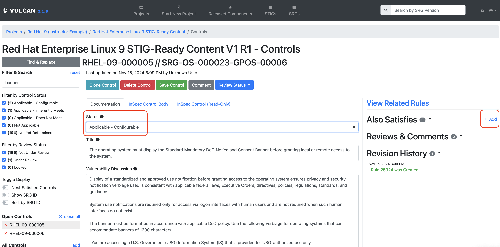

Select it and let's pick `STIG Ready whatever 2` in the search bar.

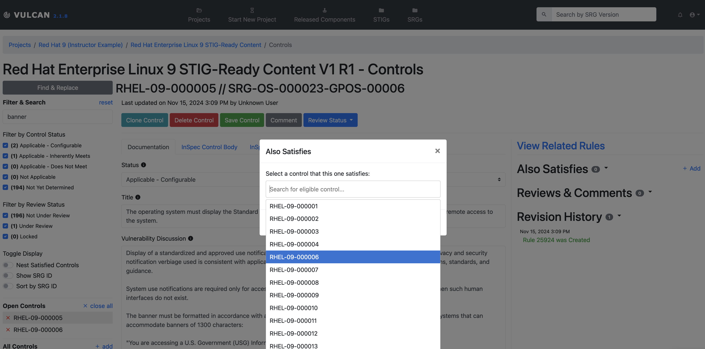

If we head over to view `RHEL-09-000006`, we see that it is not editable, because we indicated that another requirement already satisfies it. We also see a little indicator of this relationship next to each requirement in the list on the left-hand side.

::: warning
The requirement _must_ have its status set to "Applicable - Configurable" for the "Also Satisfies" add button to appear. The feature does not make sense in the context of any other status.
:::

[^Statuses]: Definitions from Table 4-1 in DISA's Vendor STIG Process Guide. See Resources.
[^VendorSTIGProcessGuide]: Sections 4.1.15 through 4.1.17 of the "Vendor STIG Process", Version 4 Release 1. See [Resources](../../resources/README.md).