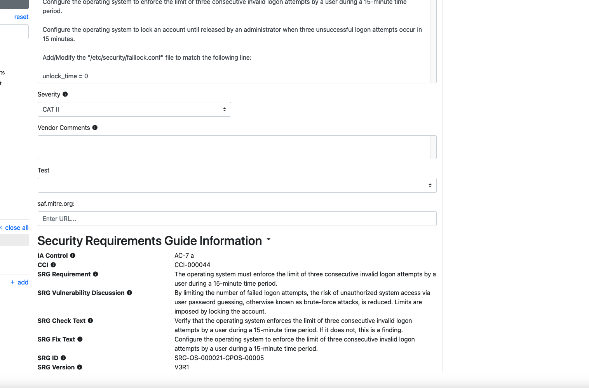

## 8.1 Check and Fix

Let's go back to our requirement for earlier that we said was "Applicable - Configurable." It's time to fill it out completely.

The Check and Fix fields are the ones that acually tell the user:
1. How to determine if a piece of software is compliant with the requirement, and 
2. How to bring it into compliance if it isn't already. 

As such, these fields represent the bulk of what you will need to research and modify when constructing your security guidance.

DISA requires that STIG authors use very specific language for these sections. Again, we will leverage the official guidance[^VendorSTIGProcessGuide] for instructions.

## 8.2 Check

Per the Vendor STIG Process Guide section 4.1.11 -

"The Check is used to provide specific instruction on how to validate product configuration settings. It must include any information and procedures necessary for validating the configured value.

The Check should also state:
- What system privileges, if any, are necessary to perform the check.
- Whether the check procedure requires local access or can be performed remotely.
- Whether performing the check impacts system reliability or availability.

If the vendor is leveraging third-party tools to satisfy a requirement, identify in the Check the product and the specific steps to check compliance. 

If the product is expected to be compatible with a number of third-party tools, include in the Check general instructions that would enable a systems administrator with reasonable familiarity with the third-party tool to perform the necessary procedure. 

For example, if the requirement is to block certain TCP ports on a firewall, a general instruction to this effect may suffice.
"

### 8.2.1 Check Writing Style

"Write the Check so the user can easily follow the steps to assess and determine compliance. 
- If the check procedure is not applicable for a specific condition, state that at the top of the Check. (Refer to “Check text example” below.)
- Do not restate the requirement in the Check.
- Do not include steps to alter values or settings.
- Do not use words such as “should,” shall,” or “please.” 
- Use action verbs such as “verify,” “navigate,” “identify,” “type,” “obtain,” etc.
- Give exact steps to test compliance with the requirement.
- For checks that require a sequence of actions, use numbered steps as shown below:
    1. Log on to…
    2. Open the…
    3. Click….
    4. Determine…
-  Include a “finding” statement written as: “If….this is a finding”.

**Check text example:**
    
    If Bluetooth connectivity is required to facilitate use of approved external devices, this is not applicable.

    To determine if any hardware components for Bluetooth are loaded in the system, run the following command:

    # sudo kextstat | grep -i Bluetooth

    If a result is returned, this is a finding.

    In some cases, determining when an item is NOT a finding might be appropriate.

**Check text example:**
    
    If the "xyz" parameter is set to "5", this is not a finding.

    When using a command to inspect the status of a host, listing example output can be helpful. The output must comply with STIG requirements unless an example of a failure is needed and is clearly explained.

**Check text example:**
    
    Find the file systems that contain the directories being exported with the following command:

    # cat /etc/fstab | grep nfs
    UUID=e06097bb-cfcd-437b-9e4d-a691f5662a7d    /store        nfs        rw,nosuid     0 0

    If a file system found in "/etc/fstab" refers to NFS and does not have the "nosuid" option set, this is a finding.
"

::: note The Finding Statement
We want to call out the Finding statement as particularly important. STIG content must be very clear on when exactly a misconfiguration becomes a **finding,** or non-compliance with the requirement.

Recall that a STIG is intended to be something that can be followed by someone who is not an expert in the system at hand; recall also that we want to eventually automate these checks, and as such we want to make it easier for us as well!
:::

## 8.3 Fix

Per the Vendor STIG Process Guide section 4.1.11 -

"The Fix is used to provide specific instructions on how to configure the product to comply with the requirement. 

After steps in the Fix text are implemented, the resulting system state should be the same no matter how many times the instructions are followed."

## 8.3.1 Fix Writing Style

"When writing the Fix content, the vendor must include all steps needed to configure the product to comply with the requirement.
- Do not use general language. When writing the criteria statement in the Fix text, be specific. Use the exact steps to take to bring the product into compliance with the requirement.
- Do not restate the requirement in the Fix.
- In the Fix procedures, do not use such words as “should,” shall,” or “please.” 
- Use action verbs such as “ensure,” “configure,” “set,” “select,” etc.
- For Fix procedures that require a sequence of actions, use numbered steps as shown below:
    1. Log on to…
    2. Open the…
    3. Click the….
    4. Ensure…
- Do not include a finding statement in the Fix.
"

## 8.4 Completing Our Requirement

Let's go back and try this for requirement RHEL-09-000003. Right now, the requirement is only populated by the original SRG text. We need to tailor this to RHEL9.

### 8.4.1 Using Other STIGs as Reference

Remember that STIG writing is an open-book test. We encourage authors to go back and take a look at how other authors filled out their requirements for similar systems. In fact, the best place to look for reference is usually in a prior major version of the same software. That is, the best place to start for security guidance for RHEL9 is to *see what they did for other RHEL versions!*

Luckily, Vulcan has access to every STIG and SRG you have uploaded to the instance for cross-referencing.

1. Click on the RHEL-09-000003 requirement again and click on the "View Related Rules" button on the right-hand side.

You'll see a view of every requirement Vulcan can find in its content library that also refers back to the same SRG ID.

You can filter and search through this library for keywords if you like, or even restrict the results to only show content your team has written inside this Vulcan instance's Components. For now, though, we are likely interested only in the published STIGs.

2. Let's take a look at some of these RHEL7 STIG requirements. They seem promising. We can even copy them directly into the Check and Fix fields on our RHEL9 STIG requirement if we want to! Let's do that now.

::: warning 
The real, published RHEL9 STIG is uploaded to this Vulcan instance. For the purposes of this exercise, though, we will use an earlier version of RHEL.
:::

Great! Now we have a Check and Fix field that actually have content. Note also that this content is already following STIG syntax; the commands are very direct, and the line on what counts as a finding is clearly drawn.

3. Save the requirement.

::: warning Is It Always This Easy?
Prior STIGs are always an excellent *starting point,* but new STIG content does require research and testing to ensure that guidance from the prior STIGs is still accurate for our current Component.
:::
::: note The Original SRG content
If you scroll down in the requirement window, you can expand out the original SRG content that this STIG requirement was sourced from. This can be useful to reference if you want to make sure your Check and Fix are still addressing the SRG requirement.

:::
[^VendorSTIGProcessGuide]: Sections 4.1.11 and 4.1.13 of the "Vendor STIG Process", Version 4 Release 1.