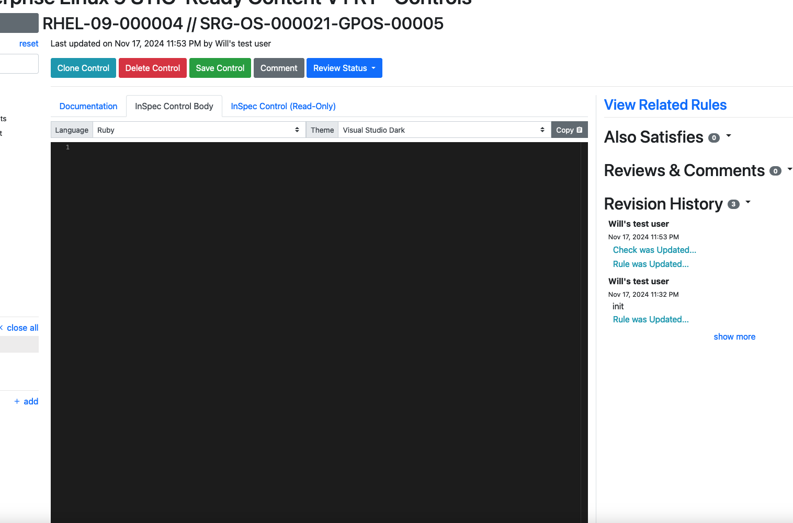
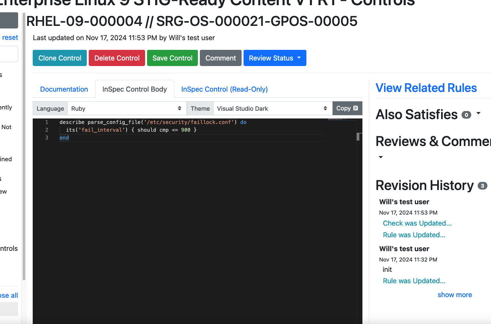
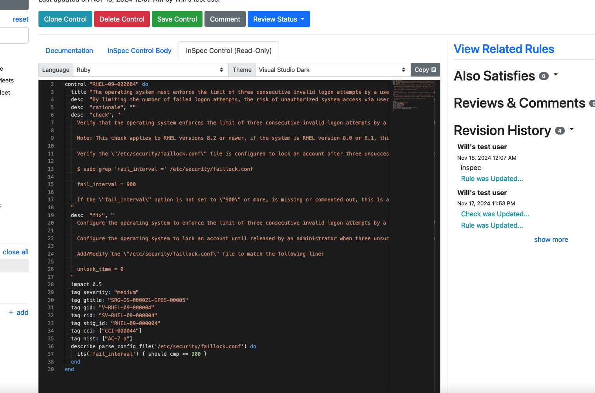

## 9.1 Automated Validation Tests

Now that we have written up some Check and Fix text, it's time to use one of Vulcan's other features -- the InSpec code pane.

We've already used Vulcan to generate a document that has most of the metadata in place that we would need to properly label an automated validation test. Now we can go the last mile or so to a complete security test.

### 9.1.1 The InSpec Control Body

1. Click on the InSpec Control Body tab in the requirement window.



You'll see a code editing window directly in Vulcan. What we can do now is write in the test code we want to use for testing the check we just wrote.

::: warning Wait, what if I have no idea how to write InSpec code?!
Great news, we have an in-depth [training class](@/../../../courses/beginner/README.md) on how to do this ([two of them](@/../../../courses/advanced/README.md), actually).

But if you don't have the time for those, don't sweat it; we just want you to know that this is something you can do with Vulcan.
:::

2. For demonstration purposes, we'll copy in the code from the actual MITRE SAF RHEL7 STIG InSpec profile[^rhel7_profile].

That code is as follows:
``` ruby
audit_command = '/etc/passwd'

if virtualization.system.eql?('docker')
  impact 0.0
  describe 'Control not applicable - audit config must be done on the host' do
    skip 'Control not applicable - audit config must be done on the host'
  end
else
  describe 'Command' do
    it "#{audit_command} is audited properly" do
      audit_rule = auditd.file(audit_command)
      expect(audit_rule).to exist
      expect(audit_rule.key).to cmp 'identity'
      expect(audit_rule.permissions.flatten).to include('w', 'a')
    end
  end
end
```

3. Go ahead and copy that code block and paste it into the editing window.



::: note
If you have taken the SAF User class, you have used `inspec exec` to run code that looks like the above against a target system.
:::

4. Save the requirement.

5. Now check the "InSpec Control (Read-Only)" tab. It has used the contents of the other two tabs to assemble a completed InSpec control from your requirement, including the complete context of your STIG control as metadata tags in the test.



We can export this content and start using it immediately if we wish (we'll discuss how in a later section).

### 9.1.2 Why am I writing test code inside Vulcan?

Vulcan includes the ability to write InSpec control code right alongside original guidance because we need a tight binding between the human-readable guidance and the machine-readable automation code.

Using Vulcan will ensure that all of your guidance is included in your test code as metadata (you can also do this by creating a profile stub with the [SAF CLI](https://saf-cli.mitre.org/#xccdf-benchmark-to-inspec-stub).)

You can think of this process as recording the pedigree of your tests into the code, so that you dont lose it as your code moves down the pipeline, and so that you *always know why you are running a check*.

Furthermore, another reason we added the InSpec control editing window is because in most cases, you are writing security guidance because you want to write security validation code! Recall that the whole point of Vulcan is to help us define the security posture target so that we can automate reaching it!

::: note Do I need to use InSpec for my ATO process?
DOD does not and will not require teams to use any one particlar security validation tool.

MITRE SAF favors InSpec because it favors our use cases nicely, but there are many different security tools on the market, some of which are better suited to particular tasks.
:::

[^rhel7_profile]: See the full profile code [here](https://github.com/mitre/redhat-enterprise-linux-7-stig-baseline). Or see many more examples of InSpec profiles at https://saf.mitre.org/libs/validate.