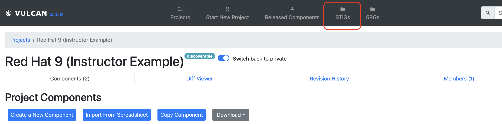
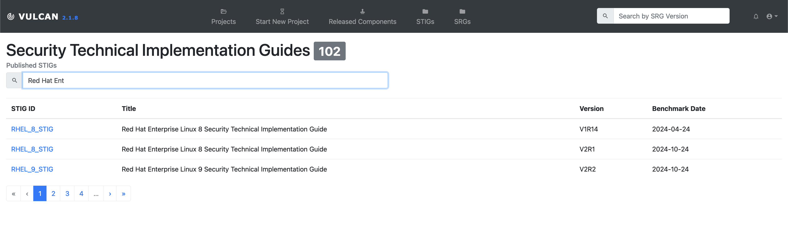
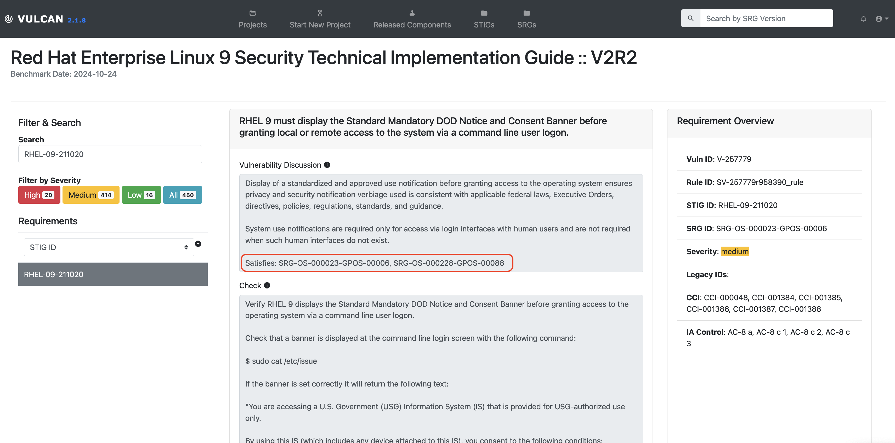
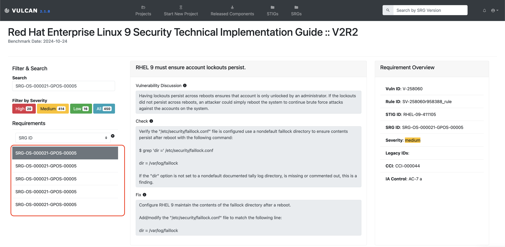
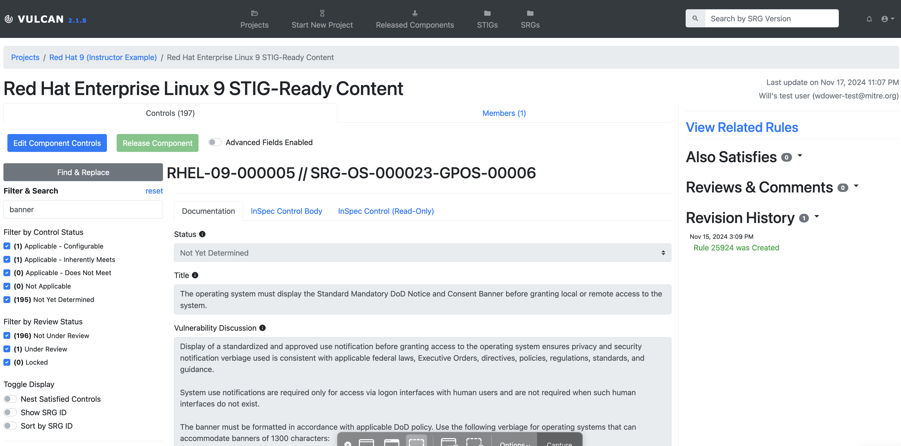
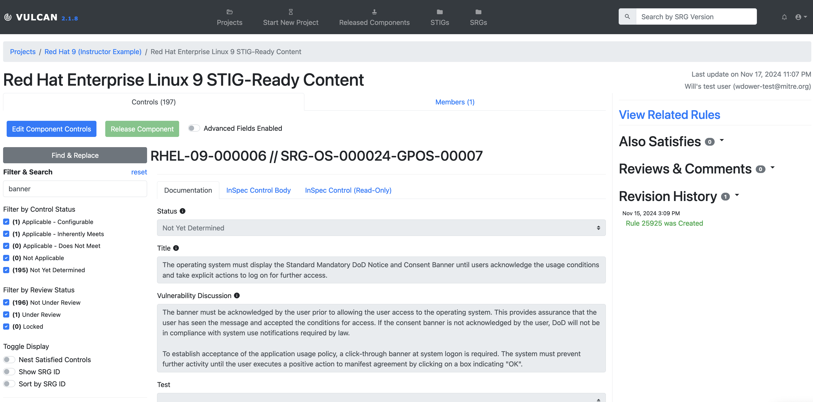
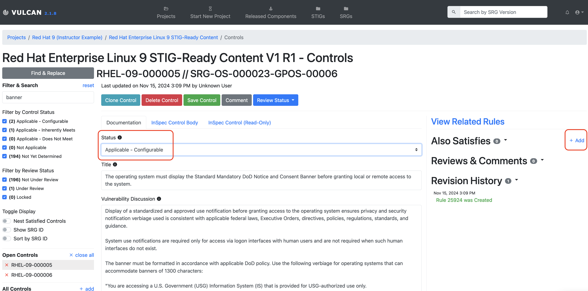
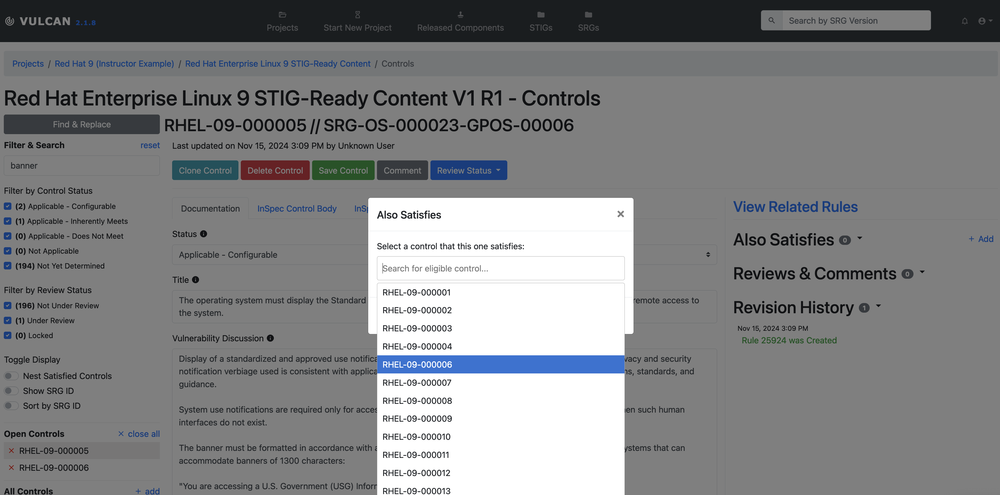
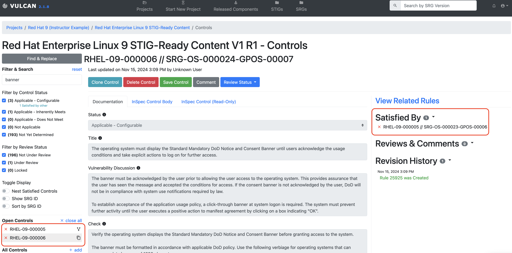

## 10.1 Combining and Adding Requirements

Remember how we said earlier that SRG requirements do not always have one-to-one equivalents in STIG documents? So far, we have noted that STIG requirements are distilled down from a more general SRG requirement. However, STIG authors often learn during the authorship process that a single STIG check will cover more than one SRG requirement, or that a single SRG requirement is better covered by several STIG checks. Therefore, in Vulcan, we sometimes need to indicate that one requirement in our security guidance covers multiple SRG controls, and sometimes we need to create a brand new requirement entirely.

## 10.2 Checking the Answer Key

Let's use the RHEL9 STIG -- the _real_ RHEL9 STIG -- as an example. The RHEL9 STIG document is conveniently loaded into the training instance of Vulcan for us to examine. Check out the STIG option on the top navbar.

You can filter for RHEL and select the published RHEL9 STIG for easy viewing. (If you are running your own Vulcan locally, your instance admin user is able to upload the raw XCCDF document for the STIG on the same tab.)

On the side of the page we see a search bar we can use to find individual components. We, the instructors, already know a good example for what we're talking about, so let's go ahead and search for the real STIG identifier `RHEL-09-211020`.

::: note Wait, why does the real STIG use different IDs for each requirement?
Recall that the IDs for our requirements were automatically generated sequentially from the SRG. We noted that a real, published STIG will have DISA use its own formula to apply STIG IDs. Our numbers and theirs will not match one-to-one and that is not a problem for the purposes of this class.
:::

`RHEL-09-211020` states that "RHEL 9 must display the Standard Mandatory DOD Notice and Consent Banner before granting local or remote access to the system via a command line user logon." If you've ever logged into a government computer (or even most corporate ones) you've probably seen a disclaimer like this that warns you that the organization owns this computer and you shouldn't put anything on it that you don't want to show up in a log aggregator.

The vulnerability discussion text states that this requirement _also_ satisfies several other SRG requirements.

On our search bar, we can also switch to searching by SRG ID. Let's search for one of the SRG IDs we have already implemented in this class -- recall that our very own `RHEL-09-000004` requirement maps back to the upstream `SRG-OS-000021-GPOS-00005`. Let's search for that ID and see what the actual STIG authors for RHEL9 did for this one.

We can see a whole bunch of STIG requirements that cover this SRG control. If we take a look at each in turn we'll see that each of them is a unique check for a different system setting in RHEL9 that, when taken in aggregate, satisfy `SRG-OS-000021-GPOS-00005`.

::: note So how do I know which requirements are appropriate to combine or split apart?
There are no hard and fast rules for when we need to do this. It's up to you as the security guidance author to decide what makes a more logically organized document. 

However, a good rule of thumb is that you should mark a STIG requirement as satisfying multiple SRG requirements when the STIG requirement's Check Text test would be necessary to run in order to satisfy a different SRG requirement. Similarly, if your Check Text procedure in one STIG requirement involves testing multiple discrete settings of a system, then you may wish to split them into multiple STIG requirements. 
:::
::: warning Does that mean I can make just a few giant requirements in my security guidance to cover all the upstream SRG requirements?
No. We are _not_ saying that you should combine all of your requirements together without putting some thought into it.

Remember that people other than you and your team will need to understand the requirements you write. When in doubt, don't combine requirements. It's better to have requirements that are too specific than not enough.
:::

## 10.3 Combining Requirements

Now that we have poked around the real STIG for a while, let's discuss how to combine requirements in Vulcan.

## 10.3.1 The 'Also Satisfies' Feature

Head back to your Component and make sure you are in editing mode. Let's take a look at requirement `RHEL-09-000005`.

Looks familiar, right? This requirement is based off of the same SRG ID as the real STIG's banner text requirement.

Next, look at requirement `RHEL-09-000006`.

This requirement also deals with the banner message. The only difference between this requirement and the previous one is that `RHEL-09-000005` is asking that the banner be displayed _whenever someone accesses the system_ and `RHEL-09-000006` asking that the banner is displayed _until the user takes some action on the system_.

Both of these behaviors are in fact controlled by the same banner text file. In other words, we _cannot reasonably test requirement `RHEL-09-000005` without also testing requirement `RHEL-09-000006`_. This means that requirement `RHEL-09-000005` also satisfies `RHEL-09-000006`. Let's mark this in Vulcan.

Ensure the component is in edit mode and set the Status to "Applicable - Configurable". In the top right of the editing window for requirement `RHEL-09-000005` you will see a button labeled 'Also Satisfies':

Select it and let's pick `RHEL-09-000006` in the search bar.

If we head over to view `RHEL-09-000006`, we see that it is not editable, because we indicated that another requirement already satisfies it. We also see a little indicator of this relationship next to each requirement in the list on the left-hand side.

::: warning
The requirement _must_ have its status set to "Applicable - Configurable" for the "Also Satisfies" add button to appear. The feature does not make sense in the context of any other status.
:::