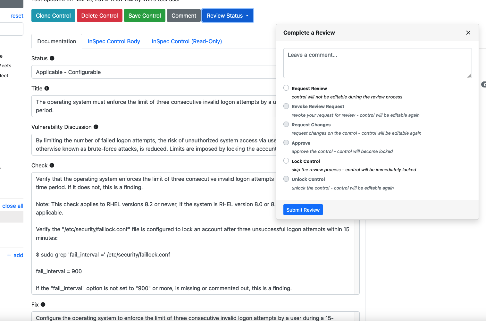
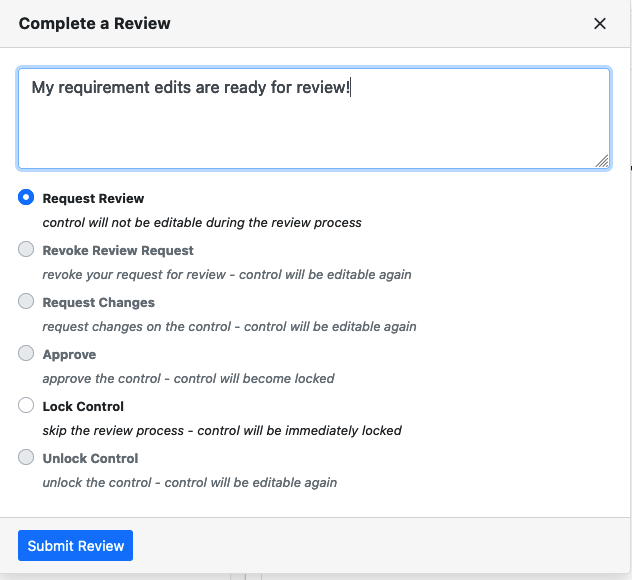
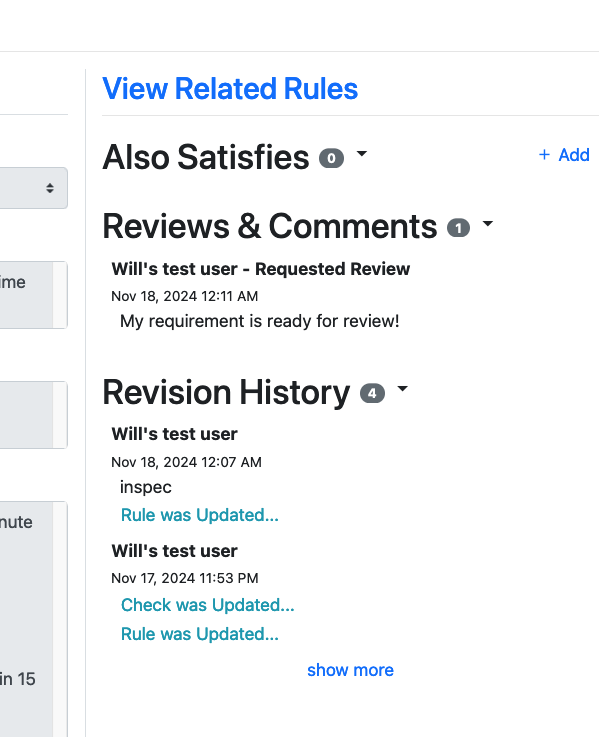
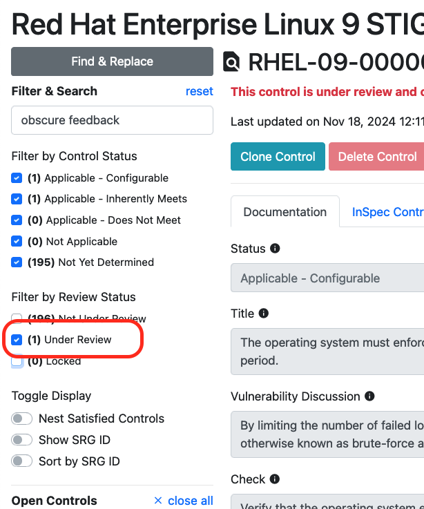

## 10.1 Peer Review

With that, we've done two full requirements -- one "Applicable - Configurable" and one "Applicable - Inherently Meets." There are only 189 or so more requirements to go!

In a real project of this size, you will be part of a team of authors each taking a subset of these requirements to complete. However, in a project of any size, you will also be peer reviewing the content your colleagues write to ensure quality standards are met.

## 10.2 Marking Requirements For Review

Let's flag our completed RHEL-09-000003 requirement as Ready for Review.

1. Click on the "Review Status" button at the top of the requirement window.

Note that we, as the primary author, are *not able to approve our own requirement;* the option is grayed out. All we can do is mark the requirement for review (or, as an admin, we can simply lock the control against further edits).

2. Let's add a comment and click the radio button to designate this requirement as Ready for Review.

3. Click "Submit Review" when done.

Note that the "Reviews & Comments" section on the right hand side of the Component view has updated.

Note also that the control is locked from further editing now. We can reverse this using the Review Status menu if we want.

## 10.3 Approving Requirements

If you want to conduct a peer review on another author's requirements, you can do so by filtering the requirements using the filter bar on the left side of the Component view.

If you enter a control that has been marked for review, and you are at least the role of Reviewer on the project, you will be able to:
- Approve: Lock the requirement for further editing; it is considered complete.
- Request Changes: unlock the requirement for further edits

