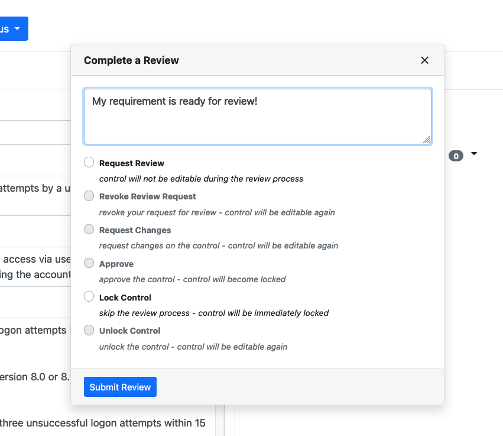

## 10.1 Peer Review

With that, we've adjudicated two full requirements -- one "Applicable - Configurable" and one "Applicable - Inherently Meets." There are only 195 or so more requirements to go!

In a real project of this size, you will be part of a team of authors each taking a subset of these requirements to complete. However, in a project of any size, you will also be peer reviewing the content your colleagues write to ensure quality standards are met. Until a requirement has undergone peer review in Vulcan, it is not considered fully complete. Once peer review has been done for a requirement, that requirement will enter the locked state, and it will no longer be editable.

::: note Do I have to peer review to use Vulcan?
Technically, a project admin can circumvent peer review by locking requirements without going through the process we are about to describe. It is not best practice to have a single author be the only "pair of eyes" on a large batch of requirements.

We strongly suggest that you write requirements as part of a team and undergo at least a simple peer review workflow. It helps keep all authors on the same page, and you'd be surprised how many mistakes even a quick peer review can catch and how many discussions it will start.
:::

## 10.2 Marking Requirements For Review

Let's practice peer reviewing requirements. lag our completed RHEL-09-000004 requirement as Ready for Review.

Click on the "Review Status" button at the top of the requirement window. You will see the Review modal appear. 

Note that you, as the primary author, are *not able to approve your own requirement;* the option is grayed out. All we can do is mark the requirement for review (or, as an admin, we can simply lock the control against further edits -- ignore this option for now).

Let's add a comment and click the radio button to designate this requirement as Ready for Review.

Click "Submit Review" when done.

Note that the "Reviews & Comments" section on the right hand side of the Component view has updated.

Note also that the control is locked from further editing now. We can reverse this using the Review Status menu if we want by removing the review request, which will unlock the requirement for editing.

## 10.3 Approving Requirements

If you want to conduct a peer review on another author's requirements, you can do so by filtering the requirements using the filter bar on the left side of the Component view.

If you enter a control that has been marked for review, and you are at least the role of Reviewer on the project, you will be able to:
- Approve: Lock the requirement for further editing; it is considered complete.
- Request Changes: unlock the requirement for further edits

::: tip
Remember earlier when we added more members to our project? If you are taking the SAF Guidance class as part of a group, ask another class attendee to review your requirement, and you can review theirs.
:::

