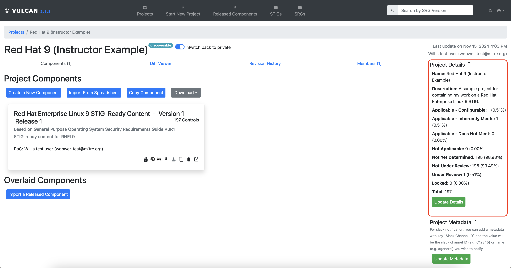
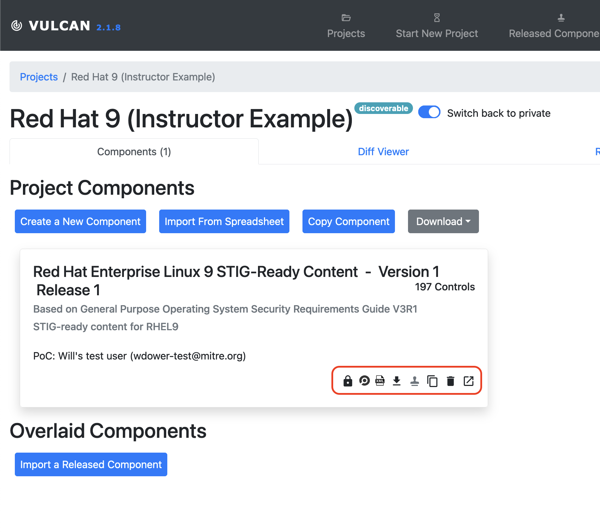
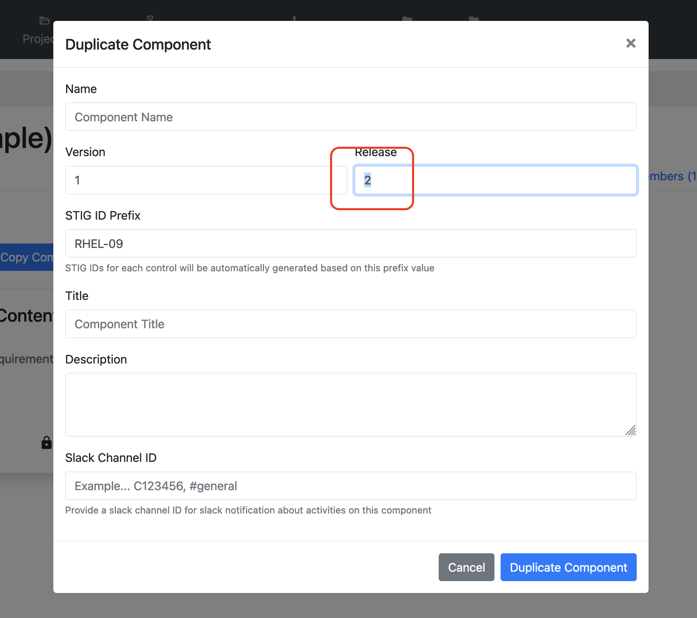
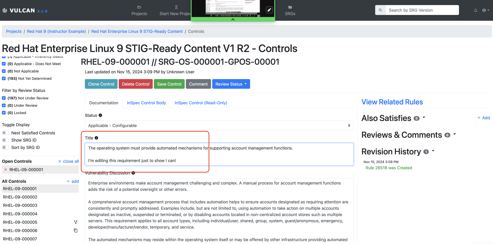
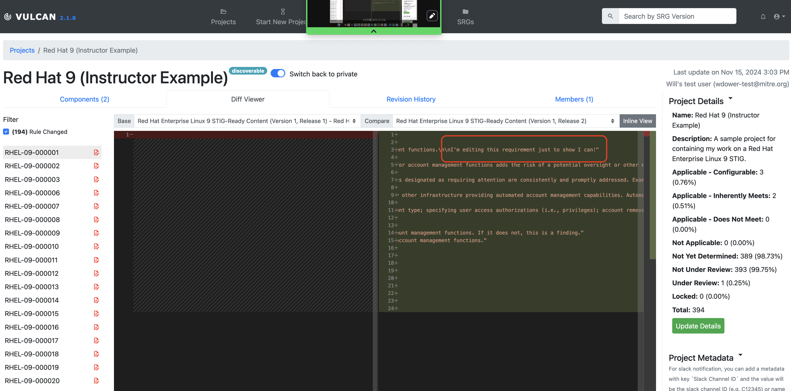

## 11.1 Exporting Your Content

At this point, we have tailored two requirements from the original SRG into STIG-ready content, and discussed how to peer review them.

Let's discuss what we can do with our components after we finish the requirement writing and reviewing.

## 11.2 Exporting the Guidance Document

We have a few ways of exporting the content from Vulcan once it is written.

1. Use the "Projects" link in the Vulcan navbar to return to the projects list page. Then click on your RHEL9 project to return to your project view.

Notice on the right-hand side that the overall project summary now reflects that we made edits.

2. You'll see a number of buttons alongside the bottom of the Component we have been editing. 

From left to right, those buttons will:

- Lock all Component controls from further editing
- Export the Component's InSpec code as a .zip of an InSpec profile
- Export the Component as a comma-separated values file (CSV)
- Release the Component -- note that this option is not enabled unless all controls have been locked from further editing
- Duplicate the Component -- this creates a copy of the Component within the same Project; useful for creating a new release of the same Component without having to change the original
- Remove the Component -- Careful with this one!
- Open the Component -- Takes us to the editing screen

### 11.2.1 Notes on Releasing

A component can only be released if every requirement is locked. Requirements are only locked from further editing when they have undergone peer review. Therefore, releasing a component should only happen when all authorship is complete.

::: tip Importing a Released Component
Once a Component is released, it can be imported into a different Vulcan project as a building block.

One of our purposes with Vulcan is to avoid duplicating effort wherever possible; if the guidannce is already written, we want to be able to access it!
:::

### 11.2.2 Notes on Exporting

Unlike formal release, the Component does not need to be locked to be exported (in any format). You are not required to keep your editing workflow inside Vulcan (though we do, of course, recommend keeping your workflow inside Vulcan where you can).

::: note 
This means, for example, that we can export our InSpec profile regularly to test our code against test systems throughout the authorship process.
:::

## 11.3 Diff Viewer

We have spent quite a bit of time discussing how to use Vulcan to make initial authorship easier. However, Vulcan also has features intended to make the maintenace of your guidance documentation easier.

This is why we have a Duplicate Component button available on the Component card, for example.

### 11.3.1 Creating a Different Component

We will not be releasing the Component in this class because that would require us to at least have made a Status Determination for each requirement. We can, however, create a Duplicate of the component. Let's do that now.

::: note Why are we duplicating the Component?
In a complex system with many software components, it may make sense to create multiple Components in one project, all of which have a shared source SRG.

For this example, we are duplicating the Component to mimic the release process.
:::

3. Click the "Duplicate the Component" button on your Component for RHEL9. You will see a pop-up that is similar to the one you saw when creating the first Component from an SRG.

This time, we want to mark this Component as Version 1, Release 2.

4. Since we have created a new Component, we should change something inside it.

Let's open up the component and edit another one of the controls. Any will do.

5. Save the edit, just like you would in the first release.

6. Go back to the Project page for RHEL9 and click the Diff Viewer tab. You'll get a menu asking you which two Components you want to compare.

7. Let's pick our two different releases of our RHEL9 component. We get a side-by side comparison view of our components, highlighting changes.

::: note
Duplicating a Component automatically generates empty InSpec stubs inside the new component, which is why the Diff viewer believes that every requirement has a change.
:::
::: tip How do I use this?
The Diff Viewer enables you to do several things.

For one, you can compare releases to tell at a glance what has changed in a piece of guidance, which traditionally would require tracking everything in a changelog manually.

For another, we can easily compare the Components we make with published STIGs.
:::

At this point, we have gone over most of the processes you would use in Vulcan to develop your own security guidance content. To close us off, let's review the process for foally publishing a STIG.