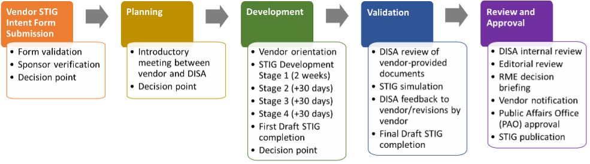

## 12.1 Notes on Formally Publishing a STIG

Most of this section is informed by DISA's own published guidance for the Vendor STIG Process, as well as the experiences of external teams and Vulcan stakeholders who have undergone the STIG creation process.

We recommend that you review the official Vendor STIG Process guide (see Resources for a copy) if you want to undergo the process.

::: tip Using Vulcan for Aritifact Management
DISA will require you to provide your draft content for review in Excel format.

That is to say, DISA's process is completely separate to Vulcan, and they will not need access to it.

Luckily, Vulcan can both export STIG-ready content to Excel format for DISA to ingest, and load reviewed content from DISA as a separate Component for easy comparison.
:::

## 12.2 Starting the Process

First and foremost - reach out early!

DISA created the Vendor STIG Process to ensure that the content produced by the vendor community is up to DOD standard. As such, DISA prefers to meet with the STIG-ready content team before the content is written to discuss the characteristics of the software component the team is trying to write guidance for.

DISA will also provide guidance on which SRG (or set of SRGs) should be selected as a foundation.

::: note Do I need to be the actual vendor to publish my content?
Not necessarily. DISA certainly expects that most people who look to formally publish STIG content will be the vendor that created a particular software component, but this is not required.

If you expect that the content you have created for a component for one project would be:
 a) useful to the wider security community, or
 b) useful to you personally on a later project
then reach out to DISA to formally publish it.
:::

### 12.2.1 Writing Style

Remember that STIGs need to be very precise about the language used in their requirements. See the discussions in [Section 8](@/../08.md) of this class for details on the correct syntax and writing style notes for the Check and Fix fields. 

## 12.3 Stages of STIG Development

DISA's documentation on the STIG process[^VendorSTIGProcessGuide] breaks it down into four development stages after the initial SRG selection, punctuated by frequent updates to and review by the agency. After the external author team finishes STIG development, there are a few more internal reviews at DISA before the final decision is made to publish.

### 12.3.1 Stage 1 STIG Development (The First Ten Requirements)

The author team will first fill out a total of 10 of the requirements in the STIG document, where the 10 requirements are a mix of all statuses (Applicable – Configurable, Applicable – Inherently Meets, Applicable – Does Not Meet, and Not Applicable).

### 12.3.2 Stage 2 STIG Development

If this initial round of requirements are written satisfactorily, the author team can continue work on the STIG content for 30 days before the next work-in-progress review from DISA. The agency may give further feedback on areas to improve at this point before continuing.

### 12.3.3 Stage 3 STIG Development

The author team can continue writing STIG content for another 30 days (a total of 60 days after the initial decision to proceed) before the next round of work-in-progress review from DISA. The agency may give further feedback on areas to improve at this point before continuing.

### 12.3.4 Stage 4 STIG Development

After another 30 days (90 days total from the initial decision to proceed) the author team should submit a completed initial draft of the STIG to DISA for a full validation of the content.

### 12.3.5 STIG Validation

Once the full draft is submitted, DISA will validate the contents of the STIG Check and Fix instructions by implementing them against a test system (the author team, if they work for the vendor of a not-yet-released product, may need to work to ensure that DISA can access a test system).

### 12.3.6 Review and Approval

At this point, DISA personnel write up a formal reports to the DISA Authorizing Offical and confirm one last time that the STIG conforms to the style guide. Content that passes this final review is now officially a STIG and can be published to the DOD Cyber Exchange.

[^VendorSTIGProcessGuide]: Section 3 of the "Vendor STIG Process", Version 4 Release 1. See Resources.