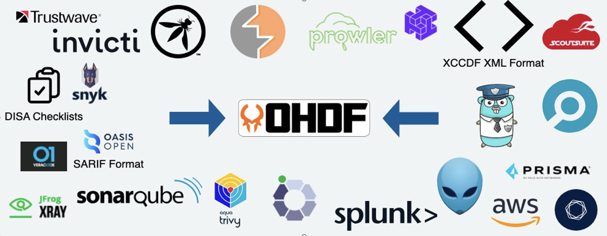
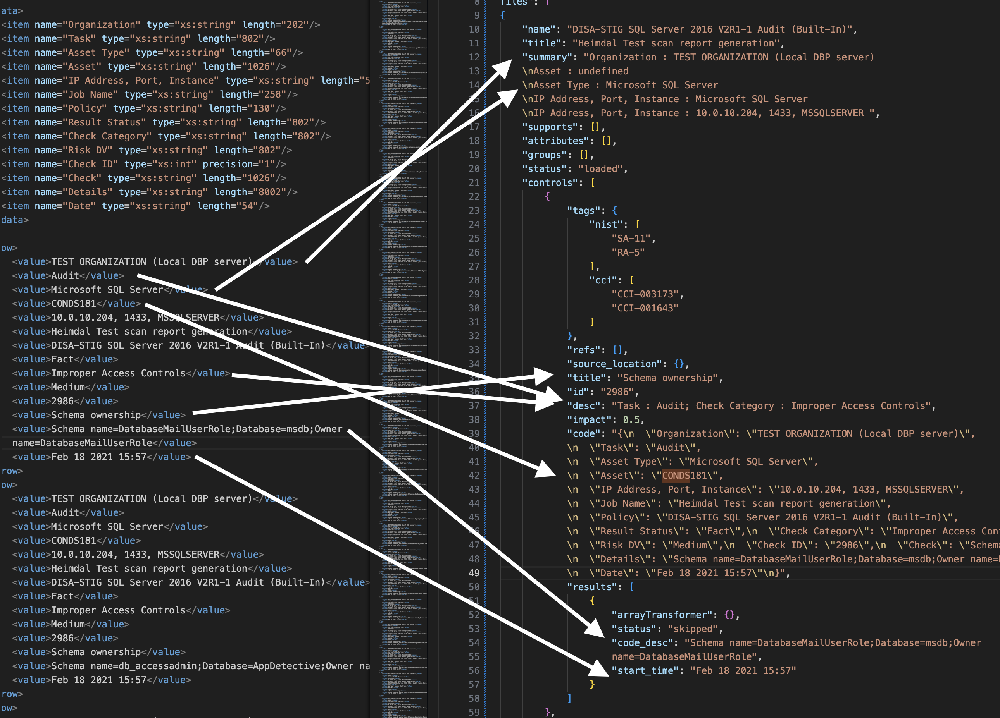

## What is OHDF?

OASIS Heimdall Data Format (OHDF) is a security data format used to normalize generated data exports from various security tools into a single common data format usable by the Security Automation Framework (SAF) tool suite. The format is defined by the [OHDF schema](https://saf.mitre.org/framework/normalize/ohdf-schema) and its goal is to provide a simple and intuitive means for representing security data context, requirements, and measures.

[OASIS Open](https://www.oasis-open.org/) is an international standards body that works on the development and advancement of open source technological standards. OHDF is currently in the process of becoming an OASIS Open standard. For more information on the OHDF charter for OASIS Open, [refer here](https://groups.oasis-open.org/communities/tc-community-home2?CommunityKey=f8888caa-8401-46f8-bf10-018dc7d3f577).

## Why OHDF?

- Many security tools do not provide context to relevant compliance standards for comparison across security tools.​
- Security tools typically generate data in unique formats that require multiple dashboards and utilities to process.​
- OHDF reduces the time it takes to process security assessments, data in disparate locations, and inconsistent semantics of a data element between formats.​

## Features

### 1. Consistent integration, aggregation, and analysis of security data from all available sources.​

- Enforces consistent schema fields through consciously designed data format mappings.
- Supports data format conversion from numerous established security tools such as AWS Security Hub's AWS Security Finding Format (ASFF) and Tenable Nessus' Nessus file format.
- Allows the integration of currently unsupported security tool data formats through the development of OHDF mappers for the OHDF Converters tool.



### 2. Preserving data integrity with original source data.

- Uses mappings which maximize meaningful schema field conversions.
- Leverages schema fields `passthrough` and `raw` to preserve the original data in its entirety.
- Allows for bidirectional format conversions to and from OHDF.

See below for an example of how *some* fields in a source file are mapped to OHDF (not all the mappings are pictured, for the sake of not cluttering the figure).



### 3. Maximizing interoperability and data sharing.​

- Provides a consistent and standardized format for communication.
- Provides an easily ingestible data format and tools to improve user readability.

### 4. Facilitating the transformation and transport of data between security/management processes or technologies.​

- Provides a clear schema for technologies/processes to support.
- Includes a simple file format that technologies/processes can accept.
- Compatible with [Heimdall](./03.md#what-is-heimdall) to provide data visualization.

### 5. Allowing for the mapping and enrichment of security data to relevant compliance standards (GDPR, NIST SP 800-53, CCIs, PCI-DSS, etc.).

- Uses mappers which provide and append relevant compliance standards to converted security tool data.

:::::::note What Are All These Abbreviations?

The aforementioned terms are all security compliance related guidelines, frameworks, or implementations. The following are explanations on terms that are commonly used in this course:

:::details NIST
The National Institute of Standards and Technology (NIST) is a U.S. agency that "promotes U.S. innovation and industrial competitiveness by advancing measurement science, standards, and technology in ways that enhance economic security and improve quality of life."

More information can be found [here](https://www.nist.gov/).
:::

:::details NIST RMF
The NIST Risk Management Framework (NIST RMF) provides "a process that integrates security, privacy, and cyber supply chain risk management activities into the system development life cycle."

More information can be found [here](https://csrc.nist.gov/projects/risk-management/about-rmf).
:::

:::::details NIST SP 800-53 Controls/Requirements
- NIST Special Publication 800-53 (**NIST SP 800-53**) "provides a catalog of security and privacy controls for information systems and organizations to protect organizational operations and assets, individuals, other organizations, and the Nation from a diverse set of threats and risks."

More information can be found [here](https://csrc.nist.gov/pubs/sp/800/53/r5/upd1/final).

- NIST SP 800-53 excerpt:

```
AC-17 REMOTE ACCESS
Control:
a. Establish and document usage restrictions, configuration/connection requirements, and
implementation guidance for each type of remote access allowed; and
b. Authorize each type of remote access to the system prior to allowing such connections.
```
:::::

:::details DISA
The Defense Information Systems Agency (DISA) is a U.S. agency conducting "DODIN (Department of Defense information networks) operations to enable lethality across all warfighting domains in defense of our nation."

More information can be found [here](https://www.disa.mil/).
:::

:::::details CCIs
Control Correlation Identifiers (**CCIs**) are "standard identifiers and descriptions by DISA that aim to correlate high-level policy expressions and low-level technical implementations of security requirements." They are analogous to NIST SP 800-53 controls in that they both provide security and privacy controls.

More information can be found [here](https://public.cyber.mil/stigs/cci/).

- CCI excerpt:

```
CCI-000002: Disseminate the organization-level; mission/business process-level; and/or system-level access control policy that addresses purpose, scope, roles, responsibilities, management commitment, coordination among organizational entities, and compliance to organization-defined personnel or roles.

References:
- NIST: NIST SP 800-53 (v3): AC-1 a
- NIST: NIST SP 800-53 Revision 4 (v4): AC-1 a 1
- NIST: NIST SP 800-53 Revision 5 (v5): AC-1 a 1 (a)
- NIST: NIST SP 800-53A (v1): AC-1.1 (iii)
```
:::::
:::::::

## What Else?

You can read more about OHDF [here](https://saf.mitre.org/framework/normalize).

## Knowledge Check

:::details What is OHDF?
OHDF is a security data format used to normalize generated data exports from various security tools into a single common data format usable by the SAF tool suite.
:::

:::details What are some uses of OHDF?
Some uses include:

- Aggregating security data formats into a single standard format.

- Facilitating the transformation/transport of data across different processes and technologies.

- Enhancing security data with relevant compliance standards.

- And more.
:::
