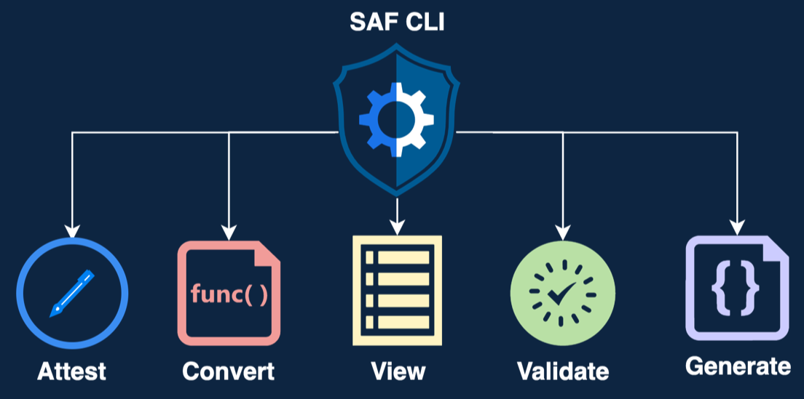
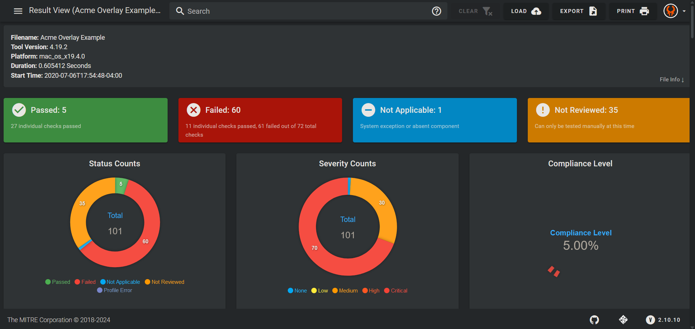

## Where Is OHDF Used?

OHDF is a cornerstone of the Security Automation Framework and is officially implemented and used in a plethora of tools and libraries including InspecJS, OHDF Converters, the SAF CLI, and Heimdall.

## What Is the Security Automation Framework?

The Security Automation Framework (SAF) is a DevSecOps framework which provides a suite of tools for assessing, applying, and managing the security compliance of computer systems. SAF has five core capabilities, of which OHDF is involved in varying degrees:

- **Plan**: OHDF is defined such that it includes all information described in the guidance, as well as relevant metadata. Thus, the information provided by the guidance is incorporated with the security tool results.

- **Harden**: OHDF is not typically used in this capability.

- **Validate**: InSpec's results format is a subset of the OHDF, meaning that InSpec is natively supported. Moreover, it's easy to write InSpec such that all the guidance information is passed through into both the OHDF profile and OHDF results formats.

- **Normalize**: With the use of OHDF Converters, we are able to map many different security results formats to our standard format, OHDF. These converters can either be accessed directly or via the SAF CLI.

- **Visualize**: OHDF is ingested by a variety of tools and transformed in many different ways. For example, a results file can be turned into a threshold file for pipeline use, turned into a POAM for ingestion by eMASS, or ingested by Heimdall directly for display purposes.

You can read more about SAF [here](../user/03.md).

## What Is InspecJS?

[InspecJS](https://github.com/mitre/heimdall2/tree/master/libs/inspecjs) is a library that provides schema definitions, classes, and utilities for OHDF file handling. InspecJS plays a pivotal role in the contextualization process where it performs tasks such as converting the individual statuses for each finding into an overall status for the control.

## What Is OHDF Converters?

[OHDF Converters](https://github.com/mitre/heimdall2/tree/master/libs/hdf-converters) is a custom data normalization library which hosts and leverages OHDF mappers for transforming various security data formats to and from OHDF. It is currently integrated in tools such as [Heimdall](https://github.com/mitre/heimdall2) and the [SAF CLI](https://github.com/mitre/saf), which collectively are part of the [Security Automation Framework (SAF)](https://saf.mitre.org/#/), a set of tools and processes which aim to standardize and ease security compliance testing and verification for systems such as automated build pipelines.

## What Is the SAF CLI?

The Security Automation Framework Command Line Interface (SAF CLI) brings together applications, techniques, libraries, and tools developed by MITRE and the security community to streamline security automation for systems and DevOps pipelines.

An example use case of the SAF CLI is for automating certain security processes in a CI/CD pipeline. One process would be normalizing security data into OHDF using the `saf convert` command.  One can set up the SAF CLI to automatically ingest security reports generated from the build pipeline, and then forward the newly generated OHDF files to a visualization tool such as Heimdall that allows a security assessor to review the state of the current software build.

## What Is Heimdall?

[Heimdall](https://github.com/mitre/heimdall2) is a visualization tool that provides a GUI-based means for managing and analyzing security data. Data that is imported into Heimdall is automatically converted to OHDF through OHDF Converters, which serves as the underlying library that services data format conversion requests in Heimdall.

