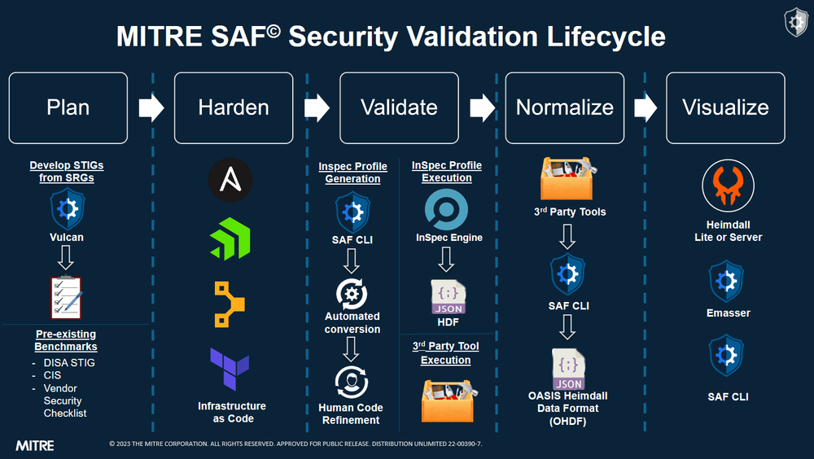

## Where Is OHDF Used?

OHDF is part of the SAF normalization process (see below) and is officially implemented and used in a plethora of tools and libraries including InspecJS, OHDF Converters, the SAF CLI, and Heimdall2.

## What Is InspecJS?

[InspecJS](https://github.com/mitre/heimdall2/tree/master/libs/inspecjs) is a library that provides schema definitions, classes, and utilities for OHDF file handling. InspecJS plays a pivotal role in the contextualization process where it converts the individual statuses for each finding into an overall status for the control.

## What Is OHDF Converters?

[OHDF Converters](https://github.com/mitre/heimdall2/tree/master/libs/hdf-converters) is a custom data normalization library which leverages OHDF mappers for transforming various security data formats to and from OHDF. It is currently integrated into [Heimdall2](https://github.com/mitre/heimdall2) and the [SAF CLI](https://github.com/mitre/saf), which collectively are part of the [Security Automation Framework (SAF)](https://saf.mitre.org/#/), a set of tools and processes which aim to standardize and ease security compliance testing and verification within an automated build pipeline.

## What Is the SAF CLI?

The [SAF CLI](https://github.com/mitre/saf) is a tool that provides various automation support functions for CI/CD. One of its main functions is the `saf convert` command, which allows for the conversion of data between OHDF and several supported security tool data formats.

## What Is Heimdall2?

[Heimdall2](https://github.com/mitre/heimdall2) is a visualization tool that provides a GUI-based means for managing and analyzing security data. Data that is imported into Heimdall2 is automatically converted to OHDF through OHDF Converters, which serves as the underlying library that services data format conversion requests in Heimdall2.