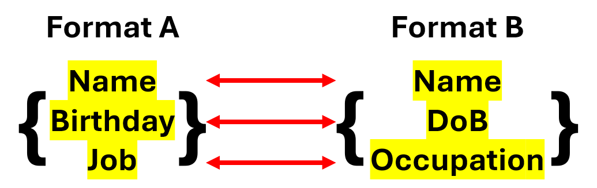
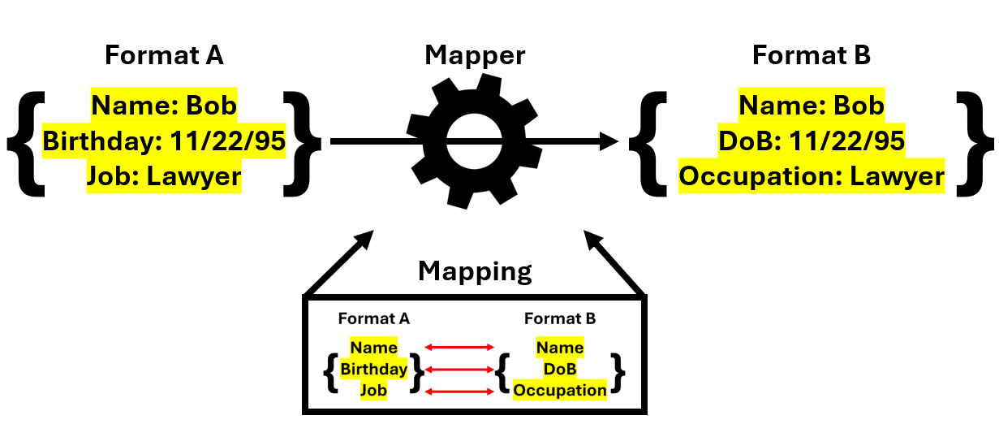
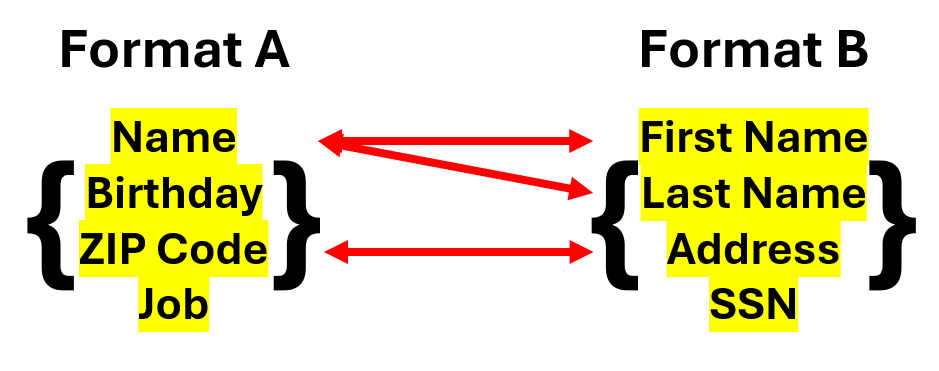
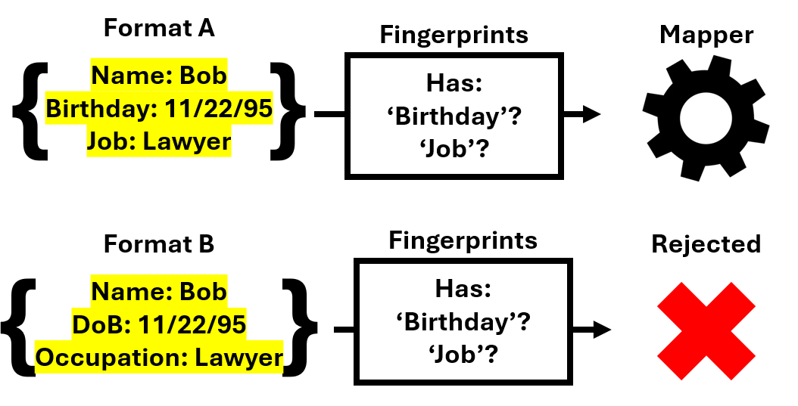
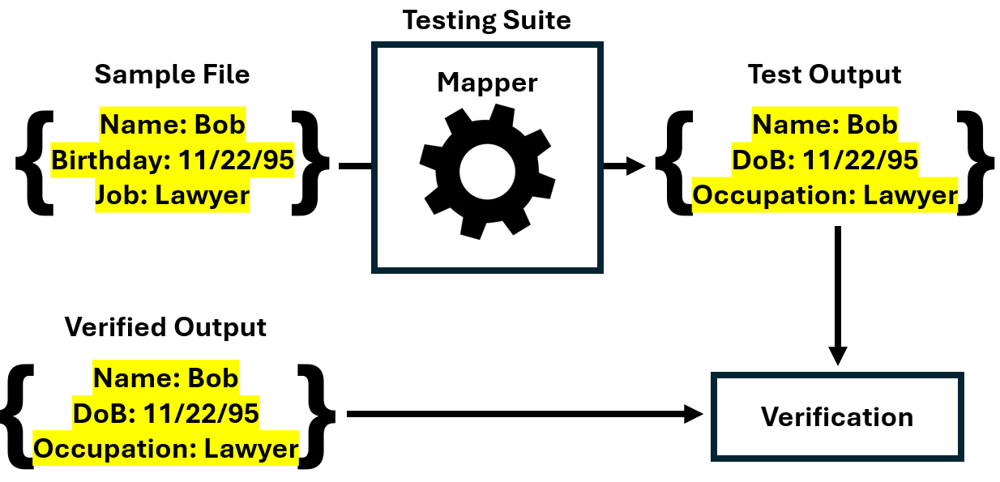

## A Look Ahead

In this section, we will cover:

- [What a mapper is](#what-is-a-mapper)
- [What an OHDF mapper is](#what-is-an-ohdf-mapper)

## What Is a Mapper?

A mapper is an example of the Adapter Design Pattern which is used to correlate (or 'map') data elements in two different objects with one another. Mappers are useful in that they allow us to correlate items in objects that are nominally different but semantically the same. A result of this is that we can easily transform one object type into another through the use of mappings which define the direct relationship of data elements in each object type. An important aspect of the transformation process is that while the data elements containing the values are transformed, the values themselves typically remain the same.



Mappings are the actual correlation of data elements between two different objects. They are the basis for mappers and are responsible for defining which data elements between two objects are semantically the same. Mappers are the implementation of mappings which perform the necessary processing to transform the objects according to relationships found in the mappings. In order to have a mapper that is as accurate as possible in its transformations, the mappings should ideally include correlations for all data elements in the objects.



Oftentimes, however, we will encounter situations where the data elements between two objects either do not perfectly align or are not correlatable in a one-to-one relationship. In such scenarios, data elements can also be correlated to other data elements that are semantically similar enough and or correlated to multiple data elements that are appropriate in a one-to-many or many-to-one relationship.



Here are some scenarios which demonstrate some key aspects of mappers:

::: details Transferring Employee IDs
Say we have a business that is changing its employee identification software and needs to transfer the current credentials of its employees from Software A to Software B. The data formats the softwares use for IDs are as follows:

```json
// Software A
{Name, DoB, Age, Title}

// Software B
{employee, employeeBirthday, employeeAge, jobTitle}
```

How do we transfer John's credentials from Software A to Software B?

```json
{
  "Name": "John Doe",
  "DoB": "10-6-1992",
  "Age": 32,
  "Title": "Security Technician"
}
```

What we can do is create a mapping which correlates the items from Software A's ID scheme to Software B's:

| Format A         | Format B |
| ---------------- | -------- |
| employee         | Name     |
| employeeBirthday | DoB      |
| employeeAge      | Age      |
| jobTitle         | Title    |

With this, we can then develop a mapper which takes John's credentials from Software A and transforms it to Software B's format as so:

```json
{
  "Name": "John Doe",
  "DoB": "10-6-1992",
  "Age": 32,
  "Title": "Security Technician"
}
```

```
   ||
  \  /
   \/

 MAPPER

   ||
  \  /
   \/
```

```json
{
  "employee": "John Doe",
  "employeeBirthday": "10-6-1992",
  "employeeAge": 32,
  "jobTitle": "Security Technician"
}
```

The important thing to note here is that mappers rely on underlying mappings which match semantically similar fields between two objects. These matches allow us to correctly convert each item in one object to the other.
:::

::: details Newly Issued Licenses
The city of Gdańsk is issuing a new license for its citizens. The old and new license formats are as so:

```json
// Old license
{name, father, mother, spouse, age, id}

// New license
{firstName, lastName, DoB, nationalID, spouse, children}
```

How do we transfer Wojtek's license from the old format to the new format?

```json
{
  "name": "Wojtek Bokiewicz",
  "father": "N/A",
  "mother": "Irena Bokiewicz",
  "spouse": "N/A",
  "age": 21,
  "id": 2491
}
```

Like in the previous scenario, we can create a mapping between the two formats to correlate semantically similar items. In this case, however, our formats do not perfectly align, which means that we may have multicorrelated or uncorrelated data elements.

| Old License | New License |
| ----------- | ----------- |
| name        | firstName\* |
| name        | lastName\*  |
| father      | N/A         |
| mother      | N/A         |
| spouse      | spouse      |
| age         | DoB\*       |
| id          | nationalID  |
| N/A         | children    |

\*: Data element requires manipulation to apply.

Notice that certain data elements in the new license format do not have a direct mapping back to the old license format and vice versa. This results in data loss when we convert from the old data format to the new data format where we lose possibly critical information.

We can prevent this through data preservation, which is specifically implemented by adding new data elements to accomodate the lost ones or by adding a 'data repository' which stores all unused data elements. Data preservation in OHDF mappers will be discussed further in the next section.

We can see this data loss when we actually apply this mapping:

```json
{
  "name": "Wojtek Bokiewicz",
  "father": "N/A",
  "mother": "Irena Bokiewicz",
  "spouse": "N/A",
  "age": 21,
  "id": 2491
}
```

```
   ||
  \  /
   \/

 MAPPER

   ||
  \  /
   \/
```

```json
{
  "firstName": "Wojtek",
  "lastName": "Bokiewicz",
  "DoB": 1942,
  "nationalID": 2491,
  "spouse": "N/A",
  "children": ""
}
```

Note how the information stored in the `mother` field is totally lost.

An additional issue that may occur is empty data elements being generated by the mapper when no data is pulled over from the input data object (see `children`). There are many possible solutions for this, including pulling in the correct data from an external source, providing a default value that automatically fills out for every generated entry, or just leaving the field blank. All options are potentially valid depending on the needs of your mapper.

Another important detail to note is how certain mappings require additional manipulations performed on the data in order to qualify the data as applicable to that data element. This can occur in both singly correlated (see `age` to `DoB`) or multicorrelated mappings (see `name` to `firstName` and `lastName`). Ideally, you should limit the amount of manipulations you perform on data unless absolutely necessary in order to preserve the integrity of your input data. If you must perform manipulations on the data, try to also preserve the original data in a backup data element or data repository.

:::

## What Is an OHDF Mapper?

An OHDF mapper is a mapper specifically focused on transforming security data to and from OHDF. It consists of a mapping and a number of helper functions which facilitate the actual application of the mapping. In the case of the SAF tool suite, these mappers allow for the conversion of any given data format to OHDF (\*-to-OHDF) and vice versa (OHDF-to-\*) using helper functions and utilities provided by the existing conversion infrastructure in OHDF Converters.

We can break down each individual OHDF mapper into three general components:

- Fingerprinting: This component contains information on specific data elements unique to a given data format. It uses those 'fingerprints' to correctly identify the data format when encountered and pass it along to the actual mapper for transformation.



- Mapper: This component contains the actual mapping correlating the given data format to or from OHDF and the mapper which implements it. Mappings are built upon an understanding of the security data format (whether through formal schemas or on-hand export examples) and the OHDF schema, and the mechanics of the mapper revolve around correlating the fields in each as accurately as possible. Mappers may sometimes include preprocessing on the input file in order to ensure that the data is readable and easily usable by the mapper implementation.

- Testing: This component consists of a testing suite which verifies the operability of the mapper and a variety of sample files that the testing suite ingests to perform those verifications.



## A Look Back

In this section, we covered:

- [What a mapper is](#what-is-a-mapper)

  - A mapper is a design pattern which allows us to to correlate items in objects that are nominally different but semantically the same. Mappings are the underlying correlations that define the relationship between data elements in the objects, while mappers are the actual implementation of those correlations which transforms one object into the another.

- [What an OHDF mapper is](#what-is-an-ohdf-mapper)

  - An OHDF mapper is a mapper specifically geared towards either converting to OHDF or from OHDF and can be broken down into three general components: The fingerprinting component, the mapper component, and the testing component.

### Knowledge Check

:::details How does an OHDF mapper identify the correct file to normalize?
An OHDF mapper uses its fingerprinting component, which identifies data elements unique to that data format.
:::
