## Test Kitchen - Getting Started

[Test Kitchen](http://kitchen.ci) is a robust tool for testing infrastructure code and software on isolated platforms. It provides a consistent, reliable environment for developing and testing infrastructure code.

## Workflow Defined by our Test Kitchen Files

Test Kitchen's workflow involves building out suites and platforms using its drivers and provisioners. It follows a create, converge, verify, and destroy cycle:

1. **Create:** Test Kitchen creates an instance of the platform.
2. **Converge:** It applies the infrastructure code to the instance.
3. **Verify:** It checks if the instance is in the desired state.
4. **Destroy:** It destroys the instance after testing.

In our testing workflow, we have defined four test suites to test different deployment patterns in two configurations - `vanilla` and `hardened`.

- `vanilla`: This represents a completely stock installation of the testing target, as provided by the product vendor, with no configuration updates beyond what is 'shipped' by the vendor. Apart from the standard Test Kitchen initialization, the system is considered 'stock'.
- `hardened`: This configuration is set up using the `driver` section of the Test Kitchen suite and is executed during the `converge` phase. The `hardened` configuration represents the final `target configuration state` of our test instance, adhering to the recommended configuration of the Benchmark we are working on. For example, it aligns as closely as possible with the Red Hat Enterprise Linux V1R12 recommendations.

For more details on Test Kitchen's workflow, refer to the [official documentation](http://kitchen.ci/docs/getting-started/).

```journey Test Kitchen Workflow
    section Setup
      Checkout  Repo: 3: 
      Install Tools: 3:
      Setup Runner: 3:
    section Configure
      Setup Vanilla Instance: 3: 
      Setup Hardened Instance: 3: 
    section Run Test Suite
      Run Tests on Vanilla: 3: 
      Run Tests on Hardened: 3: 
    section Record Results 
      Save Tests in Pipeline: 3: 
      Upload Tests to Heimdall Server: 3: 
    section Validate Aginst Threshold
      Validate the 'vanilla' threshold: 4: 
      Validate the 'hardened' threshold: 4: 
    section Pass/Fail the Run
      Failed: 1: 
      Passed: 5: 
```
<!-- 
 -->

## Test Kitchen's Modifications to Targets

Test Kitchen makes minor modifications to the system to facilitate initialization and access. It adds a 'private ssh key' for the default user and sets up primary access to the system for this user using the generated key. Test Kitchen uses the 'platform standard' for access - SSH for Unix/Linux systems and WinRM for Windows systems.