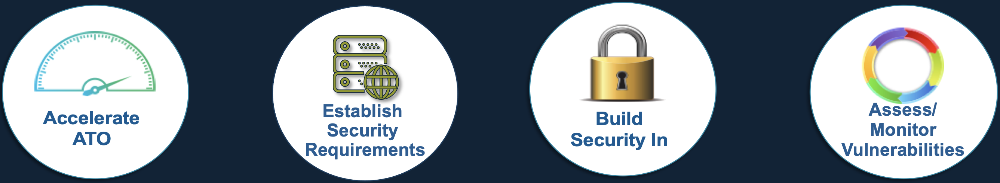

## 2.1 The Goal of the SAF
### 1. Accelerate ATO
- Automate tailored security configuration testing in every build
- Aggregate all security assessment results in a single dashboard to show security status
### 2. Establish Security Requirements
- Align security tests to requirements
- Write STIG-ready content for software components
### 3. Build Security In
- Automate security control assessment aligned to common standards
- Implement security requirements within existing DevSecOps pipelines
### 4. Assess/Monitor Vulnerabilities
- Visualize results of all ongoing assessments to understand risk over time
- Enable ongoing or continuous authorization to operate (cATO)

## 2.2 The Road to Security Automation

As you can see from the picture below, the process for developing automated security tests starts with requirements documents like SRGs, STIGs or CIS Benchmark that are written in regular, human language and then implemented as code. We need that code to record test results in a standardized format so that we can easily export our security data somewhere people can use it to make decisions (like the Heimdall visualization app).

This challenge is what the [MITRE Security Automation Framework](https://saf.mitre.org) or MITRE SAF was developed to simplify -- to make the journey from a Requirement Document to an automated test profile and back again a little easier to navigate.

